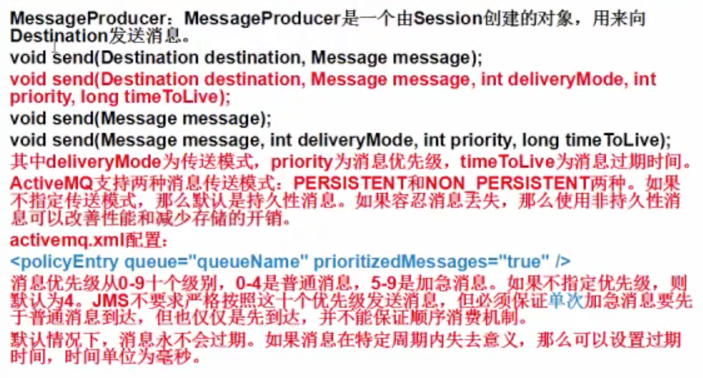
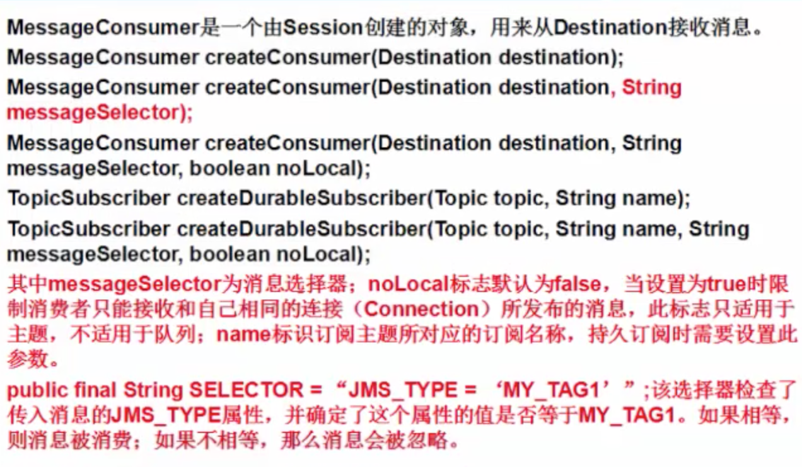
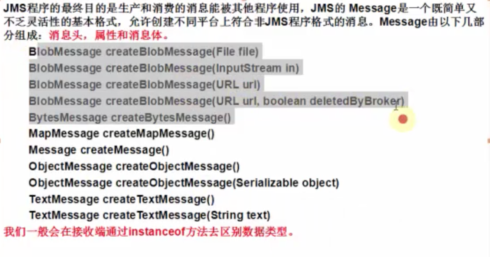
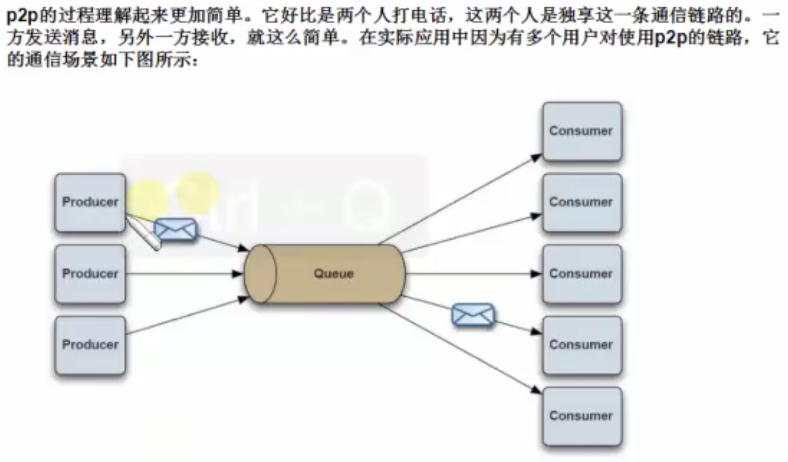
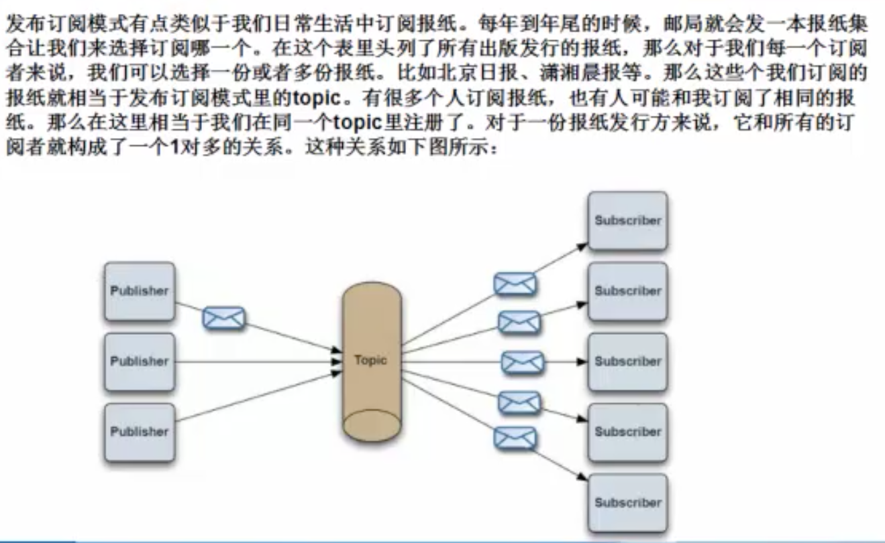

## ActiveMQ
### JMS
- Java消息服务（JMS）定义了Java中访问消息中间件的接口。JMS只是接口，并没有给予实现，实现JMS接口的消息中间件成为JMS Provider，已有MOM（面向消息的中间件）系统包括Apache的ActiveMQ，以及阿里巴巴的RocketMQ，IBM的MQSeries，微软的MSMQ和BEA的MessageQ，RabbitMQ等等。他们基本都遵循JMS规范。
- JMS属于
  -  Provider（MessageProvider）：生产者
  -  Consumer（MessageConsumer）：消费者
  -  PTP:Point to Point，即点对点的消息模型
  -  Pub/Sub：Publish/Subscribe，即发布/订阅的消息模型
  -  Queue：队列目标
  -  Topic：主题目标
  -  ConnectionFactory：连接工厂，JMS用它创建连接
  -  Connection：JMS客户端到JMS Provider的连接
  -  Destination：消息的目的地
  -  Session：会话，一个发送或接收消息的线程
- 消息格式
  -  StreamMessage Java原始值的数据流
  -  MapMessage 一套名称-值对
  -  TextMessage 一个字符串对象
  -  ObjectMessage 一个序列化的Java对象
  -  BytesMessage 一个未解释字节的数据流
 
### 配置
- activemq.xml（可以配置持久化【mysql或者kahadb】,并发量不大可以用mysql，并发量大用kahadb或leveldb）
- jetty.xml
  -  默认端口号：8161
- jetty-realm.properties
  -  登录的用户名和密码
- 控制台（可以查看消息队列或者删除等）
  -  localhost:8161/admin 用户名，密码从properties文件中看 
### HelloWorld
- 第一步：建立ConnectionFactory工厂对象，需要填入用户名、密码、以及要连接的地址，均使用默认即可，默认端口为"tcp://localhost:61616"
- 第二步：通过ConnectionFactory工厂对象我们创建一个Connection连接，并且调用Connection的start方法开启连接，Connection默认是关闭的。
- 第三步：通过Connection对象创建Session会话（上下文环境对象），用于接收消息，参数配置1为是否启用是事务，参数配置2为签收模式，一般我们设置自动签收。
- 第四步：通过Session创建Destination对象，指的是一个客户端用来指定生产消息目标和消费消息来源的对象，在PTP模式中，Destination被称作Queue即队列；在Pub/Sub模式，Destination被称作Topic即主题。在程序中可以使用多个Queue和Topic。
- 第五步：我们需要通过Session对象创建消息的发送和接收对象（生产者和消费者）MessageProducer/MessageConsumer。
- 第六步：我们可以使用MessageProducer的setDeliveryMode方法为其设置持久化特性(存储到kahadb，jdbc等等)和非持久化特性（DeliveryMode)。
```
producer.setDeliveryMode(DeliveryMode.NON_PERSISTENT);   
```
- 第七步：最后我们使用JMS规范的TextMessage形式创建数据（通过Session对象），并用MessageProducer的send方法发送数据。同理客户端使用receive方法进行接收数据。最后不要忘记关闭Connection连接。

### ActiveMQ安全机制(添加访问用户名和密码)
- activeMQ的web管理页面：http://127.0.0.1:8161/admin
  -  activeMQ管控台使用jetty部署，所以需要修改密码则需要到相应的配置文件（/conf/jetty-realm.properties）
- activeMQ设置有安全机制，只有符合认证的用户才能进行发送和获取消息，所以我们需要在activemq.xml里去添加安全验证配置（conf/activemq.xml,在第123行之后添加配置！【添加一个插件配置即可】）

```xml
<plugins>
			<simpleAuthenticationPlugin>
				<users>
					<authenticationUser username="msj" password="msj" groups="users,admins"/>
				</users>
			</simpleAuthenticationPlugin>
		</plugins>
```

### Connection方法使用
- <font color="#f00">当一个Connection被创建时，他的传输默认是关闭的，必须使用start方法开启。一个Connection可以建立一个或多个Session。</font>
- <font color="#f00">当一个程序执行完成后，必须关闭之前创建的Connection，否则ActiveMQ不能释放资源，关闭一个Connection同样也关闭了Session，MessageProducer和MessageConsumer。</font>

### Session方法使用
- Session可以被事务化，也可以不被事务化。通常，可以通过向Connection上的适当创建方法传递一个布尔参数对此进行设置。
```
Session createSession(boolean transacted,int acknowledgeMode);
``` 
其中transacted为使用事务标识，acknowledgeMode为签收模式。
- 结束事务有两种方法：提交或者回滚。当一个事务提交，消息被处理。如果事务中有一个步骤失败，事务就回滚，这个事务中的已经执行的动作将被撤销。在发送消息最后也必须要使用session.commit()方法表示提交事务。
- 签收模式有三种形式：
  -  Session.AUTO_ACKNOWLEDGE 当消费者从receive或onMessage成功返回时，Session自动签收消费者的这条消息的收条。
  -  Session.CLIENT_ACKNOWLEDGE 消费者通过调用消息（Message）的acknowledge方法签收消息。在这种情况下，签收发生在Session层面：签收一个已消费的消息会自动地签收这个Session所有已消费消息的收条。
  -  Session.DUPS_OK_ACKNOWLEDGE 此选项只是Session不必确保对传送消息的签收。它可能引起消息的重复，但是降低了Session的开销，所以只有消费者能容忍重复的消息（并发情况下，可能c1,c2,c3等多个消费者同时拿到某个消息），才可使用。
  
### MessageProducer

- ActiveMq无法保证优先级顺序（即优先级高的先执行），所以为了保证顺序，在ActiveMQ和消费者之间加多个顺序排队系统保证严格的顺序消费。RocketMQ支持优先级顺序。（在ActiveMQ4.x中可以采用Exclusive Consumer或者Exclusive Queues避免这种情况，Broker会从消息队列中一次发送消息给一个消息消费者保证顺序）

### MessageConsumer


- 消息的同步和异步接收：
  -  消息的同步接收是指客户端主动去接收消息，客户端可以采用MessageConsumer的receive方法去接收下一个消息。

Message receive()

Message receive(long timeout)

Message receiveNoWait()

  -  消息的异步接收是指当消息到达时，ActiveMQ主动通知客户端，可以通过注册一个实现MessageListener接口的对象到MessageConsumer。MessageListener只有一个必须实现的方法----onMessage，它只接收一个参数，即Message。在为每个发送到Destination的消息实现onMessage时，将调用该方法。

### Message


### 创建临时消息
ActiveMQ通过create TemporaryQueue和create TemporaryTopic创建临时目标，这些目标持续到创建它的Connection关闭。只有创建临时目标的Connection所创建的客户端才可以从临时目标中接收消息，但是任何的生产者都可以向临时目标中发送消息。如果关闭了创建此目标的Connection，那么临时目标被关闭，内容也将小时。

TemporaryQueue createTemporaryQueue

TemporaryTopic createTemporaryTopic

## 高级主题
### P2P


### publish-subscribe


### 与spring进行整合

[http://blog.csdn.net/jiangxuchen/article/details/8004570](http://blog.csdn.net/jiangxuchen/article/details/8004570)

[http://blog.163.com/czg_elog/static/4610456120133943548952/](http://blog.163.com/czg_elog/static/4610456120133943548952/)

## 集群
### Zookeeper+ActiveMQ
[Zookeeper+ActiveMQ](https://github.com/CentMeng/JavaFrameTest/tree/master/src/com/msj/activemq/doc/activemq集群配置文档.pdf)

### 最好用的模式：network connector
[网络连接模式](https://github.com/CentMeng/JavaFrameTest/tree/master/src/com/msj/activemq/doc/ActiveMQ集群：网络连接模式network_connector详解.docx)

## MQ用途
- 消息中间件
- 异步处理任务机制（异步消费数据、异步发送邮件、异步查询操作等）

## ActiveMQ和RocketMQ
- ActiveMQ过滤效果不是很好，消费量大的时候会有问题，承载性能不好

## 其他补充
- maven默认密码admin123