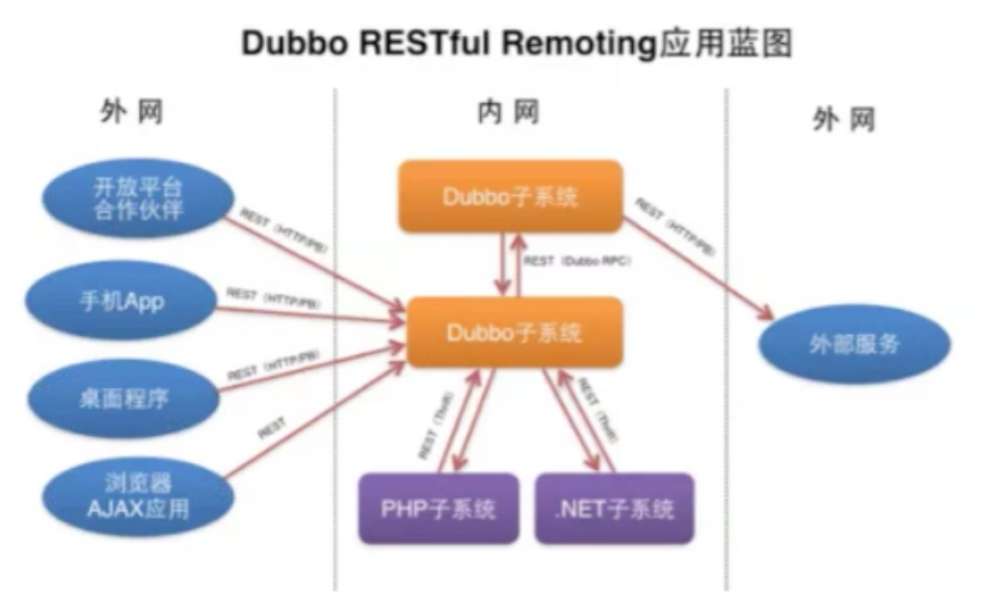
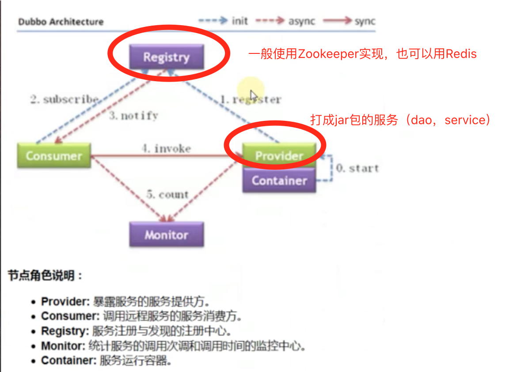
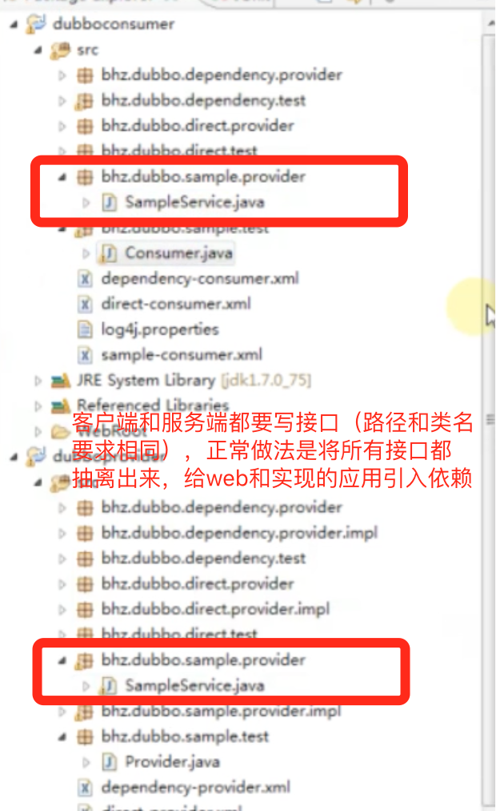

## Dubbo
> [Dubbo](http://dubbo.io/)是一个被国内很多互联网公司广泛使用的开源分布式服务框架，即使从国际视野来看应该也是一个非常全面的SOA基础框架。作为一个重要的技术研究课题，当当网根据自身的需求，为Dubbo实现了一些新的功能，并将其命名为Dubbox（即Dubbo eXtensions）



### [Dubbo简介](http://dubbo.io/)
Dubbo是一个分布式服务框架，致力于提供高性能和透明化的RPC远程服务调用方案，以及SOA服务治理方案。简单的说，dubbo就是个服务框架，如果没有分布式的需求，其实是不需要用的，只有在分布式的时候，才有dubbo这样的分布式服务框架的需求，并且本质上是个服务调用的冻冻，说白了就是个远程服务调用的分布式框架（告别Web Service模式中的WSdl，以服务者与消费者的方式在dubbo上注册）

其核心部分包含：

1. 远程通讯：提供对多种基于长连接的NIO框架抽象封装，包括多种线程模型，序列化，以及“请求-响应”模式的信息交换方式。
2. 集群容错：提供基于接口方法的透明远程过程调用，包括多协议支持，以及软负载均衡，失败容错，地址路由，动态配置等集群支持。
3. 自动发现：基于注册中心目录服务，使服务消费方能动态的查找服务提供方，使地址透明，使服务提供方可以平滑增加或减少机器。


### Dubbo的用途
1. 透明化的远程方法调用，就像调用本地方法一样调用远程方法，只需简单配置，没有任何API侵入。
2. 软负载均衡及容错机制，可在内网替代F5等硬件负载均衡器，降低成本，减少单点。
3. 服务自动注册与实现，不在需要写死服务提供方地址，注册中心基于接口名查询服务提供者的IP地址，并且能够平滑添加或删除服务提供者。
4. Dubbo采用全Spring配置方式，透明化接入应用，对应用没有任何API侵入，只需用Spring加载Dubbo的配置即可，Dubbo基于Spring的Schema扩展进行加载。

### [Dubbo用户指南](http://dubbo.io/User+Guide-zh.htm)

- Dubbo架构


## HelloWorld
### sample-provider.xml
```xml
<?xml version="1.0" encoding="UTF-8"?>
<beans xmlns="http://www.springframework.org/schema/beans"
	xmlns:xsi="http://www.w3.org/2001/XMLSchema-instance" xmlns:dubbo="http://code.alibabatech.com/schema/dubbo"
	xsi:schemaLocation="http://www.springframework.org/schema/beans
        http://www.springframework.org/schema/beans/spring-beans.xsd
        http://code.alibabatech.com/schema/dubbo
        http://code.alibabatech.com/schema/dubbo/dubbo.xsd
        ">

	<!-- 具体的实现bean -->
	<bean id="sampleService" class="msj.dubbo.sample.provider.impl.SampleServiceImpl" />

	<!-- 提供方应用信息，用于计算依赖关系 -->
	<dubbo:application name="sample-provider" />

	<!-- 使用zookeeper注册中心暴露服务地址 -->
	<dubbo:registry address="zookeeper://192.168.1.111:2181?backup=192.168.1.112:2181,192.168.1.113:2181" />

	<!-- 用dubbo协议在20880端口暴露服务 -->
	<dubbo:protocol name="dubbo" port="20880" />

	<!-- 声明需要暴露的服务接口  写操作可以设置retries=0 避免重复调用SOA服务 -->
	<dubbo:service retries="0" interface="msj.dubbo.sample.provider.SampleService" ref="sampleService" />

</beans>
```

### sample-consumer.xml
```xml
<?xml version="1.0" encoding="UTF-8"?>
<beans xmlns="http://www.springframework.org/schema/beans"
	xmlns:xsi="http://www.w3.org/2001/XMLSchema-instance" xmlns:dubbo="http://code.alibabatech.com/schema/dubbo"
	xsi:schemaLocation="http://www.springframework.org/schema/beans
        http://www.springframework.org/schema/beans/spring-beans.xsd
        http://code.alibabatech.com/schema/dubbo
        http://code.alibabatech.com/schema/dubbo/dubbo.xsd
        ">

	<!-- 消费方应用名，用于计算依赖关系，不是匹配条件，不要与提供方一样 -->
	<dubbo:application name="sample-consumer" />

	<dubbo:registry address="zookeeper://192.168.1.111:2181?backup=192.168.1.112:2181,192.168.1.113:2181" />

	<!-- 生成远程服务代理，可以像使用本地bean一样使用demoService 检查级联依赖关系 默认为true 当有依赖服务的时候，需要根据需求进行设置 -->
	<dubbo:reference id="sampleService" check="false"
		interface="msj.dubbo.sample.provider.SampleService" />

</beans>
```



## 管控台

- dubbo-admin-xxx.war 放到tomcat的webapp中

- dubbo.properties 修改注册中心（zookeeper）和登录密码

- dubbo管控台版本必须要与dubbo版本对应

## 使用demo
### 一个服务依赖另一个服务
#### Provider

```xml
<?xml version="1.0" encoding="UTF-8"?>
<beans xmlns="http://www.springframework.org/schema/beans"
	xmlns:xsi="http://www.w3.org/2001/XMLSchema-instance" xmlns:dubbo="http://code.alibabatech.com/schema/dubbo"
	xsi:schemaLocation="http://www.springframework.org/schema/beans
        http://www.springframework.org/schema/beans/spring-beans.xsd
        http://code.alibabatech.com/schema/dubbo
        http://code.alibabatech.com/schema/dubbo/dubbo.xsd
        ">
	
	<dubbo:annotation package="bhz" />
	
	<!-- 提供方应用信息，用于计算依赖关系 -->
	<dubbo:application name="dependency-provider" />

	<!-- 使用zookeeper注册中心暴露服务地址 -->
	<dubbo:registry address="zookeeper://192.168.1.111:2181?backup=192.168.1.112:2181,192.168.1.113:2181" />

	<!-- 用dubbo协议在20880端口暴露服务 -->
	<dubbo:protocol name="dubbo" port="20890" />
	
	<!-- 注意这里，我们在使用DependencyService的时候，这个服务可能需要依赖某一个服务，比如SampleService 检查级联依赖关系 默认为true 当有依赖服务的时候，需要根据需求进行设置 -->
	<dubbo:reference id="sampleService" check="true"
		interface="msj.dubbo.sample.provider.SampleService" />
```

#### Consumer

```xml
<?xml version="1.0" encoding="UTF-8"?>
<beans xmlns="http://www.springframework.org/schema/beans"
	xmlns:xsi="http://www.w3.org/2001/XMLSchema-instance" xmlns:dubbo="http://code.alibabatech.com/schema/dubbo"
	xsi:schemaLocation="http://www.springframework.org/schema/beans
        http://www.springframework.org/schema/beans/spring-beans.xsd
        http://code.alibabatech.com/schema/dubbo
        http://code.alibabatech.com/schema/dubbo/dubbo.xsd
        ">

	<!-- 消费方应用名，用于计算依赖关系，不是匹配条件，不要与提供方一样 -->
	<dubbo:application name="dependency-consumer" />

	<dubbo:registry address="zookeeper://192.168.1.111:2181?backup=192.168.1.112:2181,192.168.1.113:2181" />

	<!-- 生成远程服务代理，可以像使用本地bean一样使用demoService 检查级联依赖关系 默认为true 当有依赖服务的时候，需要根据需求进行设置 -->
	<dubbo:reference id="dependencyService"
		interface="msj.dubbo.dependency.provider.DependencyService" />

</beans>
```

### 直连提供者
> 不经过注册中心（zookeeper），直接点对点

#### Provider

```xml
<?xml version="1.0" encoding="UTF-8"?>
<beans xmlns="http://www.springframework.org/schema/beans"
	xmlns:xsi="http://www.w3.org/2001/XMLSchema-instance" xmlns:dubbo="http://code.alibabatech.com/schema/dubbo"
	xsi:schemaLocation="http://www.springframework.org/schema/beans
        http://www.springframework.org/schema/beans/spring-beans.xsd
        http://code.alibabatech.com/schema/dubbo
        http://code.alibabatech.com/schema/dubbo/dubbo.xsd
        ">

	<!-- 具体的实现bean -->
	<bean id="directService" class="bhz.dubbo.direct.provider.impl.DirectServiceImpl" />

	<!-- 提供方应用信息，用于计算依赖关系  -->
	<dubbo:application name="direct-provider"  />

	<!-- 使用zookeeper注册中心暴露服务地址 只订阅的方式：register="false"-->
	<dubbo:registry address="zookeeper://192.168.1.111:2181?backup=192.168.1.112:2181,192.168.1.113:2181" />

	<!-- 用dubbo协议在20880端口暴露服务 -->
	<dubbo:protocol name="dubbo" port="20880" />

	<!-- 直连配置特殊点： 直连服务提供者：是在消费端进行配置的，而不是在服务提供端，所以这里不需要任何配置 -->
	<dubbo:service retries="0" interface="msj.dubbo.direct.provider.DirectService" ref="directService" />

</beans>
```

#### Consumer

```xml
<?xml version="1.0" encoding="UTF-8"?>
<beans xmlns="http://www.springframework.org/schema/beans"
	xmlns:xsi="http://www.w3.org/2001/XMLSchema-instance" xmlns:dubbo="http://code.alibabatech.com/schema/dubbo"
	xsi:schemaLocation="http://www.springframework.org/schema/beans
        http://www.springframework.org/schema/beans/spring-beans.xsd
        http://code.alibabatech.com/schema/dubbo
        http://code.alibabatech.com/schema/dubbo/dubbo.xsd
        ">

	<!-- 消费方应用名，用于计算依赖关系，不是匹配条件，不要与提供方一样 -->
	<dubbo:application name="direct-consumer" />

	<dubbo:registry address="zookeeper://192.168.1.111:2181?backup=192.168.1.112:2181,192.168.1.113:2181" />

	<!-- 直连提供者配置，在这里（也就是消费端进行配置） url="" -->
	<dubbo:reference id="directService" check="false"
		url="dubbo://localhost:20880" 
		interface="msj.dubbo.direct.provider.DirectService" />

</beans>
```

## 属性说明
### [启动时检查](http://dubbo.io/User+Guide-zh.htm#UserGuide-zh-%E5%90%AF%E5%8A%A8%E6%97%B6%E6%A3%80%E6%9F%A5)
### [集群配置](http://dubbo.io/User+Guide-zh.htm#UserGuide-zh-%E9%9B%86%E7%BE%A4%E5%AE%B9%E9%94%99)
### [负载均衡](http://dubbo.io/User+Guide-zh.htm#UserGuide-zh-%E8%B4%9F%E8%BD%BD%E5%9D%87%E8%A1%A1)
- 一般情况下不会将负载均衡配置到dubbo上，可以在控制台修改
- 轮询方式如果一个节点出现问题，那么所有轮询到这个节点的请求都会积压
### [线程模型](http://dubbo.io/User+Guide-zh.htm#UserGuide-zh-%E7%BA%BF%E7%A8%8B%E6%A8%A1%E5%9E%8B)

## 配置说明
### [重点配置](http://dubbo.io/User+Guide-zh.htm#UserGuide-zh-%E9%85%8D%E7%BD%AEAPI)
- version
- retries
- connections(当前service对每个提供者的最大连接数)
- token
- async （consumer调用provider，是阻塞还是异步直接返回，异步方式不太好，默认是false）
- weight（权重）
- executes

生产者：

- threadpool

消费者：

- actives