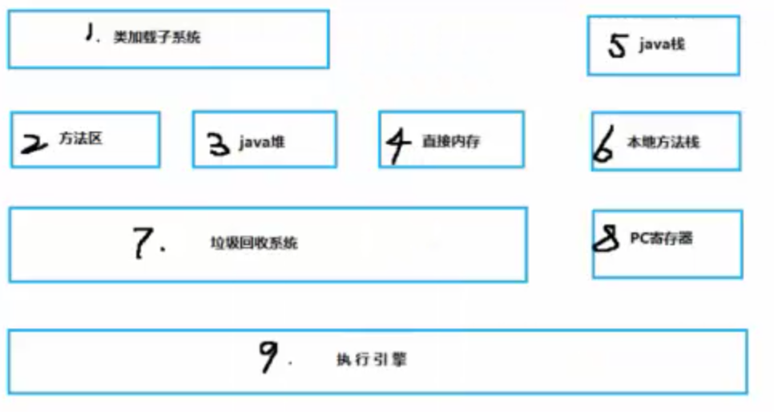
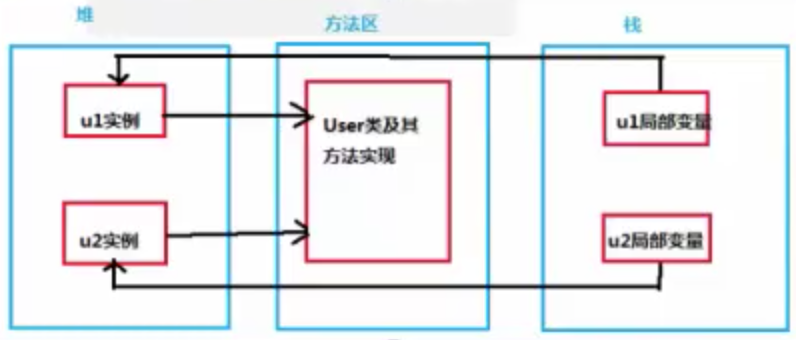
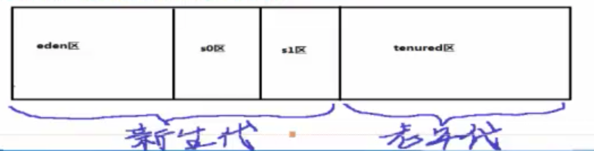
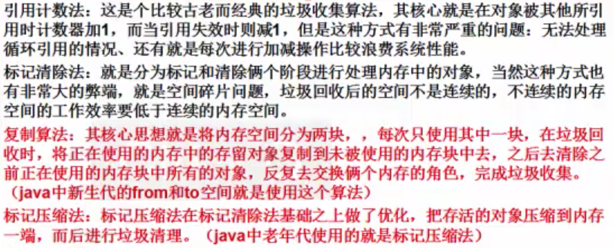
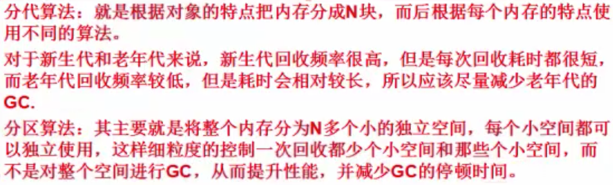
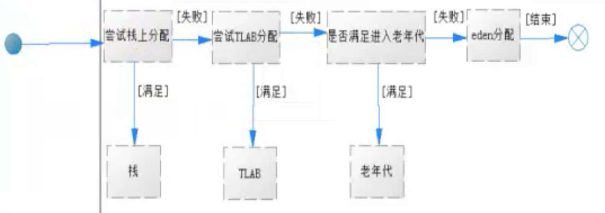
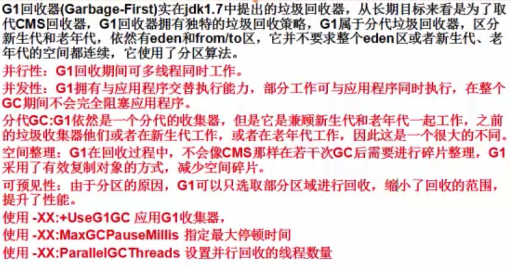

## JVM
### Java虚拟机概述和基本概念
网站推荐：[http://blog.csdn.net/u013256816/article/details/51484031](http://blog.csdn.net/u013256816/article/details/51484031)

虚拟机可以分为系统虚拟机和程序虚拟机，VisualBox，VMare属于系统虚拟机，他们完全是对物理计算机的仿真，提供了一个可运行完整操作系统的软件平台。程序虚拟机典型代表就是Java虚拟机，它专门为执行单个计算机程序而设计，在java虚拟机中执行的指令我们称为java字节码指令。无论是系统虚拟机还是程序虚拟机，在上面运行的软件都被限制于虚拟机提供的资源中。Java发展至今，出现过很多虚拟机，最初Sun使用的一款叫Classic的Java虚拟机，到现在引用最广泛的是HotSpot虚拟机，除了Sun以外，还有BEA的JRockit，目前JRockit和HosSpot都被Oracle收入旗下。
#### java虚拟机基本结构

- 类加载子系统：负责从文件系统或者网络中加载Class信息，加载的信息存放在一块称之为方法区的内存空间。

- 方法区：就是存放类信息、常量信息、常量池信息、包括字符串字面量和数字常量等。

- java堆：在java虚拟机启动的时候建立java堆，它是java程序最主要的内存工作区域，几乎所有的对象实例都存放到java堆中，堆空间是所有线程共享的。java堆实在jvm启动的时候就建立的，这块内存区域 存放了对象实例及数组(所有new的对象)也就是 Object object = new Object(); 这里object只是一个引用是放在栈里面的，new Object() 被放在了 堆内存里面， 
由于现在收集器都是采用分代收集算法，堆被划分为新生代和老年代。新生代主要存储新创建的对象和尚未进入老年代的对象。老年代存储经过多次新生代GC(Minor GC)任然存活的对象。

- 直接内存：Java的NIO库允许Java程序使用直接内存，从而提高性能，通常直接内存速度优于java堆。读写频繁的场合可能会考虑使用。

- 每个虚拟机线程都有一个私有的栈，一个线程的java栈在线程创建的时候被创建，java栈中保存着局部变量、方法参数、同时java的方法调用，返回值等。
- 本地方法栈和java栈非常类似，最大不同为本地方法栈用于本地方法调用。java虚拟机允许java直接调用本地方法（通常使用C编写）。
- 垃圾收集系统是java的核心，也是必不可少的，java有一套自己进行垃圾清理的机制，开发人员无需手工清理。
- PC（Program Counter）寄存器也是每个线程私有的空间，java虚拟机会为每个线程创建PC寄存器，在任意时刻，一个java线程总是在执行一个方法，这个方法被称为当前方法，如果当前方法不是本地方法，PC寄存器就会执行当前正在被执行的指令，如果是本地方法，则PC寄存器值为undefined，寄存器存放如当前执行环境指针、程序计数器、操作栈指针、计算的变量指针等信息。
- 虚拟机最核心的组件就是执行引擎了，它负责执行虚拟机的字节码。一般会先进行编译成机器码后执行。

### 堆、栈、方法区
#### 堆、栈、方法区概念和联系
- 堆解决的事数据存储的问题，即数据怎么放，放在哪。
- 栈解决程序的运行问题，即程序如何执行，或者说如何处理数据。
- 方法区则是辅助对战的快永久区（Perm），解决堆栈信息的产生，是先决条件。

我们创建一个新的对象，User：那么User类的一些信息（类信息，静态信息都存放于方法区中）而User类被实例化出来之后，被存储到java堆中，一块内存空间。当我们去使用的时候，都是使用User对象的引用，形如 User user = new User（）；这里的User就是存放在java栈中的，即User真实对象的一个引用。

#### java堆
java堆是和java应用程序关系最密切的内存空间，几乎所有的对象都存放在其中，并且java堆完全是自动化管理的，通过垃圾回收机制，垃圾对象会自动清理，不需要显示的释放。

- 根据垃圾回收机制不同，java堆有可能拥有不同的结构。最为常见的就是将整个java堆分为新生代和老年代。其中新生代存放新生的对象或者年龄不大的对象，老年代则存放老年对象。（新生代和老年代都会经历垃圾回收，只不过是频率差异）
- 绝大多数情况下，对象首先分配在eden区，在一次新生代回收后，如果对象还存活，则会进入s0或者s1区，之后经过一次新生代回收，如果对象存活则它的年龄增加1，当对象达到一定的年龄后，则进入老年代。(为什么会有2块s区，因为java进行垃圾回收算法时候使用的是复制算法)

#### java栈
java栈是一块线程私有的内存空间，一个栈，一般由三部分组成：局部变量表、操作数栈和帧数据区
- 局部变量表：用于报错函数的参数和局部变量。
- 操作数栈：主要保存计算过程的中间结果，同时作为计算过程中变量临时的存储空间。
- 帧数据区：除了局部变量表和操作数栈以外，栈还需要一些数据来支持常量池的解析，这里帧数据区保存着访问常量池的指针，方便程序访问常量池，另外，当函数返回或者出现异常时，虚拟机必须有一个异常处理表，方便发送异常的时候找到异常的代码，因此异常处理表也是帧数据区的一部分。
#### java方法区
java方法区和堆一样，方法区是一块所有线程共享的内存区域，它保存系统的类信息，比如类及其父类的全限定名（java.lang.Object没有父类）、类的类型（Class or Interface）、访问修饰符（public, abstract, final）、实现的接口的全限定名的列表、字段信息、方法信息、静态变量、ClassLoader引用、Class引用、常量池。方法区的大小决定了系统可以保存多少个类，如果系统定义太多的类，导致方法区溢出。虚拟机同样会抛出内存溢出错误。方法区可以理解为永久区（Perm）。（默认是64MB）
### 了解虚拟机参数
虚拟机参数配置，其实主要围绕堆、栈、方法区进行配置。
#### 堆分配参数
- -XX:+PrintGC 使用这个参数，虚拟机启动后，只要遇到GC就会打印日志
- -XX:+UseSerialGC 配置串行回收器
- -XX:+PrintGCDetails 可以查看详细信息，包括各个区的情况
- -Xms： 设置java程序启动时初始堆大小
- -Xmx： 设置java程序能获得的最大堆大小
- -Xmx20m -Xms5m -XX:+PrintCommandLineFlags：可以将隐式或者显示传给虚拟机的参数输出。

示例：[Test01](https://github.com/CentMeng/JavaFrameTest/tree/master/src/com/msj/jvm/Test01.java)

总结：在实际工作中，我们可以直接将初始的堆大小与最大堆大小设置相等，这样的好处是可以减少程序运行时的垃圾回收，从而提高性能。

新生代配置：

- -Xmn:可以配置新生代的大小，设置一个比较大的新生代会减少老年代的大小，这个参数对系统性能以及GC行为有很大的影响，新生代大小一般会设置整个堆空间的1/3到1/4左右(如果业务需要时常回收对象的话，就把新生代设置的大小大一点，如果希望多存放存久的数据，则老年代大点)。
- -XX：SurvivorRatio：用来设置新生代中eden空间和from/to空间的比例。含义：-XX：SurvivorRatio=eden/from=eden/to例如：-XX:SurvivorRatio=2 （eden区/s0区=2，即eden区2份，s0区1份，则s1也是1份，因为s0和s1是等大互换的）

示例[Test02](https://github.com/CentMeng/JavaFrameTest/tree/master/src/com/msj/jvm/Test02.java)

总结：不同的堆分布情况，对系统执行会产生一定的影响，在实际工作中，应该根据系统的特点做出合理的配置，基本策略：尽可能将对象预留在新生代，减少老年代的GC次数。

除了可以设置新生代的绝对大小（-Xmn），还可以使用（-XX：NewRatio）设置新生代和老年代的比例：-XX：NewRatio=老年代/新生代
#### 堆溢出处理
在java程序的运行过程中，如果堆空间不足，则会抛出内存溢出的错误（Out Of Memory）OOM,一旦这类问题发生在生产环境，可能引起严重的业务中断，java虚拟机提供了-XX：+HeapDumpOnOutOfMemoryError，使用该参数可以在内存溢出时导出整个堆信息，与之配合使用的还有参数，-XX：HeapDumpPath，可以设置导出堆的存放路径。

内存分析工具：Memory Analyzer 1.5.0

地址：[http://download.eclipse.org/mat/1.5/update-site/](http://download.eclipse.org/mat/1.5/update-site/)

示例：[Test03](https://github.com/CentMeng/JavaFrameTest/tree/master/src/com/msj/jvm/Test03.java)
#### 栈配置
Java虚拟机提供了参数-Xss来指定线程的最大栈空间，整个参数也直接决定了函数可调用的最大深度(方法被循环调用的次数)。

示例[Test04](https://github.com/CentMeng/JavaFrameTest/tree/master/src/com/msj/jvm/Test04.java)
#### 方法区
和java堆一样，方法区是一块所有线程共享的内存区域，它用于保存系统的类信息，方法区（永久区）可以保存多少信息可以对其进行配置，在默认情况下，-XX：MaxPermSize为64MB，如果系统运行时生产大量的类，就需要设置一个相对合适的方法区，以免出现永久区内存溢出的问题。

-XX：PermSize=64MB -XX：MaxPermSize=64MB
#### 直接内存配置
直接内存广泛用于NIO中，直接内存跳过了java堆，使java程序可以直接访问原生堆空间，因此在一定程度上加快了内存空间的访问速度。但是说直接内存一定就可以提高内存访问速度也不见得，具体情况具体分析。(JDK1.7及以上不需要配置)

-XX:MaxDirectMemorySize，如果不设置默认值为最大堆空间，即-Xmx。直接内存使用达到上限时，就会触发垃圾回收，如果不能有效的释放空间，也会引起系统的OOM.
#### Client和Server虚拟机工作模式（1.6以前分工作模式，1.7 64位都是Server模式，不提供Client模式）
java虚拟机支持Client和Server两种运行模式，使用参数-client可以指定使用Client模式，使用g-server可以指定使用Server模式。可以直接在命令行查看当前计算机系统自动选择的运行模式。java -version即可。

二者区别：Client模式相对Server启动较快，如果不追求系统的长时间使用性能仅仅是测试，可以使用Client模式。而Server模式则启动比较慢，原因是会对其进行复杂的系统性能信息收集和使用更复杂的算法对程序进行优化，一般我们的生产环境都会使用Server模式，长期运行其性能要远远快于Client模式。
### 垃圾回收概念和算法、及对象的分代转换
GC（Garbage Collection）中的垃圾，特指存于内存中，不会再被使用的对象。垃圾回收有很多算法：引用计数法、标记压缩法、复制算法、分代、分区的思想。
#### 垃圾收集算法

 
 - 新生代采用复制算法，老年代采用标记压缩法。
 - 新生代和老年代为什么采用不同的垃圾回收算法？
   -  因为新生代的存活率比较低即回收的对象比较多，老年代经过多次垃圾回收存活下来，所以存活率比较高即回收的对象比较少。

#### 垃圾回收时的卡顿现象
垃圾回收器的任务是识别和回收垃圾对象进行内存清理，为了让垃圾回收器可以高效的执行，大部分情况下，会要求系统进入一个停顿的状态。停顿的目的是终止所有应用线程，只有这样系统才不会有新的垃圾产生，同时停顿保证了系统状态在某一个瞬间的一致性，也有益于更好的标记垃圾对象。因此在垃圾回收时，都会产生应用程序的停顿。
#### 对象如何进入老年代
年龄配置：
-XX:MaxTenuringThreshold，默认情况下为15。

示例：[Test05]（https://github.com/CentMeng/JavaFrameTest/tree/master/src/com/msj/jvm/Test05.java）

总结：根据设置MaxTenuringThreshold参数，可以指定新生代对象经过多少次回收后进入老年代。

另外，大对象（新生代eden区无法装入时，也会直接进入老年代）。JVM里有个参数可以设置对象的大小超过在指定大小之后，直接晋升老年代。

-XX:PertenureSizeThreshod

示例：[Test06]（https://github.com/CentMeng/JavaFrameTest/tree/master/src/com/msj/jvm/Test06.java）

总结：使用PretenureSizeThreshod可以进行指定进入老年代的对象大小，但是要注意TLAB区域有限分配空间。
#### TLAB
TLAB全称是Thread Local Allocation Buffer 即线程本地分配缓存。 从名字上看是一个线程专用的内存分配区域，是为了加速对象分配而生的。每一个线程都会产生一个TLAB，该线程独享的工作区域，java虚拟机使用这种TLAB区来避免多线程冲突问题，提高了对象分配的效率。TLAB空间一般不会太大，当大对象无法在TLAB分配时，则会直接分配到堆上。（建议不要修改，在JDK1.7之后，会自动调整)
 
 - -XX:+UseTLAB 使用TLAB
 - -XX:+TLABSize 设置TLAB大小
 - -XX:TLABRefillWasteFraction 设置维护进入TLAB空间的单个对象大小，他是一个比例值，默认为64，即如果对象大于整个空间的1/64，则在堆创建对象。
 - XX:+PrintTLAB 查看TLAB信息
 - XX:ResizeTLAB 自调整TLABRefillWasteFraction阀值。
 
 示例[Test07](https://github.com/CentMeng/JavaFrameTest/tree/master/src/com/msj/jvm/Test07.java) 
#### 对象创建流程图
jvm根据数据的大小，参数的设置，决定如何创建分配，以及其位置

### 垃圾收集器
#### 串行垃圾回收器
串行回收器是指使用单线程进行垃圾回收的回收器。每次回收时，串行回收器只有一个工作线程，对于并行能力较弱的计算机来说，串行回收器的专注性和独占性往往有更好的性能表现。串行回收器可以在新生代和老年代使用，根据作用于不同的堆空间，分为新生代回收器和老年代回收器。
- 使用-XX:+UseSerialGC 参数可以设置使用新生代串行回收器和老年代串行回收器
#### 并行垃圾回收器
并行回收器在串行回收器基础上做了改进，他可以使用多个线程同时进行垃圾回收，对于计算能力强的计算机而言，可以有效的缩短垃圾回收所需的实际时间。

##### ParNew回收器

ParNew回收器是一个工作在新生代的垃圾收集器，他只是简单的将串行回收器多线程化，他的回收策略和算法和串行回收器一样。

使用：-XX:+UseParNewGC 新生代ParNew回收器，老年代则使用串行回收器。ParNew回收器工作时的线程数量可以使用 -XX:ParallelGC Threads参数指定，一般最好和计算机的CPU相当，避免过多的想成影响性能。

##### ParallelGC回收器（侧重于吞吐量，适合于电商平台多并发的情况）

新生代ParallelGC回收器，使用了复制算法的收集器，也是多线程独占形式的收集器，但ParallelGC回收器有个非常重要的特点，就是它非常关注系统的吞吐量。

提供了俩个非常关键的参数控制系统的吞吐量：

- -XX:MaxGCPauseMillis：设置最大垃圾收集停顿时间，可用把虚拟机在GC停顿的时间控制在MaxGCPauseMillis范围内，如果希望减少GC停顿时间可以将MaxGCPauseMillis设置的很小，但是会导致GC频繁，从而增加了GC的总时间，降低了吞吐量。所以需要根据实际情况设置改值。
- -XX:GC TimeRatio：设置吞吐量大小，它是一个0到100之间的整数，默认情况下他的取值是99，那么系统将花费不超过1/(1+n)的时间用于垃圾回收，也就是1/(1+99)=1%的时间。

另外还可以指定-XX:+UseAdaptiveSizePolicy打开自适应模式，在这种模式下，新生代的大小、eden、from/to的比例，以及晋升老年代的对象年龄参数会被自动调整，以达到在堆大小、吞吐量和停顿时间之间的平衡点。 
 
- 老年代ParallelOldGC回收器也是一种多线程的回收器，和新生代的ParallelGC回收器一样，也是一种关注吞吐量的回收器，它使用了标记压缩算法进行实现。
  -  XX:+UseParallelOldGC 进行设置
  -  XX:+ParallelGC Threads 也可以设置垃圾收集时的线程数量。

#### CMS回收器（最主流）
CMS 全称为：Concurrent Mark Sweep 意为并发标记清除，它使用的是标记清除法，主要关注系统停顿时间。

使用：+XX:+UseConcMarkSweepGC 进行设置

使用：+XX:+ConcGCThreads 设置并发线程数量。

CMS并不是独占的回收器（GC过程中，应用程序仍然在不停地工作，但这样又会有新的垃圾不断的产生，所以在使用CMS的过程中应该确保内存足够可用）。CMS不会等到应用程序饱和的时候才去回收垃圾，而是在某一阀值的时候开始回收，回收阀值可用指定的参数进行设置，-XX:CMSInitiatingOccupancyFraction来设定，默认为68，也就是说当老年代的空间使用率达到68%的时候，会执行CMS回收。如果内存使用率增长的很快，在CMS执行的过程中，已经出现了内存不足的情况，此时CMS回收就会失败，虚拟机将启动老年代串行回收器进行垃圾回收，这会导致应用程序中断，直到垃圾回收完成后才会正常工作，这个过程GC的停顿时间可能较长，所以-XX:CMSInitiatingOccupancyFraction的设置要根据实际的情况。 

我们知道，标记清除算法有个缺点就是存在内存碎片的问题，那么CMS有个参数设置-XX:+UseCMSCompactAtFullCollection可以使CMS回收完成之后进行一次碎片整理，-XX:+CMSFullGCsBeforeCompaction参数设置进行多少次CMS回收之后，对内存进行一次压缩。
#### G1回收器

### Tomcat性能影响体验、性能监控工具
通过[JMeter](https://github.com/CentMeng/JavaFrameTest/tree/master/src/com/msj/jvm/doc/JMeter从入门到精通.doc)对Tomcat增加压力 不同的虚拟机参数应该会有不同的表现

测试代码：[web程序](https://github.com/CentMeng/JavaFrameTest/tree/master/src/com/msj/jvm/doc/Test.rar)
