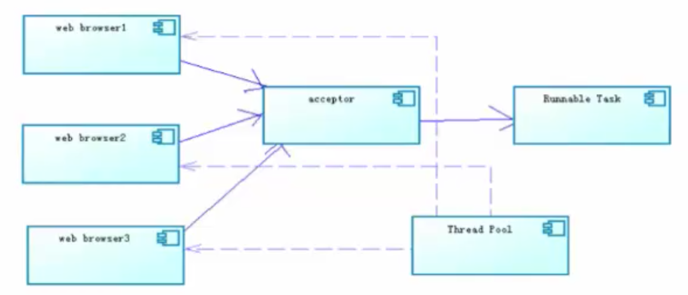
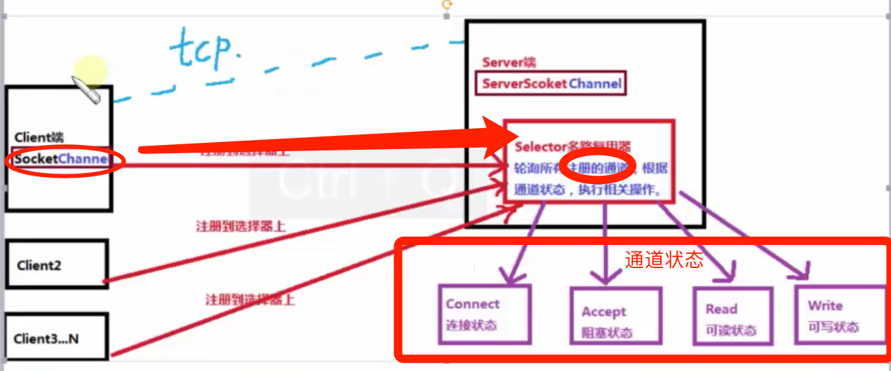
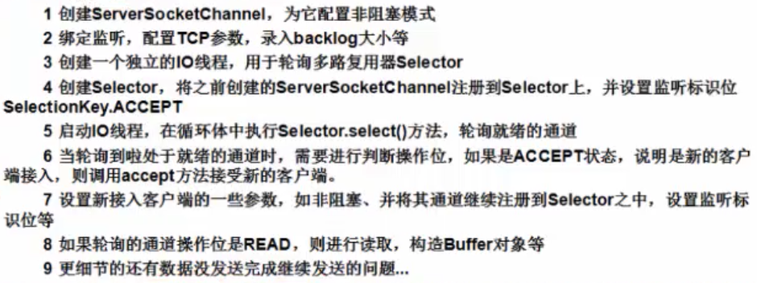
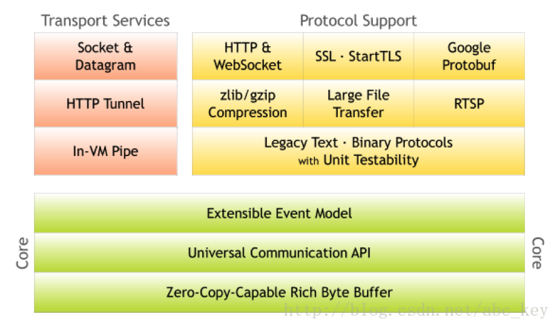
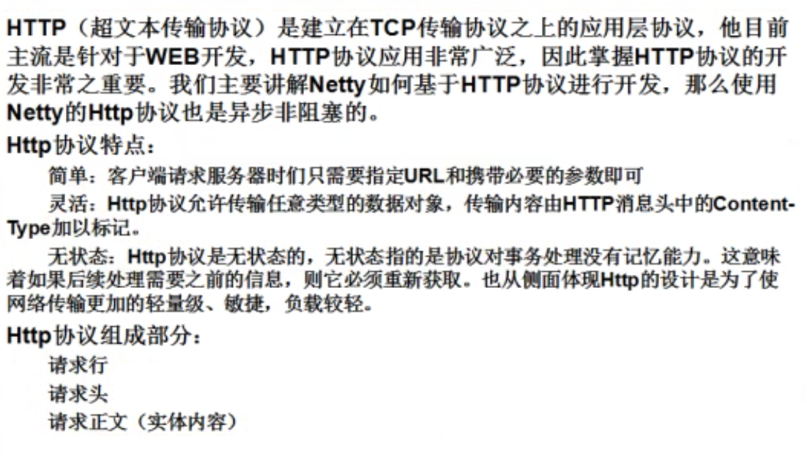
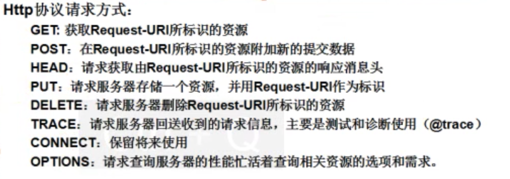
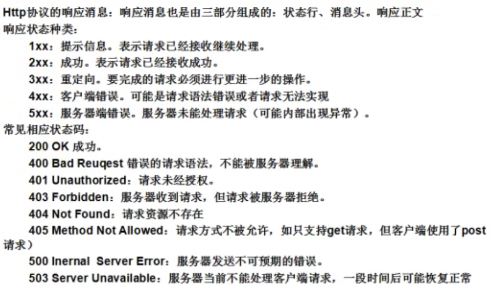

## 网络编程基础篇
### Socket
- Socket又称“套接字”，应用程序通常通过“套接字”向网络发送请求或者应答网络请求。
  -  Socket和ServerSocket类库位于java.net包中。ServerSocket用于服务器端，Socket是建立网络连接时使用的。在连接成功时，应用程序两端都会产生一个Socket实例，操作这个实例，完成所需的会话。对于一个网络连接来说，套接字是平等的，不因为在服务器端或在客户端而产生不同的级别。不管是Socket还是ServerSocket它们的工作都是通过SocketImpl类及其子类完成的。
- 套接字之间的连接过程可以分为四个步骤：服务器监听，客户端请求服务器，服务器确认，客户端确认，进行通信。  
  -  服务器监听：是服务器端套接字并不定位具体的客户端套接字，而是处于等待连接的状态，实时监控网络状态。
  -  客户端请求：是指由客户端的套接字提出连接请求，要连接的目标是服务器端的套接字。为此，客户端的套接字必须首先描述它要连接的服务器的套接字，指出服务器端套接字的地址和端口号，然后向服务器端套接字提出连接请求。
  -  服务器端连接确认：是指当服务器端套接字监听到或者说接收到客户端套接字的连接请求，它就相应客户端套接字的请求，建立一个新的线程，把服务器端套接字的描述发给客户端。
  -  客户端连接确认：一旦客户端确认了此描述，连接就建立好了。双方开始通信。而服务器端套接字继续处于监听状态，继续接受其他客户端套接字的连接请求。
- windows 一般支持1000个线程，Linux辞职2000个线程。
- jdk1.5之前，利用伪异步方式[（线程池+队列）](https://github.com/CentMeng/JavaFrameTest/tree/master/src/com/msj/network/bio2)，解决socket创建client端过多，服务器撑爆问题。jdk1.6通过nio方式。
#### [伪异步IO](https://github.com/CentMeng/JavaFrameTest/tree/master/src/com/msj/network/bio2)
- 采用线程池和任务队列可以实现一种伪异步的IO通信框架。我们学过连接池的使用和队列的使用，其实就是将客户端的socket封装成一个task任务（实现runnable接口的类）然后投递到线程池中去，配置相应的队列进行实现。


#### 基本概念
- IO（BIO）和NIO区别
IO:阻塞型IO,面向流，无选择器
NIO:非阻塞型IO,面向缓冲，选择器
  -  阻塞概念：应用程序在获取网络数据时候，如果网络传输数据很慢，那么程序就一直等着，直到传输完为止。
  -  非阻塞概念：应用程序直接可以获取已经准备就绪好的数据，无需等待。
  -  BIO为同步阻塞形式，NIO为同步非阻塞形式。NIO并没有实现异步，在JDK1.7之后，升级NIO包，支持异步非阻塞通信模型即NIO2.0(AIO)。
  -  同步时，应用程序会直接参与IO读写操作，并且我们的应用程序会直接阻塞到某一个方法上，直到数据准备就绪；或者采用轮询的策略实时检查数据的就绪状态例如NIO，如果就绪则获取数据。
  -  异步时，则所在的IO读写操作交给操作系统处理，与我们的应用程序没有直接关系，我们应用程序不需要关心IO读写，当操作系统完成了IO读写操作时，会给我们应用程序发送通知，我们应用程序直接拿走数据即可。

#### [NIO](https://github.com/CentMeng/JavaFrameTest/tree/master/src/com/msj/network/nio)
NIO本质就是避免原始的TCP建立连接使用3次握手的操作，减少连接的开销。

- [Buffer](https://github.com/CentMeng/JavaFrameTest/tree/master/src/com/msj/network/nio/test/TestBuffer.java)（缓冲区）
Buffer是一个对象，它包含一些要写入或者要读取的数据。在NIO类库中加入Buffer对象，体现了新库与原IO的一个重要的区别。在面向流的IO中，可以将数据直接写入或读取到Stream对象中。在NIO库中，<font color ="#f00">所有数据都是用缓冲区处理的（读写）</font>。缓冲区实质上是一个数组，通常它是一个字节数组（ByteBuffer），也可以使用其他类型的数组。这个数组为缓冲区提供了数据的访问读写等操作属性，如位置、容量、上限等概念，参考api文档。
  -  Buffer类型：我们最常用的就是ByteBuffer，<font color="#f00">实际上每一种java基本类型都对应了一种缓冲区（除了Boolean类型）</font> 。ByteBuffer，CharBuffer，ShortBuffer，intBuffer，LongBuffer，FloatBuffer，DoubleBuffer。
  -  put方法执行完，要调用下flip方法来恢复未知
- Channel(通道)
  -  通道（Channel），它就像自来水管道一样，网络数据通过Channel读取和写入，通道与流不同之处在于通道是双向的，而流只是一个方向上移动（一个流必须是InputStream或者OutputStream的子类），而通道可以用于读、写或者二者同时进行，最关键的是可以与多路复用器结合起来，有多种的状态位，方便多路复用器去识别。事实上通道分为两大类，一类是网络读写的（SelectableChannel），一类是用于文件操作的（FileChannel），我们使用的SocketChannel和ServerChannel都是SelectableChannel的子类。 
- Selector（选择器，多路复用器）
  -  NIO编程的基础，非常重要。多路复用器提供选择已经就绪的任务的能力。简单说，就是Selector会不断地轮询注册在其上的通道（Channel），如果某个通道发生了读写操作，这个通道就处于就绪状态，会被Selector轮询出来，然后通过SelectionKey可以取得就绪的Channel集合，从而进行后续的IO操作。
  -  一个多路复用器可以负责成千上万Channel通道，没有上限，这也是JDK使用了epoll代替了传统的select实现，获得连接句柄没有限制。这也就意味着我们只要一个线程负责Selector的轮询，就可以接入成千上万个客户端，这是JDK NIO库的巨大进步。 
  -  Selector线程就类似一个管理者（Master），管理了成千上万个管道，然后轮询哪个管道的数据已经准备好，通知cpu执行IO的读取或写入操作。
  -  Selector模式：当IO事件（管道）注册到选择器以后，selector会分配给每个管道一个值，相当于标签。selector选择器是以轮询的方式进行查找注册的所有IO事件（管道），当我们的IO事件（管道）准备就绪后，select就会识别，会通过key值来找到相应的管道，进行相关的数据处理操作（从管道里读或写数据，写到我们的数据缓冲区中）。
  -  每个管道都会对选择器进行注册不同的事件状态，以便选择器超找。SelectionKey.OP_CONNECT,  SelectionKey.OP_ACCEPT,SelectionKey.OP_READ,SelectionKey.OP_WRITE。

- NIO通信步骤


#### [AIO](https://github.com/CentMeng/JavaFrameTest/tree/master/src/com/msj/network/aio)
AIO编程，在NIO基础之上引入了异步通道的概念，并提供了异步文件和异步套接字通道的实现，从而在真正意义上实现了异步非阻塞，之前我们学习的NIO只是非阻塞而并非异步。而AIO它不需要通过多路复用器对注册的通道进行轮询操作即可实现异步读写，从而简化了NIO编程模型。也可以称之为NIO2.0，这种模式才真正的属于我们异步非阻塞的模型。

- AsynchronousServerSocketChannel
- AsynchronousScoketChannel

#### 总结 Socket进化史

- BIO（同步阻塞）:就是传统Socket编程，有一个阻塞模型。只要client端和server端要建立一个tcp连接都需要三次握手，三次握手本身性能上就很浪费性能，然后每次我开始必须服务器端先启动，服务器端有个accept方法，使服务器整个程序阻塞着，然后有一个client端进来，accept方法就返回一个Socket对象，然后通过一个新的Thread做数据处理。
- NIO（同步非阻塞）:有一个Client端想接入Server端，两端不是直接连接，通过一个selector。服务器端的通道注册到这个Selector上，然后客户端的一些通道都得注册到这个Selector。然后轮询这个Selector，把里面Channel根据不同状态处理相对应的事务。一个Selector（也就是可以通过一个线程）接入成千上万个客户端，接入过程需要自己实现。
- AIO（异步非阻塞）:自己有一堆线程组，轮询过程不用代码写，里面已经封装好了，有一个client端过来，通过线程组某一个线程和client端接入。接入之后，会有代码和client端读写实际处理操作。在BIO里面，读写操作是new一个Thread去单独交互，这样很浪费性能。在AIO是new一个对象[ServerCompletionHandler](https://github.com/CentMeng/JavaFrameTest/tree/master/src/com/msj/network/aio/ServerCompletionHandler.java)，***但是只支持接入一个对象，接入一个对象后程序就停了，所以如果想接入第二个对象，需要在handler里面进行递归操作。并且在Handler里面处理读写***

## [Netty](http://netty.io)
为什么选择Netty？简单，实现Socket通信不必去需写复杂的代码逻辑，不用去考虑性能，不需要考虑编解码问题，半包读写问题等。得到成百上千的商业/商用项目验证，如Hadoop的RPC框架Avro，和JMS框架，RocketMQ，还有主流的分布式通信框架Dubbox等等。

学习网址：[http://ifeve.com/netty5-user-guide/](http://ifeve.com/netty5-user-guide/) 示例：[test](https://github.com/CentMeng/JavaFrameTest/tree/master/src/com/msj/network/netty/test)
### Netty初步
- Netty框架

- Netty特性

- Netty实现通信的步骤
  1.  创建两个NIO线程组，一个专门用于网络事件处理(接受客户端连接)，另一个则进行网络通信读写（实际业务处理）。
  2.  创建一个ServerBootstrap对象，配置Netty的一系列参数，例如接受传出数据的缓存大小等等。
  3.  创建一个实际处理数据的类ChannelInitializer,并进行初始化的准备工作，比如设置接受传出数据的字符集、格式、已经实际处理数据的接口。
  4.  绑定接口，执行同步阻塞方法等待服务器启动即可。
- Netty使用场景
  -  放到Tomcat里
  -  [利用maven打成jar包](https://github.com/CentMeng/JavaFrameTest/tree/master/src/com/msj/network/netty/mave生成jar包_pom.xml)，直接放到系统中运行 

```xml
	<build>
		<!-- 配置文件  -->
		
		<resources>
			<resource>
				<targetPath>${project.build.directory}/classes</targetPath>
				<directory>src/main/resources</directory>
				<filtering>true</filtering>
				<includes>
					<include>**/*.xml</include>
					<include>**/*.properties</include>
				</includes>
			</resource>
			<resource>
				<targetPath>${project.build.directory}/classes/META-INF</targetPath>
				<directory>src/main/resources</directory>
				<filtering>true</filtering>
				<includes>
					<include>spring-context.xml</include>
				</includes>
			</resource>
		</resources>	
		
		
		<pluginManagement>
			<plugins>
				<!-- 解决Maven插件在Eclipse内执行了一系列的生命周期引起冲突 -->
				<plugin>
					<groupId>org.eclipse.m2e</groupId>
					<artifactId>lifecycle-mapping</artifactId>
					<version>1.0.0</version>
					<configuration>
						<lifecycleMappingMetadata>
							<pluginExecutions>
								<pluginExecution>
									<pluginExecutionFilter>
										<groupId>org.apache.maven.plugins</groupId>
										<artifactId>maven-dependency-plugin</artifactId>
										<versionRange>[2.0,)</versionRange>
										<goals>
											<goal>copy-dependencies</goal>
										</goals>
									</pluginExecutionFilter>
									<action>
										<ignore />
									</action>
								</pluginExecution>
							</pluginExecutions>
						</lifecycleMappingMetadata>
					</configuration>
				</plugin>
			</plugins>
		</pluginManagement>
		<plugins>
			<!-- 打包jar文件时，配置manifest文件，加入lib包的jar依赖 -->
			<plugin>
				<groupId>org.apache.maven.plugins</groupId>
				<artifactId>maven-jar-plugin</artifactId>
				<configuration>
					<classesDirectory>target/classes/</classesDirectory>
					<archive>
						<manifest>
							<mainClass>tpri.mina.execute.Main</mainClass>
							<!-- 打包时 MANIFEST.MF文件不记录的时间戳版本 -->
							<useUniqueVersions>false</useUniqueVersions>
							<addClasspath>true</addClasspath>
							<classpathPrefix>lib/</classpathPrefix>
						</manifest>
						<manifestEntries>
							<Class-Path>.</Class-Path>
						</manifestEntries>
					</archive>
				</configuration>
			</plugin>
			<plugin>
				<groupId>org.apache.maven.plugins</groupId>
				<artifactId>maven-dependency-plugin</artifactId>
				<executions>
					<execution>
						<id>copy-dependencies</id>
						<phase>package</phase>
						<goals>
							<goal>copy-dependencies</goal>
						</goals>
						<configuration>
							<type>jar</type>
							<includeTypes>jar</includeTypes>
							<useUniqueVersions>false</useUniqueVersions>
							<outputDirectory>
								${project.build.directory}/lib
							</outputDirectory>
						</configuration>
					</execution>
				</executions>
			</plugin>
		</plugins>
	</build>
```

### [HelloWorld](https://github.com/CentMeng/JavaFrameTest/tree/master/src/com/msj/network/netty/helloworld)
- 对于ChannelOption.SO_BACKLOG的讲解
  *  服务器端TCP内核模块维护2个队列，我们称之为A，B
  *  客户端向服务器端connect的时候，会发送带有SYN标志的包（第一次握手）
  *  服务器收到客户端发来的SYN的时，向客户端发送SYN ACK确认（第二次握手）
  *  此时TCP内核模块把客户端连接加入到A队列中，然后服务器收到客户端发过来的ACK时（第三次握手），
  *  TCP内核模块把客户端连接从A队列移到B队列，连接完成，应用程序的accept回返回。
  *  也就是accept从B队列中取出完成三次握手的连接。
  *  A队列和B队列的长度之和是BACKLOG。当A,B队列的长度之和大于BACKLOG的时候，新连接将会被TCP内核拒绝。
  *  所以，如果BACKLOG过小，可能会出现accept速度跟不上，A，B队列满了，导致新的客户端无法连接
  *  要注意的是：BACKLOG对程序支持的连接数并没有影响，BACKLOG只是影响了还没有被accept取出的连接。
- ChannelHandlerAdapter的channelRead方法中的Object，如果没有write方法，最后要释放。
```
ReferenceCountUtil.release(msg);
```
- 一个ServerBootstrap可以绑定多个端口，增加了接收数据能力

### Netty核心技术之（TCP拆包和粘包问题）
熟悉TCP编程的可能都知道，无论是服务器端还是客户端，当我们读取或者发送数据的时候，都需要考虑TCP底层的粘包/拆包机制。

- TCP是一个“流”协议，所谓流就是没有界限的遗传数据。大家可以想象下如果河里的水就好比数据，他们是连成一片的，没有分界线，TCP底层并不了解上层的业务数据具体的含义，它会根据TCP缓冲区的实际情况进行包的划分，也就是说，在业务上，我们一个完整的包可能会被TCP分成多个包进行发送，也可能把多个小包封装成一个大的数据包发送出去，这就是所谓的TCP粘包、拆包问题。（例如，实际业务发送“ABC DEF GHI”这些数据分成“ABC”."DEF","GHI"三个包发送,但实际TCP是“流”协议，实际发送可能是“AB”,"DEFG","HI"）

- TCP粘包、拆包问题产生的原因：
  -  应用程序write写入的字节大小大于套接口发送缓冲区的大小
  -  进行MSS大小的TCP分段
  -  以太网帧的payload大于MTU进行IP分片 
- TCP粘包、拆包问题解决方案（前两种解决方案netty已经实现）

(1)  消息定长，例如每个报文的大小固定为200个字节，如果不够，空位补空格。（netty解决方案：[FixedLengthFrameDecoder](https://github.com/CentMeng/JavaFrameTest/tree/master/src/com/msj/network/netty/ende2)【定长】）

```
 .childHandler(new ChannelInitializer<SocketChannel>() {
			@Override
			protected void initChannel(SocketChannel sc) throws Exception {
				//设置定长字符串接收
				sc.pipeline().addLast(new FixedLengthFrameDecoder(5));
				//设置字符串形式的解码,write时候还是buffer但是handler接收时候可以直接强转成string
				sc.pipeline().addLast(new StringDecoder());
				sc.pipeline().addLast(new ServerHandler());
			}
		});
```
(2)  在包尾部增加特殊字符进行分割，例如加回车等（netty解决方案：分隔符类[DelimiterBasedFrameDecoder](https://github.com/CentMeng/JavaFrameTest/tree/master/src/com/msj/network/netty/ende1)【自定义分隔符】）

```
   .childHandler(new ChannelInitializer<SocketChannel>() {
			@Override
			protected void initChannel(SocketChannel sc) throws Exception {
				//设置特殊分隔符
				ByteBuf buf = Unpooled.copiedBuffer("$_".getBytes());
				sc.pipeline().addLast(new DelimiterBasedFrameDecoder(1024, buf));
				//设置字符串形式的解码,write时候还是buffer但是handler接收时候可以直接强转成string
				sc.pipeline().addLast(new StringDecoder());
				sc.pipeline().addLast(new ServerHandler());
			}
		});
```
(3)  将消息分为消息头和消息体，在消息头中包含表示消息总长度的字段，然后进行业务逻辑的处理（自定义协议【百度搜索netty自定义协议】）
 
### Netty核心技术之（编解码技术【传递对象】）
编解码技术，说白了就是java序列化技术，序列化的目的就两个，第一进行网络传输，第二对象持久化。

虽然我们可以使用java进行对象序列化，netty去传输，但是java序列化的硬伤太多，比如java序列化没法跨语言、序列化后码流太大、序列化性能太低等等。
- 主流的编解码框架
  -  JBoss的Marshalling包
  -  google的Protobuf
  -  基于Protobuf的Kyro（dubbo中会讲解）
  -  MessagePack框架
  
-  最简单的跨平台传递对象方法是使用json
- ***序列化的时候，客户端，服务端都要有要序列化的对象，并且包名，类名都一样***
- 兼容操作系统的分隔符：File.separatorChar

#### [JBoss Marshalling](https://github.com/CentMeng/JavaFrameTest/tree/master/src/com/msj/network/netty/serial)
JBoss Marshalling是一个java对象序列化包，对JDK默认的序列化框架进行了优化，但又保持跟java.io.Serializable接口的兼容，同时增加了一些可调的参数和附加特性。
类库：jboss-marshalling-1.3.0、jboss-mashalling-serial-1.3.0

下载地址：[https://www.jboss.org/jbossmarshalling/downloads](https://www.jboss.org/jbossmarshalling/downloads)

示例：[Netty+Marshalling](https://github.com/CentMeng/JavaFrameTest/tree/master/src/com/msj/network/netty/serial)

```
.childHandler(new ChannelInitializer<SocketChannel>() {
			protected void initChannel(SocketChannel sc) throws Exception {
				sc.pipeline().addLast(MarshallingCodeCFactory.buildMarshallingDecoder());
				sc.pipeline().addLast(MarshallingCodeCFactory.buildMarshallingEncoder());
				sc.pipeline().addLast(new ServerHandler());
			}
		});
```
[MarshallingFactory](https://github.com/CentMeng/JavaFrameTest/tree/master/src/com/msj/network/netty/serial/MarshallingCodeCFactory.java)

```Java
/**
 * Marshalling工厂
 */
public final class MarshallingCodeCFactory {

    /**
     * 创建Jboss Marshalling解码器MarshallingDecoder
     * @return MarshallingDecoder
     */
    public static MarshallingDecoder buildMarshallingDecoder() {
    	//首先通过Marshalling工具类的精通方法获取Marshalling实例对象 参数serial标识创建的是java序列化工厂对象。
		final MarshallerFactory marshallerFactory = Marshalling.getProvidedMarshallerFactory("serial");
		//创建了MarshallingConfiguration对象，配置了版本号为5 
		final MarshallingConfiguration configuration = new MarshallingConfiguration();
		configuration.setVersion(5);
		//根据marshallerFactory和configuration创建provider
		UnmarshallerProvider provider = new DefaultUnmarshallerProvider(marshallerFactory, configuration);
		//构建Netty的MarshallingDecoder对象，俩个参数分别为provider和单个消息序列化后的最大长度，解码大于这个长度就不处理
		MarshallingDecoder decoder = new MarshallingDecoder(provider, 1024 * 1024 * 1);
		return decoder;
    }

    /**
     * 创建Jboss Marshalling编码器MarshallingEncoder
     * @return MarshallingEncoder
     */
    public static MarshallingEncoder buildMarshallingEncoder() {
		final MarshallerFactory marshallerFactory = Marshalling.getProvidedMarshallerFactory("serial");
		final MarshallingConfiguration configuration = new MarshallingConfiguration();
		configuration.setVersion(5);
		MarshallerProvider provider = new DefaultMarshallerProvider(marshallerFactory, configuration);
		//构建Netty的MarshallingEncoder对象，MarshallingEncoder用于实现序列化接口的POJO对象序列化为二进制数组
		MarshallingEncoder encoder = new MarshallingEncoder(provider);
		return encoder;
    }
}

```
### [Netty的UDP实现](https://github.com/CentMeng/JavaFrameTest/tree/master/src/com/msj/network/netty/udp)
### [Netty的WebSocket实现](https://github.com/CentMeng/JavaFrameTest/tree/master/src/com/msj/network/netty/websocket)
webSocket将网络套接字引入到了客户端和服务端，众所周知，我们实现聊天功能，可能需要古老的Socket技术，亦或者是古老的DWR框架，方向Ajax技术，再有可能就是Comet服务器推技术，H5的webSocket很轻松的可以进行聊天功能实现，Netty和H5的WebSocket结合非常的简单，Netty为我们封装了其协议类，我们可以很方便的进行使用。

- ws特点：
  -  单一的TCP连接，双方可通信
  -  对代理，防火墙和路由器透明
  -  无头部信息、Cookie和身份验证
  -  无安全开销
  -  通过ping/pong帧保持链路激活
  -  服务器可主动传递消息给客户端，不再需要客户端轮询

### 最佳实践（数据通信，心跳检测）
#### [数据通信](https://github.com/CentMeng/JavaFrameTest/tree/master/src/com/msj/network/netty/runtime)
- 我们需要考虑的问题是两台机器（甚至多台）使用Netty是怎样进行通信，个人大体上分为三类：
  -  第一种，使用长连接通道不断开的形式进行通信，也就是服务器和客户端的通道一直处于开启状态，如果服务器性能足够好，并且我们的客户端数量也比较少的情况下，还是推荐这种方式的。
  -  第二种，一次性批量提交数据，采用短连接方式。也就是我们会把数据保存在本地临时缓冲区或者临时表里，当达到临界值时进行一次性批量提交，又或者根据定时任务轮询提交，这种情况弊端是做不到实时性传输，在对实时性要求不高的应用程序中可以推荐使用。
  -  第三种，我们可以使用一种特殊的长连接，在指定某一时间之内（比如设置60秒），服务器与某台客户端没有任何通信（60秒内没有任何通信），则断开连接。下次连接则是客户端向服务器发送请求的时候，再次建立连接。但是，这种模式我们需要考虑2种因素：

(1）如何在超时（即服务器和客户端没有任何通信）后关闭通道？关闭通道后我们又如何再次建立连接？ ***[解决方案:如下代码](https://github.com/CentMeng/JavaFrameTest/tree/master/src/com/msj/network/netty/runtime/Client.java)***
  
```Java
  public void connect(){
		try {
			this.cf = b.connect("127.0.0.1", 8765).sync();
			System.out.println("远程服务器已经连接, 可以进行数据交换..");				
		} catch (Exception e) {
			e.printStackTrace();
		}
	}
	
	public ChannelFuture getChannelFuture(){
		
		if(this.cf == null){
			this.connect();
		}
		if(!this.cf.channel().isActive()){
			this.connect();
		}
		
		return this.cf;
	}
```
  （2）客户端宕机，我们无需考虑，下次客户端重启之后我们就可以与服务器建立连接，但是服务器宕机时，我们的客户端如何与服务器建立连接？ ***解决方案:写个脚本，定时轮询，给服务器发连接，看服务器是否启动，启动了就重新创立连接。如果客户端是java的，可以通过spring的定时任务，定时看服务器好没好，好则保持通讯***

  ```
//两端都需要加，当服务器端与客户端在指定时间以上没有任何进行通信，则会关闭响应的通道，主要为减小服务端资源占用
sc.pipeline().addLast(new ReadTimeoutHandler(5)); 
  ``` 
  ***两端如果client端和server端设置超时时间不一样，则短的一方先单一断开，等时间长的一方时间到，双方才会断开连接。***
 
#### [心跳检测](https://github.com/CentMeng/JavaFrameTest/tree/master/src/com/msj/network/netty/heartBeat)
我们使用Socket通信一般经常会处理多个服务器之间的心跳检测，一般来讲我们去维护服务器集群，肯定有一台（或几台）服务器主机（Master），然后还应该有N台从节点（Slave），那么我们主机肯定要时时刻刻知道自己下面的从服务器的各方面情况，然后进行实时监控的功能，这个在分布式架构里叫做心跳检测或者说心跳监控。最佳处理方案，建议使用一些通信框架进行实现,Netty就可以去做这样一件事。一般每隔5秒-10秒心跳一次。

- 如果跨域的话，还要考虑安全问题，可以采用SSL或者其他方案解决。
  -  从节点调用通道激活方法，把auth发送给主节点
  -  主节点认证后，主从节点才可以通信     
- 使用sigar.jar包方法获取系统信息。
[Sigar API](https://github.com/CentMeng/JavaFrameTest/tree/master/src/com/msj/utils/TestSigar.java) 提供一个方便的接口来收集系统信息，如：
  -  系统内存，页面交换，cpu，平均负载，运行时间，登录信息
  -  每个进程占用的内存，cpu，帐号信息，状态，参数，环境，打开的文件
  -  文件系统探测和度量
  -  网络接口探测，配置信息和度量
  -  网络路由和连接表
- ***使用sigar.jar需要把[hyperic-sigar-1.6.4.zip](https://github.com/CentMeng/JavaFrameTest/tree/master/src/com/msj/network/netty/doc/hyperic-sigar-1.6.4.zip)文件中找到sigar-bin/lib目录下对应系统的文件到JAVA_HOME/bin目录下或者JAVA_HOME/jre/bin目录,否则获取不到信息***

### Netty实现文件服务器（基于HTTP协议）




#### [Netty文件上传](https://github.com/CentMeng/JavaFrameTest/tree/master/src/com/msj/network/netty/upload)