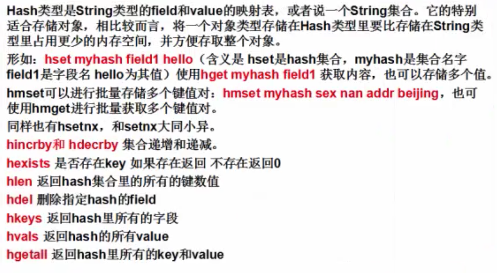
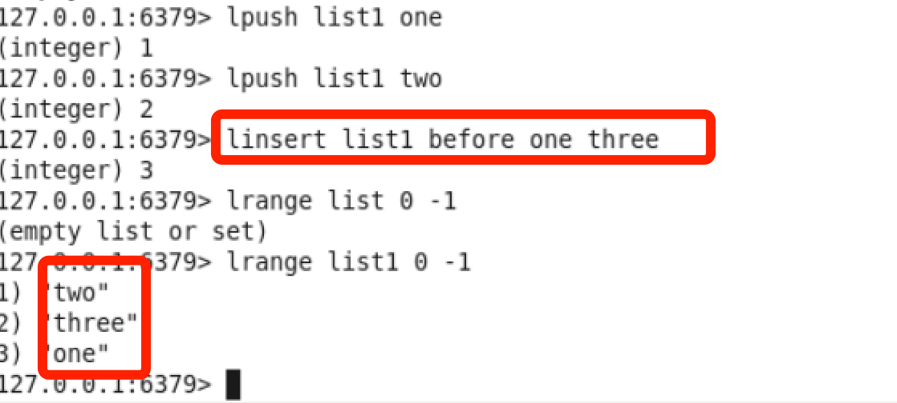
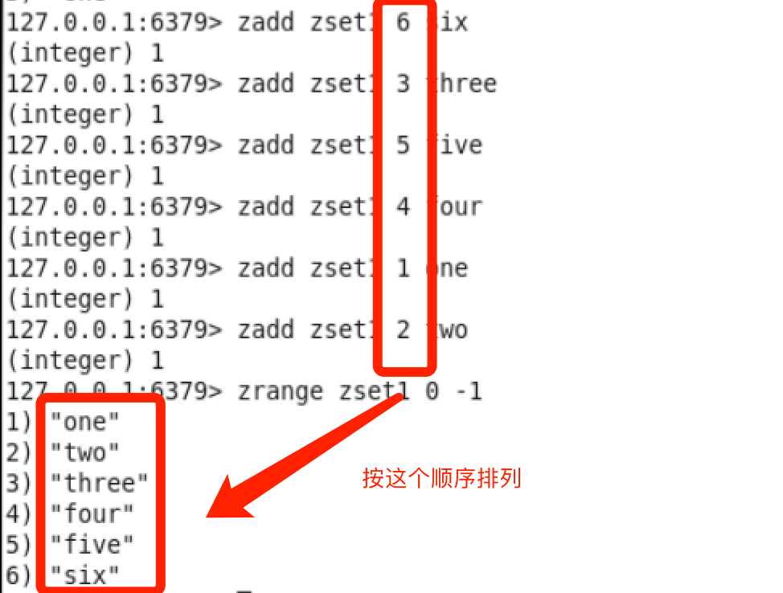
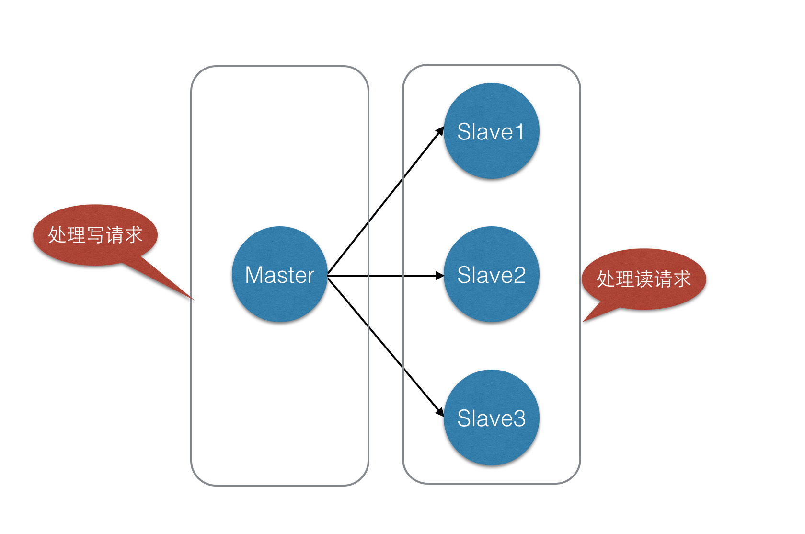
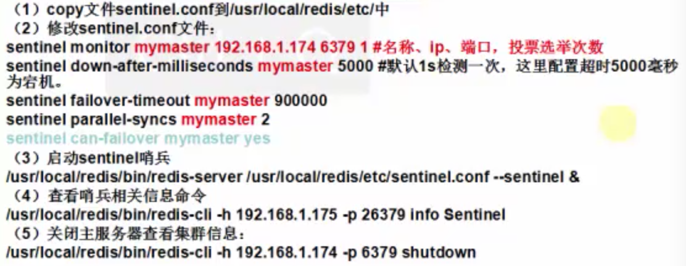
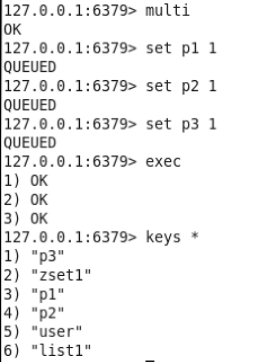
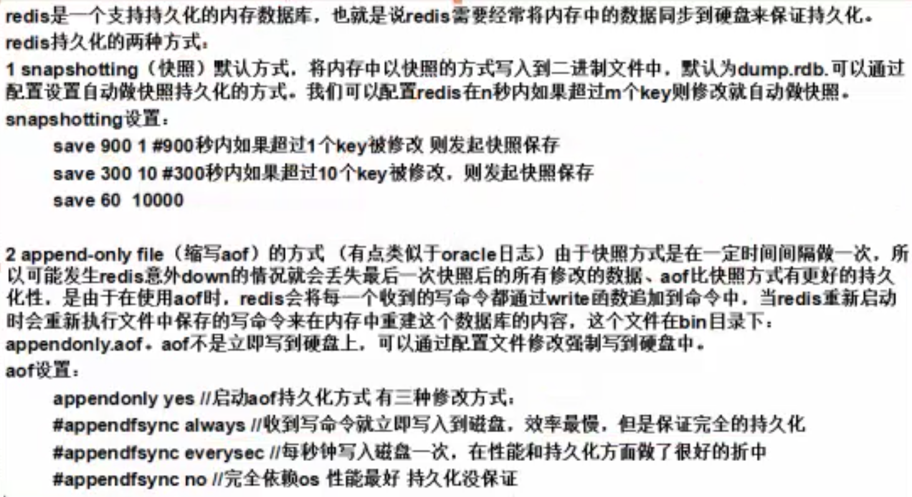
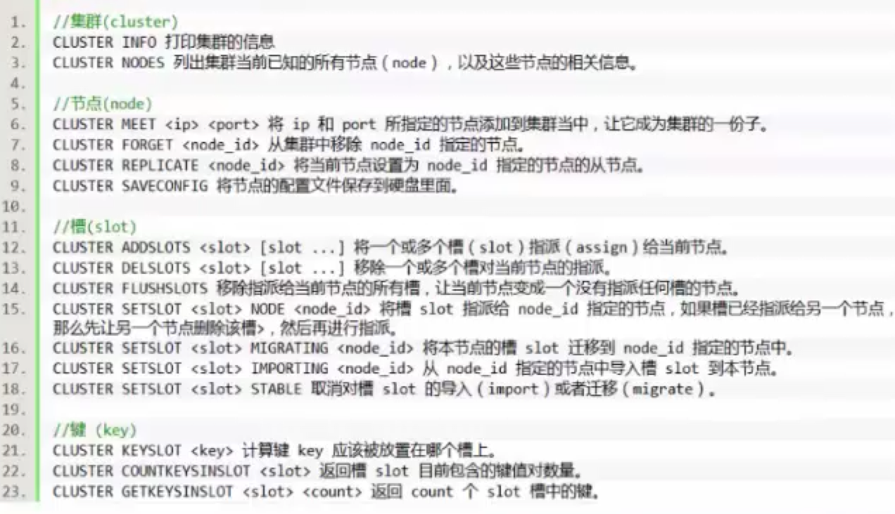

# Redis
## NOSQL(Redis)简介，Redis安装与部署
### NOSQL简介
NOSQL，泛指非关系型的数据库，NoSql数据库的四大分类：

- 键值（Key-Value）存储数据库：这一类数据库主要会使用到一个哈希表，这个表中有一个特定的键和一个指针指向特定的数据。如Redis，Voldemort，Oracle BDB
- 列存储数据库：这部分数据库通常是用来应对分布式存储的海量数据。键依然存在，但是它们的特点是指向了多个列。如HBase，Riak
-  文档型数据库：该类型的数据模型是版本化的文档，半结构化的文档以特定的格式存储，比如JSON。文档型数据库可以看作是键值数据库的升级版，允许之间嵌套键值。而且文档型数据库比键值数据库的查询效率更高。如：CouchDB，MongoDB
- 图形数据库：图形结构的数据库同其他行列以及刚性结构的Sql数据库不同，它是使用灵活的图形模型，并且能够扩展到多个服务器上。NoSql数据库没有标准的查询语言（SQL），因此进行数据库查询需要制定数据模型。许多NoSql数据库都有REST式的数据接口或者查询API。如：Neo4J,InfoGrid，Infinite Graph

### 非关系型数据库特点
- 数据模型比较简单
- 需要灵活性更强的IT系统
- 对数据库性能要求较高
- 不需要高度的数据一致性
- 对于给定key，比较容易映射复杂值的环境

### Redis简介
是以key-value形式存储，和传统的关系型数据库不一样，不一定遵循传统数据库的一些基本要求（非关系型的、分布式的、开源的、水平可扩展的）

优点：

- 对数据高并发读写
- 对海量数据的高效率存储和访问
- 对数据的可扩展性(横向扩展【从节点扩充】和纵向扩展【主节点变成子节点】)和高可用性（存储到内存中，断电消失，刷数据到硬盘上【有RDB（同步到硬盘）和AOF（日志方式恢复）两种方式来实现】）

缺点：

- redis（ACID处理非常简单）
- 无法做到太复杂的关系数据库模型

Redis是以key-value store存储，data structure service 数据结构服务器。键可以包含：（string）字符串，哈希，（list）链表，（set）集合，（zset）有序集合。这些数据集合都支持push/pop、add/remove及取交集和并集以及更丰富的操作，redis支持各种不同的方式排序，为了保证效率，数据都是缓存在内存中，<font color = "#f00">它也可以周期性的把更新的数据写入磁盘[RDB方式]或者把修改操作写入追加到文件[AOF方式]。</font> 

- memorycache实例是并行的，redis实例是串行的。
- Redis慢了怎么办？
  -  原因可能因为：开启AOF模式，多并发情况下会影响写的性能，因为需要记录日志
  -  解决方案1：2.0可以调虚拟机参数，3.0出了集群参数基本无用了。可以采取多加，分担写的高并发压力。
  -  解决方法2：采用另外一种NoSql数据库，ssdb（写的性能比较好） 

### Redis安装与部署
下载地址：[http://redis.io/download](http://redis.io/download)

安装步骤：

1. 首先需要安装gcc，把下载好的redis-3.0.0-rc2.tar.gz 放到linux /usr/local文件夹下
2. 进行解压 tar -zxvf redis-3.0.0-rc2.tar.gz
3. 进入到redis-3.0.0目录下，进行编译 make
4. 进入到src下进行安装 make install  验证(ll查看src下的目录，有redis-server 、redis-cil即可)
5. 建立俩个文件夹存放redis命令和配置文件
  -  mkdir -p /usr/local/redis/etc
  -  mkdir -p /usr/local/redis/bin
6. 把redis-3.0.0下的redis.conf 移动到/usr/local/redis/etc下，
  -  cp redis.conf /usr/local/redis/etc/
7. 把redis-3.0.0/src里的mkreleasehdr.sh、redis-benchmark、redis-check-aof、redis-check-dump、redis-cli、redis-server 
文件移动到bin下，命令：

  -  mv mkreleasehdr.sh redis-benchmark redis-check-aof redis-check-dump redis-cli redis-server /usr/local/redis/bin(如果没有redis-check-dump尝试cp redis-check-rdb /usr/local/redis/bin)

8. 启动时并指定配置文件：./redis-server /usr/local/redis/etc/redis.conf（注意要使用后台启动，所以修改redis.conf里的 daemonize 改为yes)

9. 验证启动是否成功：

  -  ps -ef | grep redis 查看是否有redis服务 或者 查看端口：netstat -tunpl | grep 6379

  -  进入redis客户端 ./redis-cli 退出客户端quit

  -  退出redis服务三种方式： 

（1）pkill redis-server 、

（2）kill 进程号、                       

（3）/usr/local/redis/bin/redis-cli shutdown 

***rdb文件是redis存放数据的文件***

### 命令

redis-cli(进入redis客户端)

keys *（查看redis内容）

set name msj（插入内容key是name，value是msj）

get name（查看key为name的内容）

del name（删除key为name的内容）

quit（关闭redis客户端）

redis-cli shutdown（进入redis-cli文件所在夹，此命令关闭redis服务）

## Redis基础数据类型详解

redis一共分为五种数据类型：String、Hash、List、Set、ZSet

### String类型
String类型是包含很多种类型的特殊类型，并且是二进制安全的。比如序列化的对象进行存储，比如一张图片进行二进制存储，比如一个简单的字符串，数值等等。

#### set和get方法：

- 设置值：<font color = "#f00">set</font> name msj 取值 <font color = "#f00">get</font> name（设置name多次会覆盖）
- 删除值：del name

#### 使用set<font color = "#f00">nx（not exist）</font>

- name 如果不存在进行设置，存在就不需要进行设置了，返回0

#### 使用set<font color = "#f00">zreex （expired）</font>

- setex color 10 red 设置color的有效期为10秒，10秒后返回nll（在redis里nll表示空）

#### 使用setrange 替换字符串 
- set email mengshaojie@188.com
- setrange email <font color = "#f00">10</font> ww<font color = "#f00">（10表示从第几位开始替换（是下标值即正常值-1），后面跟上替换的字符串，后面字符串有几位则替换几位）</font>

#### 使用一次性设置多个和获取多个值的mset，mget方法：
- mset key1 msj key2 msj2 key3 28; 对应的 mget key1 key2 key3 方法，对应的也有msetnx和mget方法
- 一次性设置和取值的getset方法：
  -  set key4 cc
  -  getset key4 changchun 返回旧值并设置新值的方法

#### incr和decr方法：对某一个值进行递增和递减等同于i++，i--
#### incrby和decrby方法：对某个值进行指定长度的递增和递减  (语法：incrby key [步长]) 等同于 i += 步长
#### append[name]方法：字符串追加方法
#### strien[name]方法：获取字符串的长度 

### Hash类型


- 存储一个对象，对象有几十个字段，假如频繁取一个字段，那么不适宜把字段放到对象中缓存，影响效率（根据不同业务做不同的策略）。

```
hset user name msj
hset user age 18
hset user sex man
hget user(报错)--》查看键值使用hkeys user，查看value使用hvals user，查看键值和value使用hgetall user
hmget user name age sex（查看多个值）
hlen user
hdel user
```

### List类型
List类型是一个链表结构的结合，其主要功能有push、pop、获取元素等。更详细的说，List类型是一个双端链表的结构，我们可以通过相关操作进行集合的头部或者尾部添加删除元素，list的设计非常简单精巧，既可以作为栈，又可以作为队列。

#### Ipush方法：从头部加入元素（栈）先进后出
- lpush list1 “hello” lpush list1 “world”
- lrange list1 0 -1(表示从头取到末尾)

#### rpush方法：从尾部加入元素（队列）先进先出
- rpush list2 “beijing” rpush list2 “sxt”
- lrang list2 0 -1

#### linsert方法：插入元素
- linsert list3 before [集合的元素][插入的元素]


#### lset方法：将指定下标的元素替换掉
- lset list1 two 2
#### lrem方法：删除元素，返回删除的个数（下标）
- lset list1 移除几个 移除的字段
#### ltrim方法：保留指定key的值范围内的数据
- ltrim list 2 3 （加入队列有8个元素，则只保留了下标是2-下标3的元素）
#### lpop方法：从list的头部删除元素，并返回删除元素
- lpop list1
#### rpop方法：从list的尾部删除元素，并返回删除元素
- rpop list1
#### rpoplpush：第一步从尾部删除元素，然后第二步并从头部加入元素
#### lindex方法：返回名称为key的list中index未知的元素
#### llen方法：返回元素的个数

### set（无序）类型和zset（有序）类型
set集合是string类型的无序集合，set是通过hashtable实现的，对集合我们可以取交集、并集、差集。

#### sadd方法：向名称为key的set中添加元素
- set集合不允许重复元素 smembers查看set集合的元素

#### srem方法：删除set集合元素
#### spop方法：随机返回删除的key
#### sdiff方法：返回两个集合的不同元素（哪个集合在前面就以哪个集合为标准）
#### sdiffstore方法：将返回的不同元素存储到另外一个集合里
- 这里是把set1和set2的不同元素（以set1为准）存储到set3集合里
- sdiffstore set3 set1 set2

#### sinter方法：返回集合的交集
#### sinterstore方法：返回交集结果，存入set3中
#### sunion方法：取并集
#### sunionstore：取得并集，存入set3中
#### smove方法：从一个set集合移动到另一个set集合里
- 将set1中的元素移动到set2中（相当于剪切粘贴）
- smove set1 set2

#### scard方法：查看集合里元素个数
#### sismember方法：判断某元素是否为集合中的元素
- 返回1代表是集合中的元素，0代表不是

#### srandmember方法：随机返回一个元素
zadd向有序集合中添加一个元素，该元素如果存在，则更新顺序
- 在重复插入的时候 会根据顺序属性更新

- 想查看索引则使用 zrange zset1 0 -1 withscores

#### zrem 删除名称为key的zset中的元素member
#### zincrby 以指定值去自动递增或者减少，用法和之前的incrby类似
#### zrangebyscore 找到指定区间范围的数据进行返回
#### zremrangebyrank 删除1到1（只删除索引1）
#### zremrangebyscore 删除指定序号
#### zrank返回排序索引 从小到大排序（升序排序之后再找索引）
- 注意 一个是顺序号 一个是索引 zrank返回的是索引

#### zrevrank 返回排序索引 从大到小排序（降序排列之后再找索引）
#### zrangebyscore zset1 2 3 withscores 找到指定区间范围的数据进行返回
#### zcard 返回集合里所有元素的个数
#### zcount 返回集合中score在给定区间中的数量
#### zremrangebyrank zset 【from】【to】（删除索引）
#### zremrangebyscore zset [from] [to] (删除指定序号) 

## Redis高级命令
- 返回满足的所有键keys * （可以模糊查询 keys list*）
- exists 是否存在指定的key
- expire 设置某个key的过期时间，使用ttl查看剩余时间

```
  expire name 5
  ttl name
```

- persist 取消过期时间
- select 选择数据库 数据库为0到15（一共16个数据库）默认进入的是0数据库【是逻辑划分不是物理划分即不是第一个数据库1个G，第二个数据库1个G，而是16个数据库供多少G，然后逻辑划分】

```
set name msj
set name1 msj1
keys *
select 0
keys *
select 1
keys *
```

- move [key][数据库下标] 将当前数据中的key转移到其他数据库中

```
move name 2
select 2
keys *
```

- randomkey 随机返回数据库里的一个key
- rename 重命名key

```
rename name name3
```

- echo 打印命令
- dbsize 查看数据库的key数量

```
dbsize
```

- info获取数据库信息

```
info
其中的信息解释：
cluster_enabled:0 0表示没开启，此处表示没开启集群模式
```

- config get 实时存储收到的请求（返回相关的配置信息）

```
config get * 返回所有配置
```

- flushdb 清空当前数据库，flushall清空所有数据库

### Redis的安全性
因为redis速度相当快，所以在一台比较好的服务器下，一个外部用户在一秒内可以进行15w次的密码尝试，这意味着你需要设定非常强大的密码来防止暴力破解。

vi编辑redis.conf 文件，找到下面进行保存修改

```
#requirepass foobared
requirepass ****(密码)
```
重启服务器 pkill redis-server 

再次进入127.0.0.1：6379>keys *
(error)NOAUTH Authentication required

会发现没有权限进行查询127.0.0.1:6379> auth bhz

OK 输入密码则成功进入

每次进入的时候都要输入密码，还有种简单的方式：

直接登录授权：redis-cli -abhz

### 主从复制(主服务器可以读写，从服务器只可读)
推荐博客：[http://blog.csdn.net/hechurui/article/details/49508813](http://blog.csdn.net/hechurui/article/details/49508813)

#### 场景
电子商务网站上的商品，一般都是一次上传，无数次浏览的，说专业点也就是”多读少写”。


#### 优点
- 读写分离，不仅可以提高服务器的负载能力（配置好后自动做负载均衡），并且可以根据读请求的规模自由增加或者减少从库的数量
- 数据被复制成了了好几份，就算有一台机器出现故障，也可以使用其他机器的数据快速恢复。

#### 主从复制：
- Master可以拥有多个slave
- 多个slave可以连接同一个master外，还可以连接到其他的slave[即主连多个从，从又连多个从，这种情况一般不用]
- 主从复制不会阻塞master在同步数据时，master可以继续处理client请求
- 提供系统的伸缩性

#### 主从复制过程：
1. slave与master建立连接
2. master会开启一个后台进程，将数据库快照保存到文件中，同时master主进程会开始收集新的写命令并缓存
3. 后台完成保存后，就将文件发送给slave
4. slave将此文件保存到硬盘上

#### 主从复制配置
clone服务器之后修改slave的IP地址还要修改mac地址

修改配置文件（从服务器）：/usr/local/redis/etc/redis.conf

1. slaveof <masterip> <masterport>
2. masterauth <master-password>

scp -r 本地路径/ 远程路径 （copy文件或文件夹到远程电脑路径下）
例如：scp -r redis 192.168.1.123:/usr/local/

使用info查看role角色即可知道是主服务或从服务

### 哨兵
有了主从复制的实现以后，我们如果想对主从服务器进行监控，那么在redis2.6以后提供了一个“哨兵”机制，在2.6版本中的哨兵为1.0版本，并不稳定，会出现各种各样的问题。在2.8以后的版本哨兵功能稳定起来。

redis哨兵的启动和redis实例的启动没有关系。所以可以在任何机器上启动redis哨兵。至少要保证有两个哨兵在运行[主节点可以被多个哨兵监控]，要不然宕机后哨兵会找不到主节点。

***哨兵是单独的，并不是某个服务器，只是在某个服务器中运行，一个哨兵可以监控多个服务器。主从服务器和哨兵没关系，哨兵是负责监控主从服务器***

顾名思义，哨兵的含义就是监控Redis系统的运行状况。其主要功能有两点：

1. 监控主数据库和从数据库是否正常运行
2. 主数据库出现故障时，可以自动将从数据库转换为主数据库，实现自动切换。实现步骤：
<font color = "#f00">在其中一台从服务器配置[sentinel.conf](http://www.cnblogs.com/Xrinehart/p/3502213.html)</font> 
  1.  copy文件sentinel.conf到/usr/local/redis/etc中
  2.  修改sentinel.conf文件：



- 步骤2 mymaster可以随便起，后续沿用此名称
- down-after-milliseconds 选项指定了 Sentinel 认为服务器已经断线所需的毫秒数（判定为主观下线SDOWN）
- failover-timeout 过期时间，当failover开始后，在此时间内仍然没有触发任何failover操作,当前sentinel将会认为此次failoer失败。    
- paraHel-syncs 	选项指定了在执行故障转移时， 最多可以有多少个从服务器同时对新的主服务器进行同步， 这个数字越小， 完成故障转移所需的时间就越长，但越大就意味着越多的从服务器因为复制而不可用。可以通过将这个值设为 1 来保证每次只有一个从服务器处于不能处理命令请求的状态。
- can-failover 当前sentinel实例是否允许实施“failover”(故障转移)  no表示当前sentinel为“观察者”(只参与"投票".不参与实施failover)，全局中至少有一个为yes 

#### Sentinel.conf详解

```
##sentinel实例之间的通讯端口  
##redis-0  
port 26379  
##sentinel需要监控的master信息：<mastername> <masterIP> <masterPort> <quorum>  
##<quorum>应该小于集群中slave的个数,只有当至少<quorum>个sentinel实例提交"master失效"  
##才会认为master为O_DWON("客观"失效)  
sentinel monitor def_master 127.0.0.1 6379 2  
  
sentinel auth-pass def_master 012_345^678-90  
  
##master被当前sentinel实例认定为“失效”的间隔时间  
##如果当前sentinel与master直接的通讯中，在指定时间内没有响应或者响应错误代码，那么  
##当前sentinel就认为master失效(SDOWN，“主观”失效)  
##<mastername> <millseconds>  
##默认为30秒  
sentinel down-after-milliseconds def_master 30000  
  
##当前sentinel实例是否允许实施“failover”(故障转移)  
##no表示当前sentinel为“观察者”(只参与"投票".不参与实施failover)，  
##全局中至少有一个为yes  
sentinel can-failover def_master yes  
  
##当新master产生时，同时进行“slaveof”到新master并进行“SYNC”的slave个数。  
##默认为1,建议保持默认值  
##在salve执行salveof与同步时，将会终止客户端请求。  
##此值较大，意味着“集群”终止客户端请求的时间总和和较大。  
##此值较小,意味着“集群”在故障转移期间，多个salve向客户端提供服务时仍然使用旧数据。  
sentinel parallel-syncs def_master 1  
  
##failover过期时间，当failover开始后，在此时间内仍然没有触发任何failover操作，  
##当前sentinel将会认为此次failoer失败。  
sentinel failover-timeout def_master 900000  
  
##当failover时，可以指定一个“通知”脚本用来告知系统管理员，当前集群的情况。  
##脚本被允许执行的最大时间为60秒，如果超时，脚本将会被终止(KILL)  
##脚本执行的结果：  
## 1    -> 稍后重试，最大重试次数为10;   
## 2    -> 执行结束，无需重试  
##sentinel notification-script mymaster /var/redis/notify.sh  
  
##failover之后重配置客户端，执行脚本时会传递大量参数，请参考相关文档  
# sentinel client-reconfig-script <master-name> <script-path>  
``` 

#### 测试
shutdown掉主节点1，看是否选择了从节点为主节点2。

再重新启动主节点1（***主节点1变成了从节点***）

### Redis事务
- redis的事务非常简单，使用方法如下：

首先是使用multi方法打开事务，然后进行设置，这时设置的数据都会放入队列里进行保存，最后使用exec执行，把数据依次存储到redis中，使用discard方法取消事务。



- redis的事务不能保证同时成功或失败进行提交或回滚，所以redis的事务目前还是比较简单的。

### 持久化机制


- 快照和aof两种方式只能选一种，一般使用aof并且是always模式，因为3.0之后采用集群，所以有多个主节点，减轻写操作的压力。对于2.x的版本也可以结合ssdb使用。

### 发布和订阅消息（观察者模式）
- 使用subscribe [频道]进行订阅监听
- 使用publish [频道] [发布内容] 进行发布消息广播

### 虚拟内存的使用
- redis会暂时把不经常访问的数据从内存交换到磁盘中，腾出宝贵的空间，用于其他需要访问的数据，这需要对vm相关进行配置。（3.0版本是不带VM特性的 配置无效）

修改配置文件：redis.conf

## Redis与java的使用
- 业务量不大不需要用redis用spring cache就可以

Jedis就是redis支持java的第三方类库，我们可以使用Jedis类库操作redis数据库。Jedis2.7才支持集群。

[TestSingleRedis](https://github.com/CentMeng/JavaFrameTest/tree/master/src/com/msj/redis/TestSingleRedis.java)

[TestClusterRedis](https://github.com/CentMeng/JavaFrameTest/tree/master/src/com/msj/redis/TestClusterRedis.java)

- 利用set和map，来查询类似sql语句“select * from user where age = 25 and name = 'zs'”的效果 

## Redis集群搭建
主从复制模式需要最少有3个主节点，哨兵模式有1个主节点就可以也可以多个主多个从。

- 在redis3.0以前，提供了Sentinel工具来监控各Master的状态，如果Master异常，则会做主从切换，将slave作为master，将master作为slave。其配置也是稍微的复杂，并且各方面表现一般。现在redis3.0已经支持集群的容错功能，并且非常简单。

- 用哨兵可能会出现闪断问题（主节点down掉，进行主从节点切换，网络不好情况可能需要1-2秒），所以java端应该try catch 捕获cluster is down异常，并且在catch中continue，最好sleep 1到2秒。 如果不想java代码try catch，那么还可以使用keepalived。

### 如果搭建集群？（此处用一台机器模拟多个节点）
集群搭建：至少要三个master

1. 创建一个文件夹redis-cluster，然后在其下面分别创建6个文件夹如下：
  -  mkdir -p /usr/local/redis-cluster
  -  mkdir 7001、mkdir 7002、mkdir 7003、mkdir 7004、mkdir 7005、mkdir 7006
2. 把之前的redis.conf配置文件分别copy到700\*下，进行修改各个文件内容，也就是对700\*下的每一个copy的redis.conf进行修改。如下：
  -  daemonize yes (后台启动)
  -  port 700*（分别对每个机器的端口号进行设置）
  -  bind 192.168.1.171(必须要绑定当前机器的ip，不然会无限悲剧下去，比如set和get值非常慢，深坑勿入)
  -  dir /usr/local/redis-cluster/700*/(指定数据文件存放位置，必须要指定不同的目录位置，不然会丢失数据，深坑勿入，不同机器不会出现)
  -  cluster-enabled yes （启动集群模式，开始玩耍）
  -  cluster-config-file nodes-700\*.conf(这里700\*最好和port对应上，这个文件是让各节点知道自己的配置类似共享自己的信息给其他节点)
  -  cluster-node-timeout 5000
  -  appendonly yes （开启aof模式）
3. 把修改后的配置文件，分别copy到各个文件夹下，注意每个文件要修改端口号，并且nodes文件也要不相同！
4. 由于redis集群需要使用ruby命令，所以我们需要安装ruby
  -  yum install ruby
  -  yum install rubygems
  -  gem install redis(安装redis和ruby的接口)
5. 分别启动6个redis实例，然后检测是否启动成功
  -  /usr/local/redis/bin/redis-server /usr/local/redis-cluster/700*/redis.conf
  -  ps -el | grep redis 查看是否启动成功
6. 首先到redis3.0的安装目录下，然后执行redis-trib.rb命令
  -  cd /usr/local/redis3.0/src
  -  ./redis-trib.rb create --replicas 1 192.168.1.171:7001 192.168.1.171.7002 192.168.1.171.7003 192.168.1.171.7004 192.168.1.171.7005 192.168.1.171.7006 （显示的信息主节点又slots【槽】，从节点没有slots，因为从节点不支持写操作）
7. 搭建成功，验证：
  -  连接任意一个客户端即可：./redis=cli -c -h -p(-c表示集群模式，指定ip地址和多口号) 如：/usr/local/redis/bin/redis=cli -c -h 192.168.1.171 -p 700*
  -  进行验证：cluster info(查看集群信息)、cluster nodes(查看节点列表)
  -  进行数据操作验证
  -  关闭集群则需要逐个进行关闭，使用命令：/usr/local/redis/bin/redis-cli -c -h 192.168.1.171 -p 700* shutdown
8. 补充
  - 当出现集群无法启动时，删除临时的数据文件，再次重新启动每一个redis服务，然后重新构造集群环境
  - redis-trib.rb 官方操作命令：[http://redis.io/topics/cluster=tutorial](http://redis.io/topics/cluster=tutorial)
  - 推荐博客：[http://blog.51ylp.com/nosql/1726.html/comment-page-1](http://blog.51ylp.com/nosql/1726.html/comment-page-1 )
  - 假如7001登录客户端，set信息，信息不一定就会保存到7001，因为集群是个整体，根据槽分配；但是get事后，任何一个客户端都可以获取 
  - 集群模式创建一遍就可以了，下回直接启动集群服务器就行了
 
- Linux命令
   -  关闭防火墙：service iptables stop
   -  验证：service iptables status
   -  关闭防火墙的自动运行： chkconfig iptables off
   -  验证：chkconfig --list | grep iptables 


### [Redis集群操作文档](https://github.com/CentMeng/JavaFrameTest/tree/master/src/com/msj/redis/doc/redis集群操作文档.doc) 
- 新建节点并热更新添加到集群中（大概注意点，详情参照文档）
  -  新建节点
  -  redistrib.rb命令使用 redis-trib.rb add-node 192.168.1.171:7007（新增节点） 192.168.1.171:7001（已知存在节点）
  -  查看集群状态： cluster  nodes（当添加节点成功以后，新增的节点不会有任何数据，因为它没有分配任何的slot（hash槽）。我们需要为新节点手工分配slot。）
  -  分配slot槽（/usr/local/redis3.0/src/redis-trib.rb reshard 192.168.1.171:7001）【此处有注意点查看文档】
  -  添加从节点（7008）到集群中去（/usr/local/redis3.0/src/redis-trib.rb add-node 192.168.1.171:7008 192.168.1.171:7001）
  -  将从节点（7008）master改成slave（cluster replicate 382634a4025778c040b7213453fd42a709f79e28（主节点id））
- 热更新删除从节点和主节点（大概注意点，参照文档）
  -  删除从节点（/usr/local/redis3.0/src/redis-trib.rb 
del-node 192.168.1.171:7008 97b0e0115326833724eb0ffe1d0574ee34618e9f
）
  -  主节点删除需要注意：主节点的里面是有分配了slot槽的，所以我们这里必须先把7007里的slot槽放入到其他的可用主节点中去，然后再进行移除节点操作才行，不然会出现数据丢失问题。  
 
## Redis集群与spring的整合/TomcatRedis的Session共享

