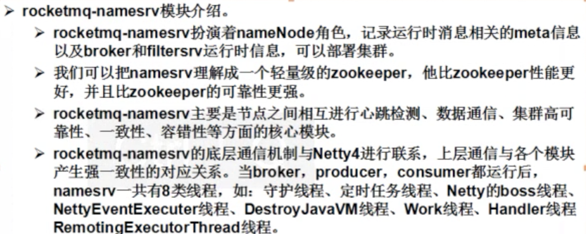

## [RocketMQ概述](https://github.com/apache/incubator-rocketmq)

>此处代码参考阿里官方demo代码

- 推荐博客：[http://www.jianshu.com/p/453c6e7ff81c](http://www.jianshu.com/p/453c6e7ff81c)
- RocketMQ 是一款分布式、队列模型的消息中间件，具有以下特点：
  -  ***能够保证严格的消息顺序***
  -  提供丰富的消息拉取模式
  -  高效的订阅者水平扩展能力
  -  实时的消息订阅机制
  -  亿级消息堆积能力
  -  Metaq3.0版本改名，产品名称改为RocketMQ(1.0，2.0之前是用zookeeper，3.0使用namesrv)

- 选用理由
  -  强调集群无单点，可扩展，任意一点高可用，水平可扩展
  -  ***海量消息堆积能力，消息堆积后，写入低延迟***
  -  支持上万个队列
  -  ***消息失败重试机制***
  -  消息可查询
  -  开源社区活跃
  -  成熟度（经过双十一考验）

### [开发指南](https://github.com/CentMeng/JavaFrameTest/tree/master/src/com/msj/rocketmq/doc/RocketMQ用户指南v3.2.4.pdf)

- 先阅读开发指南

- Producer Group和Consumer Group使RocketMQ天然支持负载均衡

- 消息中间件通常采用集中持久化方式：
  1.  持久化到数据库，例如Mysql
  2.  持久化到KV存储，例如levelDB，伯克利DB等
  3.  文件记录形式持久化，例如Kafka，RocketMQ
  4.  对内存数据做一个持久化镜像，例如beanstalkd，VisiNotify
  
1,2,3 三种持久化方式都具有将内存队列Buffer进行扩展的能力，4只是一个内存的镜像，作用是当Broker挂掉重启后仍然能将之前内存的数据恢复出来。

- Broker的Buffer满了怎么办？RocketMQ同其他MQ有非常显著的区别，RocketMQ的内存Buffer抽象成一个无限长度的队列，不管有多少数据进来都能装的下，这个无限是有前提的，Broker会定期删除过期的数据，例如Broker只保存3天的消息，那么这个Buffer虽然长度无限，但是3天前的数据会被从队尾删除。

- 消息优先级：由于RocketMQ 所有消息都是持久化的,所以如果按照优先级来排序，开销会非常大，因此RocketMQ没有特意支持消息优先级，但是可以通过变通的方式实现类似功能，即单独配置一个优先级高的队列，和一个普通优先级的队列，将不同优先级发送到不同的队列即可。

## RocketMQ环境搭建（以多Master为例，用户指南有其他例子）
[用户手册](https://github.com/CentMeng/JavaFrameTest/tree/master/src/com/msj/rocketmq/doc/rocketMQ使用手册.pdf)

- 搭建方式 
  -  多master方式，推荐这种方式，性能最好
  -  多master多slave，异步复制（可以保证实时消费）
  -  多master多slave，同步双写（可以保证实时消费，并且保证数据不丢失，但是性能会较同步复制稍微慢）

- 异步复制和同步双写：
  -  异步复制是发送消息给主节点，主节点和从节点进行同步。这样如果主节点毫秒级别挂掉的话，那么会导致消息在进行复制的过程，有少量消息没有复制过来。
  -  同步双写：发送消息给主节点的同时也发送给从节点，只有主节点和从节点都收到消息那么这个消息才是发送成功了。（涉及到钱的话建议采用这种方式）

- Linux重启网卡命令 service network restart

- Linux命令：ln 对某个文件/文件夹创建一个连接

- RocketMQ 最小的堆是1G

- nohup 启动方式会生成nohup.out来查看日志

- 文档中，部署了两台机器并在各自机器分别部署了一个NameServer和一个Broker，启动时候，先启动两台机器的NameServer，然后再启动两台机器的Broker（虽然两台机器都有多个properties配置文件，但是启动的时候一台用broker-a.properties,一台用broker-b.properties），关闭的时候，先关闭两台机器的Broker，在关闭两台机器的NameServer。(可以写个脚本)

- RocketMQ没有管控页面，需要在tomcat部署rocketmq-console.war。并且修改rocketmq-console/WEB-INF/classes/config.properties文件，将RocketMQ节点ip和端口号用分号间隔都添加进去。

- 同步刷盘和异步刷盘区别：异步刷盘写完PAGECACHE直接返回，而同步刷盘需要等待刷盘完成才返回（详情见用户指南的刷盘策略）。

## RocketMQ与Kafka对比（18项差异）

> 淘宝内部的交易系统使用了淘宝自主研发的Notify消息中间件，使用Mysql作为消息存储媒介，可完全水平扩容，为了进一步降低成本，我们认为存储部分可以进一步优化，2011年初，Linkin开源了Kafka这个优秀的消息中间件，淘宝中间件团队在对Kafka做过充分Review之后，Kafka无限消息堆积，高效的持久化速度吸引了我们，但是同时发现这个消息系统主要定位于日志传输，对于使用在淘宝交易、订单、充值等场景下还有诸多特性不满足，为此我们重新用Java语言编写了RocketMQ，定位于非日志的可靠消息传输（日志场景也OK），目前RocketMQ在阿里集团被广泛应用在订单，交易，充值，流计算，消息推送，日志流式处理，binglog分发等场景。

## HelloWorld

## RocketMQ架构

- NameServer 节点与节点做协调类似于Zookeeper

- Broker 存储数据
- filterServer 过滤，开源的有问题，收费的没问题

- Client 
- store 专注与存储，broker调store的api存储数据
- common 公共方法
- serverUtil 处理心跳，交换
- tools 涉及到管理员命令

## RocketMQ详解
### 基本设计

- 消费者指定GroupName是为了做到负载均衡，生产者指定GroupName是为了发送消息失败后，MQ能够通知其他相同GroupName的节点重新发送消息

### Producer

- 可以指定Tag来进行过滤

### [Consumer](https://github.com/apache/incubator-rocketmq/tree/master/example/src/main/java/org/apache/rocketmq/example/simple)
- 在RocketMQ里，consumer被分为2类：MQPullConsumer和MQPushConsumer（大部分情况用此模式），其实本质都是拉模式（pull），即consumer轮询从broker拉取消息。
- push方式里，consumer把轮询过程封装了，并注册MessageListener监听器，取到消息后，唤醒MessageListener的consumeMessage（）来消费，对用户而言，感觉消息是被推送过来的。
- pull方式里，取消息的过程需要用户自己写，首先通过打算消费的Topic拿到MessageQueue的集合，遍历MessageQueue集合，然后针对每个MessageQueue批量取消息，一次取完后，记录该队列下一次要取得开始offset，直到取完了，再换另一个MessageQueue。（每隔5秒钟会与broker同步offet位置，所以拉取间隔要大于5秒）

#### Consumer配置参数

#### Filter
- 我们如果想用RocketMQ的Filter组件，则必须启动mqfiltersrv
- 启动的顺序为：namesrv、broker、mqfiltersrv
- （使用命令nohup sh mqfiltersrv -c filter.properties 启动mqfiltersrv，配置文件的配置 sh mqfiltersrv -p）
- 然后我们需要实现MessageFilter接口，进行重写match方法，我们可以针对自己想要过滤的消息进行细粒度的处理
- 最后我们需要把自己实现Filter类，通过消费端的订阅方式，加入到我们消费端即可

## RocketMQ API详解
- 官方Git上有example包含顺序发送消息，filtersrv等
- 更多详情请查看博客：[http://www.jianshu.com/p/453c6e7ff81c](http://www.jianshu.com/p/453c6e7ff81c)

> Producer消息分为三种不同模式（普通，顺序，事务）

#### 顺序消息
- [demo](https://github.com/apache/incubator-rocketmq/tree/master/example/src/main/java/org/apache/rocketmq/example/ordermessage)
- 顺序是指1，2，3共3条消息，第1条消息处理完之后，再执行第二条消息，第二条消息执行完后再执行第3条消息。
- RocketMQ怎样实现顺序消费：
  -  首先Producer端发送消息进入同一个队列里【一个Topic默认有4个队列】
  -  然后Consumer端要实现另一个MessageOrder接口，他能指定一个线程从一个队列里拿数据，不允许其他线程去队列里拿数据。

#### 分布式事务消息（以支付宝转10000元给余额宝为例）
- [demo](https://github.com/apache/incubator-rocketmq/tree/master/example/src/main/java/org/apache/rocketmq/example/transaction)

- RocketMQ实现发送事务消息（如上图）：RocketMQ第一阶段发送Prepared消息时，会拿到消息的地址，第二阶段执行本地事务，第三阶段拿到的地址去访问消息，并修改消息的状态。

> 如果“确认消息发送”失败了怎么办？在3.0.8之前（好像是），RocketMQ会定期扫描消息集群中的事务消息，如果发现了Prepared消息，它会向消息发送端（生产者）确认，确认支付宝的钱到底减少没有？如果减了是回滚还是继续发送确认消息呢？RocketMQ会根据发送端设置的策略来决定是回滚还是继续发送确认消息。这样就保证了消息发送与本地事务同时成功或同时失败。3.0.8之后此功能做了阉割。

- 消费失败了怎么办？阿里给的答案：***人工解决***

## 应用案例

- Consumer业务系统与各个系统通讯用netty

## 集群监控与运维
- [RocketMQ运维指令整理](https://github.com/CentMeng/JavaFrameTest/tree/master/src/com/msj/rocketmq/doc/RocketMQ运维指令整理.docx)

### 其他
#### 打包项目 

- 里面配置的[release.xml](https://github.com/CentMeng/JavaFrameTest/tree/master/src/com/msj/rocketmq/doc/release.xml)打包机制

### 数据可靠性
* RocketMQ支持异步实时刷盘，同步刷盘，同步Replication，异步Replication
* Kafka使用异步刷盘方式，异步Replication/同步Replication

> 总结：RocketMQ的同步刷盘在单机可靠性上比Kafka更高，不会因为操作系统Crash，导致数据丢失。
> Kafka同步Replication理论上性能低于RocketMQ的同步Replication，原因是Kafka的数据以分区为单位组织，意味着一个Kafka实例上会有几百个数据分区，RocketMQ一个实例上只有一个数据分区，RocketMQ可以充分利用IO Group Commit机制，批量传输数据，配置同步Replication与异步Replication相比，性能损耗约20%~30%，Kafka没有亲自测试过，但是个人认为理论上会低于RocketMQ。

### 性能对比
* [Kafka单机写入TPS约在百万条/秒，消息大小10个字节](http://engineering.linkedin.com/kafka/benchmarking-apache-kafka-2-million-writes-second-three-cheap-machines)
* RocketMQ单机写入TPS单实例约7万条/秒，单机部署3个Broker，可以跑到最高12万条/秒，消息大小10个字节

> 总结：Kafka的TPS跑到单机百万，主要是由于Producer端将多个小消息合并，批量发向Broker。

*RocketMQ为什么没有这么做？*

1. Producer通常使用Java语言，缓存过多消息，GC是个很严重的问题
2. Producer调用发送消息接口，消息未发送到Broker，向业务返回成功，此时Producer宕机，会导致消息丢失，业务出错
3. Producer通常为分布式系统，且每台机器都是多线程发送，我们认为线上的系统单个Producer每秒产生的数据量有限，不可能上万。
4. 缓存的功能完全可以由上层业务完成。

### 单机支持的队列数
* Kafka单机超过64个队列/分区，Load会发生明显的飙高现象，队列越多，load越高，发送消息响应时间变长。[Kafka分区数无法过多的问题](http://blog.confluent.io/2015/03/12/how-to-choose-the-number-of-topicspartitions-in-a-kafka-cluster/)
* RocketMQ单机支持最高5万个队列，Load不会发生明显变化

*队列多有什么好处？*

1. 单机可以创建更多Topic，因为每个Topic都是由一批队列组成
2. Consumer的集群规模和队列数成正比，队列越多，Consumer集群可以越大

### 消息投递实时性
* Kafka使用短轮询方式，实时性取决于轮询间隔时间，0.8以后版本支持长轮询。
* RocketMQ使用长轮询，同Push方式实时性一致，消息的投递延时通常在几个毫秒。

### 消费失败重试
* Kafka消费失败不支持重试。
* RocketMQ消费失败支持定时重试，每次重试间隔时间顺延

> 总结：例如充值类应用，当前时刻调用运营商网关，充值失败，可能是对方压力过多，稍后再调用就会成功，如支付宝到银行扣款也是类似需求。

> 这里的重试需要可靠的重试，即失败重试的消息不因为Consumer宕机导致丢失。

### 严格的消息顺序
* Kafka支持消息顺序，但是一台Broker宕机后，就会产生消息乱序
* RocketMQ支持严格的消息顺序，在顺序消息场景下，一台Broker宕机后，发送消息会失败，但是不会乱序

> Mysql Binlog分发需要严格的消息顺序

### 定时消息
* Kafka不支持定时消息
* RocketMQ支持两类定时消息
	* 开源版本RocketMQ仅支持定时Level，定时Level用户可定制
	* 阿里云ONS支持定时Level，以及指定的毫秒级别的延时时间

### 分布式事务消息
* Kafka不支持分布式事务消息
* 阿里云ONS支持分布式定时消息，未来开源版本的RocketMQ也有计划支持分布式事务消息

### 消息查询
* Kafka不支持消息查询
* RocketMQ支持根据Message Id查询消息，也支持根据消息内容查询消息（发送消息时指定一个Message Key，任意字符串，例如指定为订单Id）

> 总结：消息查询对于定位消息丢失问题非常有帮助，例如某个订单处理失败，是消息没收到还是收到处理出错了。

### 消息回溯
* Kafka理论上可以按照Offset来回溯消息
* RocketMQ支持按照时间来回溯消息，精度毫秒，例如从一天之前的某时某分某秒开始重新消费消息

> 总结：典型业务场景如consumer做订单分析，但是由于程序逻辑或者依赖的系统发生故障等原因，导致今天消费的消息全部无效，需要重新从昨天零点开始消费，那么以时间为起点的消息重放功能对于业务非常有帮助。

### 消费并行度
* Kafka的消费并行度依赖Topic配置的分区数，如分区数为10，那么最多10台机器来并行消费（每台机器只能开启一个线程），或者一台机器消费（10个线程并行消费）。即消费并行度和分区数一致。

* RocketMQ消费并行度分两种情况
	* 顺序消费方式并行度同Kafka完全一致
	* 乱序方式并行度取决于Consumer的线程数，如Topic配置10个队列，10台机器消费，每台机器100个线程，那么并行度为1000。

### 消息轨迹
* Kafka不支持消息轨迹
* 阿里云ONS支持消息轨迹

### 开发语言友好性
* Kafka采用Scala编写
* RocketMQ采用Java语言编写

### Broker端消息过滤
* Kafka不支持Broker端的消息过滤
* RocketMQ支持两种Broker端消息过滤方式
	* 根据Message Tag来过滤，相当于子topic概念
	* 向服务器上传一段Java代码，可以对消息做任意形式的过滤，甚至可以做Message Body的过滤拆分。

### 消息堆积能力

理论上Kafka要比RocketMQ的堆积能力更强，不过RocketMQ单机也可以支持亿级的消息堆积能力，我们认为这个堆积能力已经完全可以满足业务需求。

### 开源社区活跃度
* Kafka社区更新较慢
* [RocketMQ的github社区有250个个人、公司用户登记了联系方式，QQ群超过1000人。](https://github.com/alibaba/RocketMQ/issues/1)

### 商业支持
* Kafka原开发团队成立新公司，目前暂没有相关产品看到
* [RocketMQ在阿里云上已经开放公测近半年，目前以云服务形式免费供大家商用，并向用户承诺99.99%的可靠性，同时彻底解决了用户自己搭建MQ产品的运维复杂性问题](http://www.aliyun.com/product/ons)

### 成熟度
* Kafka在日志领域比较成熟
* RocketMQ在阿里集团内部有大量的应用在使用，每天都产生海量的消息，并且顺利支持了多次天猫双十一海量消息考验，是数据削峰填谷的利器。