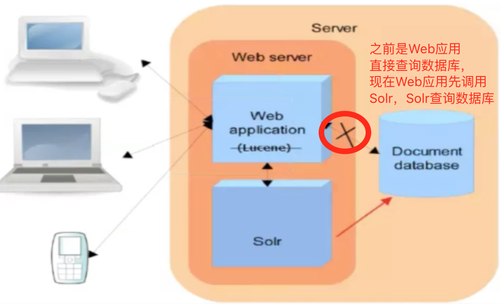
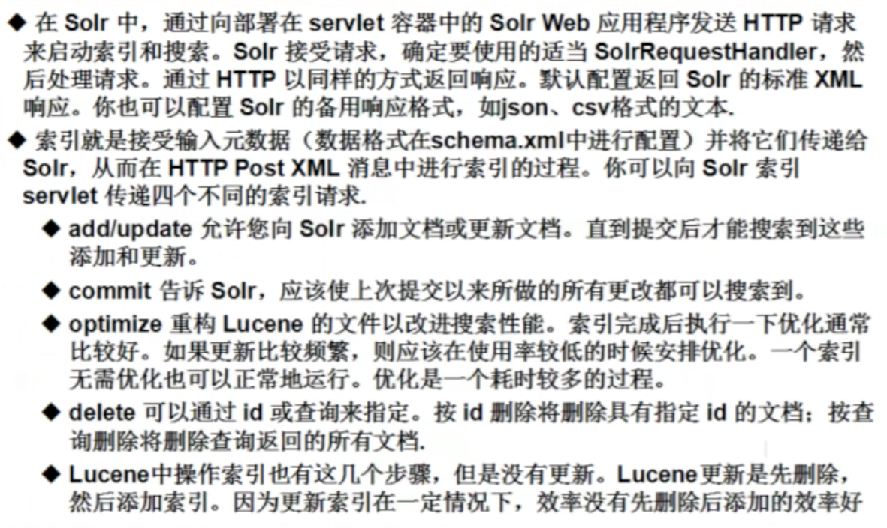
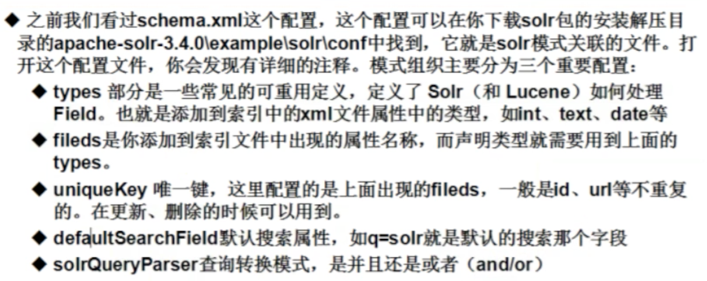

## Solr技术简介
> Solr基于Lucene的全文搜索服务器。Solr提供了比Lucene更为丰富的查询语言，同时实现了可配置、可扩展，并对索引、搜索性能进行了优化。

### 为什么使用Solr
- 单独使用Lucene实现站内搜索需要开发的工作量较大，主要表现在：索引维护、索引性能优化、搜索性能优化等，因此不建议使用
- 通过第三方搜索引擎提供的接口实现站内搜索，这样和第三方引擎系统以来紧密，不方便扩展，不建议使用
- 基于Solr实现站内搜索扩展性较好并且可以减少程序员的工作量，因为Solr提供了较为完备的搜索引擎解决方案，因此在门户、论坛等系统中常用此方案。
- Solr可以独立运行，运行在Jetty、Tomcat等这些Servlet容器中，Solr索引的实现方法很简单，用POST方法向Solr服务器发送一个描述Field及其内容的XML文档，Solr根据xml文档添加、删除、更新索引。Solr搜索只需要发送HTTP GET请求，然后对Solr返回Xml、json等格式的查询结果进行解析，组织页面布局。Solr不提供构建UI的功能，Solr提供了一个管理页面，通过管理页面可以查询Solr的配置和运行情况。



### Solr 下载与安装
下载地址:[http://www.apache.org/dyn/closer.lua/lucene/solr](http://www.apache.org/dyn/closer.lua/lucene/solr)

#### 安装步骤


### Solr操作


## 搜索引擎
### 全文检索步骤
1. 信息源->本地即solr（进行加工和处理）->建立索引库（信息集合，一组文件的集合）
2. 搜索的时候从本地的（索引库）信息集合中搜索
3. 文本在建立索引和搜索时，都会先进行分词（使用分词器）
4. 索引的结构：
  -  索引表（存放具体的词汇，哪些词汇在哪些文档里存储，索引里存储的就是分词器分词之后的结果）
  -  存放数据（文档信息集合）
5. 用户搜索时：首先经过分词器进行分词，然后去索引表里查找对应的词汇（利用倒排序索引），再找到对应的文档集合。
6. 索引库位置（Directory）
7. 信息集合里的每一条数据都是一个document（存储所有信息，他是一个Filed属性的集合）
8. store是否进行存储（可以不存储，也可以存储）
9. index是否进行存储（可以不索引，也可以索引，索引的话分为分词后索引，或者直接索引）  


### 添加中文分词器
> 无论是Solr还是Lucene，都对中文分词不太好，所以我们一般索引中文的话需要使用IK中文分词器

- 下载IK Analyzer 2012FF_hf1.zip
- 进行解压
- 安装：把IKAnalyzer2012FF_u1.jar拷贝到tomcat的solr应用服务下
- cd /usr/local/software && cp IKAnalyzer2012FF_u1.jar /usr/local/apache-tomcat-7.0.29/webapps/solr/WEB-INF/lib/
- 创建文件夹：/usr/local/apache-tomcat-7.0.29/webapps/solr/WEB-INF/classes
- 把IKAnalyzer.cfg.xml和stopword.dic拷贝到新创建的classes目录下即可
- 修改solr core的schema文件，默认是位置
- vim /usr/local/solr-4.10.3/example/solr/collection1/conf/schema.xml
- 添加如下配置：

```xml
<fieldType name="text_ik" class="solr.TextField">
<!-- 索引时候的分词器-->
<analyzer type="index" isMaxWordLength="false" class="org.wltea.analyzer.lucenne.IKAnalyzer" />
<!-- 查询时候的分词器-->
<analyzer type="query" isMaxWordLength="true" class="org.wltea.analyzer.lucenne.IKAnalyzer" />
</fieldType>
```

- 启动solr：/usr/local/apache-tomcat-7.0.2/bin/startup.sh
- 进入页面在分词器选择ik中文分词器，进行输入：互联网应用架构。
 


### 自定义词库
- 修改 /usr/local/apache-tomcat-7.0.29/webapps/solr/WEB-INF/classes/IKAnalyzer.cfg.xml目录下的IKAnalyzer.cfg.xml配置文件，添加如下配置

```xml
<!--使用的分词,一个词一行-->
<entry key="ext_dict">ext.dic;</entry>
<!--进制使用的分词-->
<entry key="ext_stopwords">stopword.dic;</entry>
```

- 新建ext.dic文件，在里面添加内容（注意：ext.dic的编码必须是Encode in UTF-8 without BOM，否则自定义的词库不会被识别）

## Solr基础

### Solr索引操作



### Solr搜索


### Solr模式




### Solr添加信息对象


### Solr查询详细使用
- 查询分页start（起始位置）、rows（数据条数）、sort（排序）
- 查询操作拼接：可使用AND、OR、NOT进行拼接联合查询
- 查询操作区间：“price:[5 TO 10]”表示包含，“price:{5 TO 10}”为不包含5到10的数据
- 查询操作过滤器：addFilterQuery提高查询效率
- 查询操作开启高亮设置：setHighlight*等方法，可以高亮显示结果信息
- 查询操作分片处理：可以进行统计分析单词出现次数

## 
### Solor管理员命令两种手段
1. 直接使用curl命令进行操作solr数据：如
  -  删除：curl http://localhost:8080/solr/update --data-binary"<delete><query>id:1</query></delete>" -H 'Content-type:text/xml;charset=utf-8'
  -  提交：curl http://localhost:8080/solr/update --data-binary"<commit/>" -H 'Content-type:text/xml;charset=utf=8'
2. 进入：/usr/local/solr-4.10.3/example/exampledocs 下执行java -jar post.jar命令进行维护数据操作
  -  删除：java -Ddata=args -jar post.jar"<delete><id>42</id></delete>"
  -  帮助：java -jar post.jar -help

### Solr集群搭建
>与Zookeeper做协调

## Solr实例
> Solr有全量同步和增量同步两种

### Solr的DIH 全量同步


> 第七步：Solr服务器的时间要和mysql服务器的时间统一


### Solr的DIH增量同步
>通过last_modify字段做判断是否更新，即根据时间来确定


