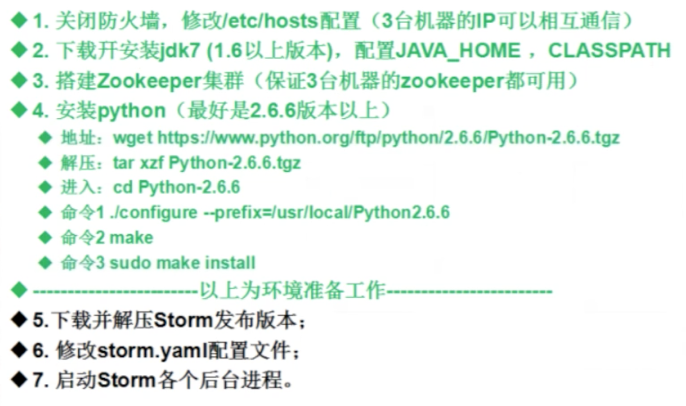

## Storm简介
- Storm是Twitter开源的一个分布式的实时计算系统，用于数据的实时分析，持续计算，分布式RPC等等。
  -  官网地址：[http://storm-project.net/](http://storm-project.net/)
  -  源码地址：[https://github.com/nathanmarz/storm](https://github.com/nathanmarz/storm)

- 实时计算需要解决的问题
  -  最显而易见的就是实时推荐系统，比如我们在淘宝等电商购物网站去买东西，推荐的广告。Hadoop只是做离线的数据分析，无法做到实时分析计算。
  -  车流量实时计算
  -  股票
- Hadoop与Storm对比

- 物理结构图

- storm中运行的一个实时应用程序，因为各个组件间的消息流动形成逻辑上的一个拓扑结构。一个Topology（拓扑）是spouts和bolts组成的图，通过stream groupings将途中的sputs和bolts连接起来


## [Storm集群环境搭建](https://github.com/CentMeng/JavaFrameTest/tree/master/src/com/msj/storm/doc/storm环境搭建.txt)



## HelloWorld

- Topology不停，nextTuple会一直轮询
- 提交Topology命令：storm jar storm01.jar msj.topology.PWTTopology1
- 查看任务命令：storm list

## Storm API
- Topology（拓扑）
- Stream grouping（流分组、数据的分发方式）
- Spout（喷口、消息源）
- Bolt（螺栓、处理器）
- Worker（工作进程 jvm）
- Executor（执行器、Task的线程）
- Task（具体的执行任务）
- Configuration（配置）

### Strom拓扑配置
 

- worker 对应jvm
- spout 对应线程池 
- 拓扑是一个有向的计算（也就是在计算的过程中是有流向的去处理业务逻辑，节点之间的连接显示数据该如何进入下一个节点，他们是进行连接传递的）
- 拓扑运行只需要使用storm命令，把一个jar提交给nimbus节点，numbus就会把任务分配给具体的子节点（supervisor）去工作

### [Strom流分组](https://github.com/CentMeng/JavaFrameTest/tree/master/src/com/msj/storm/topology/PWTopology3.java)
Stream Grouping：为每个bolt指定应该接受哪个流作为输入，流分组定义了如何在bolt的任务直接进行分发。


### Storm [WordCount](https://github.com/CentMeng/JavaFrameTest/tree/master/src/com/msj/storm/topology/WordTopology.java)
> 对一段文字出现单词频率的个数的统计demo，分split，count，report三步

### Storm Spout的可靠性
Spout是Storm数据流的入口，在设计拓扑时，一件很重要的事情就是需要考虑消息的可靠性，如果消息不能被处理而丢失是很严重的问题。

通过示例：[传递消息并且实时处理](https://github.com/CentMeng/JavaFrameTest/tree/master/src/com/msj/storm/topology/MessageTopology.java) 来说明此问题。
> Spout要implements IRichSpout，ack方法是成功回调，fail是失败回调，可以传递Tuple，从而重新发送

- 通过示例可知，如果在第一个bolt处理的时候出现异常，我们可以让整个数据进行重发，但是如果在第二个bolt处理的时候出现了异常，那么我们也会让响应的spout里的数据重发，这样就会出现事务的问题，我们就需要进行判断或者进行记录。
- 如果是数据入库的话，可以与原ID进行比对
- 如果是事务的话在编写代码时，尽量就不要进行拆分tuple
- 或者使用storm的Trident框架

> 架构设计考虑极端情况不包括代码问题或者可以通过代码改善的极端情况，可考虑断电等意外情况

- Storm系统中有一组叫做“acker”的特殊的任务，他们负责跟踪DAG（有向无环图）中的每个消息
- acker任务保存了spout消息id到一对值得映射。第一个值就是spout的任务id，通过这个id，acker就知道消息处理完成时该通知哪个spout任务。第二个值是一个64bit的数字，我们称之为“ack val”，它是树中所有消息的随机id的异或结果。ack val表示了整棵树的状态，无论这棵树多大，另需要这个固定大小的数字就可以跟踪整棵树。当消息被创建和被应答的时候都会有相同的消息id发送过来做异或。
- 每当acker发现一棵树的ack val值为0的时候，它就知道这棵树已经被完全处理了。因为消息的随机ID是一个64bit的值，因此ack val在树处理完之前被置为0的概率非常小。假设你每秒钟发送一万个消息，从概率上说，至少需要50000000年才会有机会发生一次错误。即使如此，也另有在这个消息确实处理失败的情况下才会有数据的丢失！


- Storm异或运算：进入bolt时候记录一下tuple的id，bolt出来的时候记录一下tuple的id，这样相同的id就相抵掉 = 0，如果没抵掉就 != 0。

## Storm DRPC
> 分布式RPC （distributed RPC,DRPC）

- Storm里面引入DRPC主要是利用storm的实时计算能力来并行化CPU密集型（CPU intensive）的计算任务。DRPC的storm topology以函数的参数流作为输入，而把这些函数调用的返回值作为topology的输出流。
- DRPC其实不能算是storm本身的一个特性，它是通过组合storm的原语stream、spout、bolt、topology而成的一种模式（pattern）。本来应该把DRPC单独打成一个包的，但是DRPC实在是太有用了，所以我们把它和storm捆绑在一起。
- DRPC 是通过一个“DRPC Server”来实现
- DRPC Server的整体工作流程如下：
  1.  接收一个RPC请求 
  2.  发送请求到storm topology
  3.  从storm topology接收结果
  4.  把结果发回给等待的客户端

### Storm DRPC配置和示例
- Storm提供了一个称作LinearDRPCTopologyBuilder的topology builder，它把实现DRPC的几乎所有步骤都自简化了。
- 相关代码地址：[https://github.com/nathanmarz/storm-starter/blob/master/src/jvm/storm/starter/BasicDRPCTopology.java](https://github.com/nathanmarz/storm-starter/blob/master/src/jvm/storm/starter/BasicDRPCTopology.java)

#### 实现DRPC步骤：
- 需要修改配置文件内容为（分别修改每台机器配置）：
  -  vim /usr/local/apache-storm-0.9.2/conf/storm.yaml
  -  drpc.servers: - "192.168.1.114"
- 需要启动storm的drpc服务，命令：storm drpc &
- 把相应的topology代码上传到storm服务器上

```
storm jar storm04.jar msj.drpc.BasicDRPCTopology exc
``` 
[storm04.jar](https://github.com/CentMeng/JavaFrameTest/tree/master/src/com/msj/storm/drpc/basic)

- 在本地调用远程topology即可

### Storm DRPC示例场景
>主要使用storm的并行计算能力来进行，我们在微博、论坛进行转发帖子的时候，是对url进行转发，分析给粉丝（关注我的人），那么每一个人的粉丝（关注着可能会有重复的情况），这个例子就是统计一下帖子（url）的转发人数。

- 相关代码地址：[https://github.com/nathanmarz/storm-starter/blob/master/src/jvm/storm/starter/ReachTopology.java](https://github.com/nathanmarz/storm-starter/blob/master/src/jvm/storm/starter/ReachTopology.java)

- 示例地址：[DrpcReach](https://github.com/CentMeng/JavaFrameTest/tree/master/src/com/msj/storm/drpc/reach) 

- 实现步骤如下：
  1. 获取当前转发帖子的人
  2. 获取当前人的粉丝（关注者）
  3. 进行粉丝去重
  4. 统计人数
  5. 最后使用drpc远程调用topology返回执行结果

>kafka作为数据源，storm进行数据处理，来分析日志。Storm和Kafka配合比较好

### Storm Trident


### 基本使用
使用示例：[TridentFunction](https://github.com/CentMeng/JavaFrameTest/tree/master/src/com/msj/storm/trident/example/TridentFunction.java)

- Function:继承BaseFunction

```Java
//继承BaseFunction类，重新execute方法
	public static class SumFunction extends BaseFunction {
		@Override
		public void execute(TridentTuple tuple, TridentCollector collector) {
			System.out.println("传入进来的内容为：" + tuple);
			//获取a、b俩个域
			int a = tuple.getInteger(0);
			int b = tuple.getInteger(1);
			int sum = a + b;
			//发射数据
			collector.emit(new Values(sum));
		}
	}
	
	//继承BaseFunction类，重新execute方法
	public static class Result extends BaseFunction {
		@Override
		public void execute(TridentTuple tuple, TridentCollector collector) {
			//获取tuple输入内容
			System.out.println();
			Integer a = tuple.getIntegerByField("a");
			Integer b = tuple.getIntegerByField("b");
			Integer c = tuple.getIntegerByField("c");
			Integer d = tuple.getIntegerByField("d");
			System.out.println("a: "+ a + ", b: " + b + ", c: " + c + ", d: " + d);
			Integer sum = tuple.getIntegerByField("sum");
			System.out.println("sum: "+ sum);
		}
	}
```

- build Topology

```Java
 TridentTopology topology = new TridentTopology();
		//设定数据源
		FixedBatchSpout spout = new FixedBatchSpout(
		new Fields("a", "b", "c", "d"),	//声明输入的域字段为"a"、"b"、"c"、"d"
		4, 						//设置批处理大小为1
		//设置数据源内容
		//测试数据
		new Values(1, 4, 7, 10),
		new Values(1, 1, 3, 11),
		new Values(2, 2, 7, 1),
		new Values(2, 5, 7, 2));
		//指定是否循环
		spout.setCycle(false);
		//指定输入源spout
        Stream inputStream = topology.newStream("spout", spout);
        /**
         * 要实现流sqout - bolt的模式 在trident里是使用each来做的
         * each方法参数：
         * 1.输入数据源参数名称："a", "b", "c", "d"
         * 2.需要流转执行的function对象（也就是bolt对象）：new SumFunction()
         * 3.指定function对象里的输出参数名称：sum
         */
        inputStream.each(new Fields("a", "b", "c", "d"), new SumFunction(), new Fields("sum"))
        		/**
        		 *  继续使用each调用下一个function（bolt）
        		 *	第一个输入参数为："a", "b", "c", "d", "sum"
        		 *	第二个参数为：new Result() 也就是执行函数，第三个参数为没有输出
        		 */
                .each(new Fields("a", "b", "c", "d", "sum"), new Result(), new Fields());
        return topology.build();	//利用这种方式，我们返回一个StormTopology对象，进行提交
```

### 过滤
过滤示例：[TridentFilter](https://github.com/CentMeng/JavaFrameTest/tree/master/src/com/msj/storm/trident/example/TridentFilter.java）

- Filter:继承BaseFilter

```Java
//继承BaseFilter类，重新isKeep方法
	public static class CheckFilter extends BaseFilter {
		@Override
		public boolean isKeep(TridentTuple tuple) {
			int a = tuple.getInteger(0);
			int b = tuple.getInteger(1);
			if((a + b) % 2 == 0){
				return true;
			}
			return false;
		}
	}
```

- build Topology

```Java
 TridentTopology topology = new TridentTopology();
		//设定数据源
		FixedBatchSpout spout = new FixedBatchSpout(
		new Fields("a", "b", "c", "d"),	//声明输入的域字段为"a"、"b"、"c"、"d"
		4, 						//设置批处理大小为1
		//设置数据源内容
		//测试数据
		new Values(1, 4, 7, 10),
		new Values(1, 1, 3, 11),
		new Values(2, 2, 7, 1),
		new Values(2, 5, 7, 2));
		//指定是否循环
		spout.setCycle(false);
		//指定输入源spout
        Stream inputStream = topology.newStream("spout", spout);
        /**
         * 要实现流sqout - bolt的模式 在trident里是使用each来做的
         * each方法参数：
         * 1.输入数据源参数名称：subjects
         * 2.需要流转执行的function对象（也就是bolt对象）：new Split()
         */
        inputStream.each(new Fields("a", "b", "c", "d"), new CheckFilter())
                //继续使用each调用下一个function（bolt）输入参数为subject和count，第二个参数为new Result() 也就是执行函数，第三个参数为没有输出
                .each(new Fields("a", "b", "c", "d"), new Result(), new Fields());
        return topology.build();	//利用这种方式，我们返回一个StormTopology对象，进行提交
```

### 分组
参考[Learning Storm](https://github.com/CentMeng/JavaFrameTest/tree/master/src/com/msj/storm/doc/LearningStorm.pdf) 第104页

示例：[StrategyTopology](https://github.com/CentMeng/JavaFrameTest/tree/master/src/com/msj/storm/trident/strategy/StrategyTopology.java)

### Trident aggregators
参考[Learning Storm](https://github.com/CentMeng/JavaFrameTest/tree/master/src/com/msj/storm/doc/LearningStorm.pdf) 第109页

- The partition aggregate
- The aggregate
- The persistence aggregate

示例：[WordCountTopology](https://github.com/CentMeng/JavaFrameTest/tree/master/src/com/msj/storm/trident/wordcount/WordCountTopology.java)

### Batch和Spout与Transcational
#### Trident提供下面的语义来实现有且又一次被处理的目标（不出现重复，保持事务性）
1. Tuples是被分成小的集合（一组tuple被称为一个batch）被批处理的
2. 每一批tuples被给定一个唯一ID作为事务ID（txid），当这个batch被重发时，txid不变
3. batch和batch之间的状态更新是严格顺序的。比如batch3的状态的更新必须要等到batch2的状态更新成功之后才可以进行

有了这些定义，状态实现可以检测到当前batch是否以前处理过，并根据不同的情况进行不同的处理，这个处理取决于你的输入spout。有三种不同类型的容错spout：

- non-transactional（无事务支持的spout）
- transactional（事务支持spout）
- opaque transactional（不透明事务支持的spout） 

> 示例来源Learning Storm 的126页

##### 透明事务


##### 不透明事务（比较难理解）


- 如果处理不成功，可以还原回来

> 透明事务，是只要这一批错误就将这一批数据重发

#### 接口
- 实现ITridentSpout接口
  -  最通用的API可以支持transactional or opaque transactional语义
- 实现IBatchSpout接口
  -  一个non-transactional spout
- 实现IPartitional TridentSpout接口
  -  一个transactional spout
- 实现IOpaquePartitionedTridentSpout接口
  -  一个opaque transactional spout

## Storm与KafKa
>Kafka是一种高吞吐量的分布式发布订阅消息系统，它可以处理消费者规模的网站中的所有动作流数据。 这种动作（网页浏览，搜索和其他用户的行动）是在现代网络上的许多社会功能的一个关键因素。 这些数据通常是由于吞吐量的要求而通过处理日志和日志聚合来解决。 对于像Hadoop的一样的日志数据和离线分析系统，但又要求实时处理的限制，这是一个可行的解决方案。Kafka的目的是通过Hadoop的并行加载机制来统一线上和离线的消息处理，也是为了通过集群来提供实时的消费。

### Kafka相关术语介绍
- Broker：Kafka集群包含一个或多个服务器，这种服务器被称为broker
- Topic：每条发布到Kafka集群的消息都有一个类别，这个类别被称为Topic。（物理上不同Topic的消息分开存储，逻辑上一个Topic的消息虽然保存于一个或多个broker上但用户只需指定消息的Topic即可生产或消费数据而不必关心数据存于何处）
- Partition：Partition是物理上的概念，每个Topic包含一个或多个Partition.
- Producer：负责发布消息到Kafka broker
- Consumer：消息消费者，向Kafka broker读取消息的客户端。
- Consumer Group：每个Consumer属于一个特定的Consumer Group（可为每个Consumer指定group name，若不指定group name则属于默认的group）。

### Kafka安装与使用
- kafka下载地址：http://kafka.apache.org/downloads.html
- 解压命令：tar zxvf kafka_2.10-0.9.0.1.tgz -C /usr/local
- 改名命令：mv kafka_2.10-0.9.0.1/ kafka
- 进入解压后的目录，修改server.properties文件：

```
vim /usr/local/kafka/config/server.properties
```

修改内容：

```
broker.id=0
port=9092
host.name=192.168.1.114
advertised.host.name=192.168.1.114
log.dirs=/usr/local/kafka/kafka-logs
num.partitions=2
zookeeper.connect=192.168.1.114:2181,192.168.1.115:2181,192.168.1.116:2181
```

- 建立日志文件夹：mkdir /usr/local/kafka/kafka-logs
- 启动kafka：/usr/local/kafka/bin/kafka-server-start.sh /usr/local/kafka/config/server.properties &


### KafKaManager安装

- 下载kafka-manager-1.0-SNAPSHOT.zip
- 解压：unzip kafka-manager-1.0-SNAPSHOT.zip -d /usr/local/
- 改名：mv kafka-manager-1.0-SNAPSHOT/ kafka-manager-1.0
- 编辑文件：vim /usr/local/kafka-manager-1.0/conf/application.conf

修改内容

```
kafka-manager.zkhosts="192.168.1.114:2181,192.168.1.115:2181,192.168.1.116:2181"
```

- 启动kafka-manager：nohup /usr/local/kafka-manager-1.0/bin/kafka-manager -Dconfig.file=/usr/local/kafka-manager-1.0/conf/application.conf >/dev/null 2>&1 &

- 默认端口为：9000

### Kafka操作
- 操作kafka建立topic 

```
cd /usr/local/kafka/bin
```

1. 创建topic主题命令：kafka-create-topic.sh --replica 1 --partition 1 --topic
（创建名为test的topic， 1个分区分别存放数据，数据备份总共1份）

2. 查看topic列表命令：kafka-topics.sh --zookeeper 192.168.1.114:2181 --list

3. kafka命令发送数据：kafka-console-producer.sh --broker-list 192.168.1.114 --topic test
然后我们就可以编写数据发送出去了

4. kafka命令接受数据：kafka-console-consumer.sh --zookeeper 192.168.1.114 --topic test --from-beginning
然后我们就可以看到消费的信息了

### 示例
[KafkaTopology](https://github.com/CentMeng/JavaFrameTest/tree/master/src/com/msj/storm/kafka/KafkaTopology.java)

Kafka示例：
[Kafka](https://github.com/CentMeng/JavaFrameTest/tree/master/src/com/msj/kafka)

### Redis使用
> Redis存储作为一个[Spout](https://github.com/CentMeng/JavaFrameTest/tree/master/src/com/msj/storm/redis/StormRedisBolt.java)

[RedisTopology](https://github.com/CentMeng/JavaFrameTest/tree/master/src/com/msj/storm/redis/Topology.java)
