## 并发编程
### 1.线程基础
#### 线程安全
- 线程安全概念：当多个线程访问某一个类（对象或方法）时，这个类始终都能表现出正确的行为，那么这个类（对象或方法）就是线程安全的。
- synchronized:可以在任意对象及方法上加锁，而加锁的这段代码称为“互斥去”或“临界区”
- 当多个线程访问myThread的run方法时，以排队的方式进行处理(这里排队是按照CPU分配的先后顺序而定的)，***一个线程想要执行synchronized修饰的方法里的代码，首先是尝试获得锁，如果拿到锁，执行synchronized代码体内容；拿不到锁，这个线程就会不断的尝试获得这把锁，直到拿到为止，而且是多个线程同时去竞争这把锁。（也就是会有锁竞争的问题）***。
- 多个线程同时竞争一把锁会增加cpu的消耗，有可能出现计算缓慢，严重宕机，所以一定要规划好线程的数目
- 关键字synchronized取得的锁都是对象锁，而不是把一段代码（方法）当做锁，哪个线程先执行synchronized关键字的方法，哪个线程就持有该方法所属对象的锁（Lock），***两个对象，线程获得的就是两个不同的锁，他们互不影响（如果两个对象使用一把锁，可以在锁前面添加static,如果是对象也可以使用static volatile这样可以不用synchronized）见[MultiSyncCommonOneTest.java](https://github.com/CentMeng/JavaFrameTest/blob/master/src/com/msj/sync/MultiSyncCommonOneTest.java)）***。

#### 脏读
- 在我们对一个对象的方法加锁的时候，需要考虑业务的整体性，即为setValue/getValue方法同时加载synchronized同步关键字，保证业务(service)的原子性，不然会出现业务错误。
- 数据库特性：A(原子性)C(一致性)I（隔离性）D（持久性）
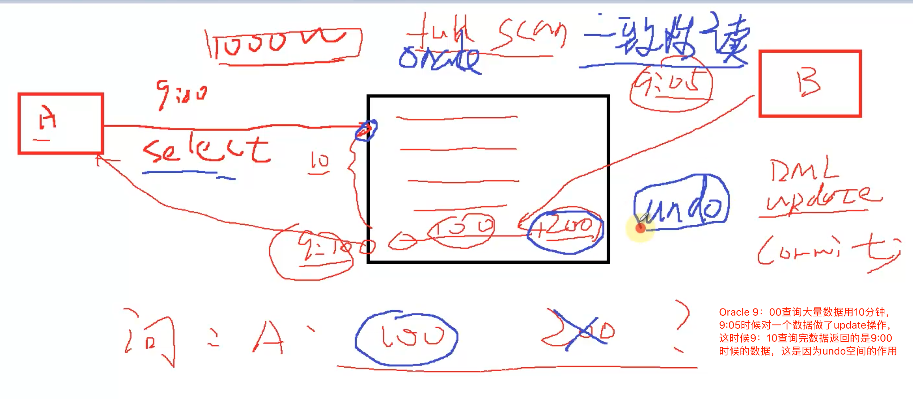

#### synchronized代码块及细节
- Oracle写存储过程的时候，要加BEGIN和END才能处理EXCEPTION
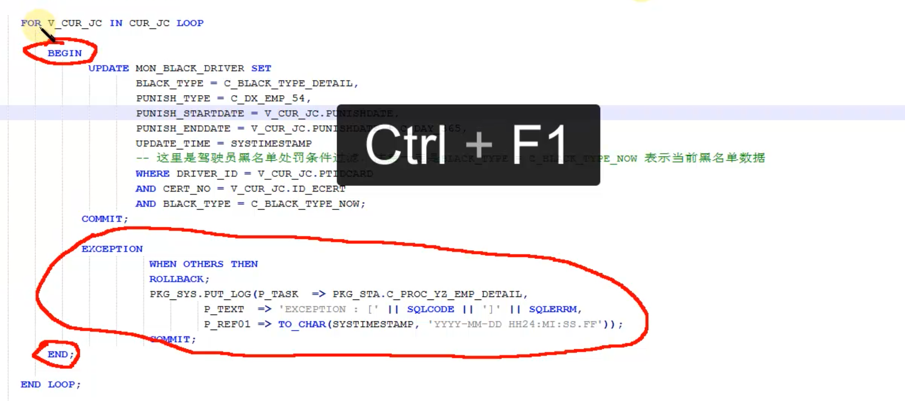

- 多线程有异常终止操作两种方式
  -  使用InterruptedException
  -  在异常体里面throw new RuntimeException()
- 使用synchronized声明的方法在某些情况下是有弊端的，比如A线程调用同步的方法执行一个很长时间的任务，那么B线程就必须等待比较长的时间才能执行，这样的情况下可以使用synchronized代码块去优化代码执行时间，也就是通常所说的减小锁的粒度。
- 锁注意事项：
  - synchronized可以使用任意的Object进行加锁
  
```Java
  public class ObjectLock {

    public void method1(){
        synchronized (this) { //对象锁
            try{
                System.out.println("do mehtod1");
                Thread.sleep(2000);
            }catch (InterruptedException e){
                e.printStackTrace();
            }
        }
    }

    public void method2(){
        synchronized (ObjectLock.class) { //类锁
            try{
                System.out.println("do mehtod2");
                Thread.sleep(2000);
            }catch (InterruptedException e){
                e.printStackTrace();
            }
        }
    }

    Object lock = new Object();
    public void method3(){
        synchronized (lock) { //任何对象锁
            try{
                System.out.println("do mehtod3");
                Thread.sleep(2000);
            }catch (InterruptedException e){
                e.printStackTrace();
            }
        }
    }


    public static void main(String[] args){

        final ObjectLock objectLock = new ObjectLock();
        Thread t1 = new Thread(new Runnable() {
            @Override
            public void run() {
                objectLock.method1();
            }
        });
        Thread t2 = new Thread(new Runnable() {
            @Override
            public void run() {
                objectLock.method2();
            }
        });
        Thread t3 = new Thread(new Runnable() {
            @Override
            public void run() {
                objectLock.method3();
            }
        });

        t1.start();
        t2.start();
        t3.start();
    }
}

```
  
  
  - 不要使用String的常量加锁，会出现死循环的问题

```Java
synchronized ("常量锁")  //死循环，因为常量引用的是同一个地址
<!--synchronized (new String（"常量锁"）)  //这种方式不会死循环-->
{
            try{
                System.out.println("do mehtod3");
                Thread.sleep(2000);
            }catch (InterruptedException e){
                e.printStackTrace();
            }
        }
``` 
  - 锁对象改变的问题，当使用一个对象进行加锁的时候，要注意对象本身发生改变的时候，那么持有的锁就不同。如果“对象本身”不发生改变，那么依然是同步的，即使是对象的属性（例如User对象的name和age属性）发生了改变（属性改变不影响锁的同步）。如果对象本身改变了，则不是同步，其他线程就进入了。

```Java
String lock = "lock";
public void method(){
        synchronized (lock) { 
            try{
                System.out.println("do mehtod);
                //锁对象发生了改变，则其他等待的线程可以进入
                lock = "change lock";
                Thread.sleep(2000);
            }catch (InterruptedException e){
                e.printStackTrace();
            }
        }
    }


```

### 2. Volatile关键字概念，线程优化执行流程，内部原理讲解
- volatile概念：volatile关键字的主要作用是使变量在多个线程间可见。
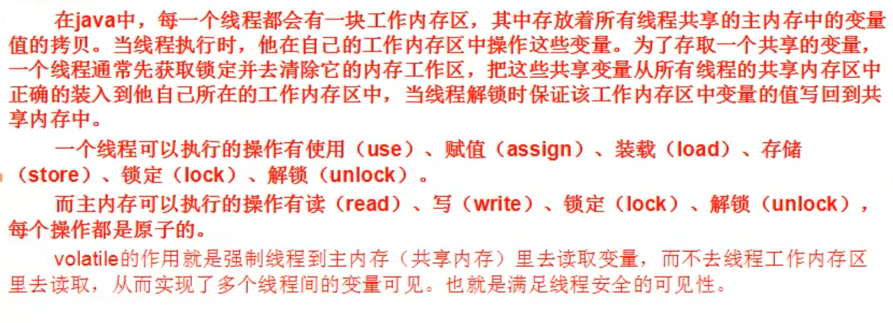

#### volatile关键字的非原子性
- JDK1.5以后，对每个线程(Thread)做了一个优化,加了一块独立的内存运行空间，这一块独立内存空间存放主内存的一些引用，也就是当前线程引用的一些变量。线程使用的时候，直接从自身的独立内存空间取数据。所以下图中，while循环不会被终止（创建在子线程，改的值改的是主线程的isRunning的值，所以不会终止）。
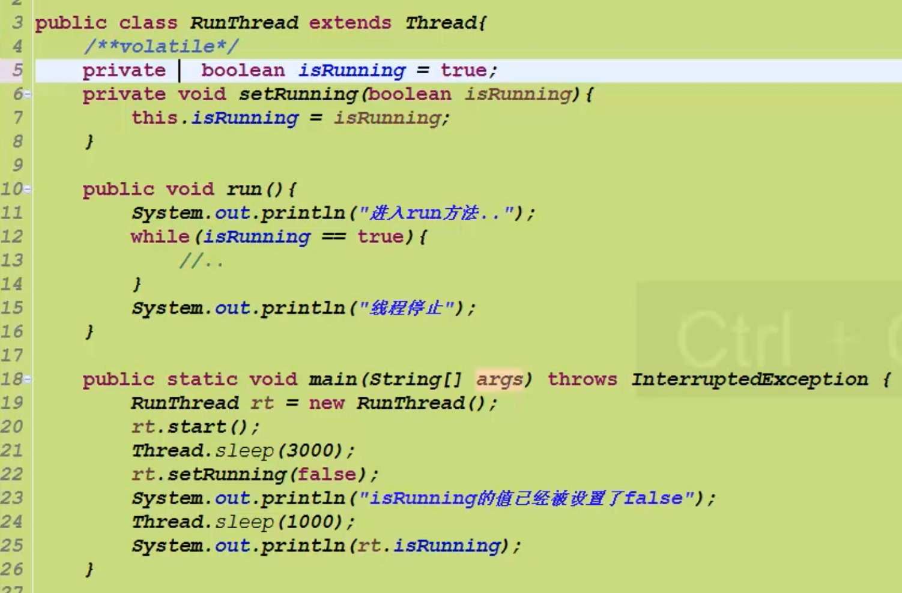
上图，如果想停止，解决办法
```Java
private volatile boolean isRunning = true;
```
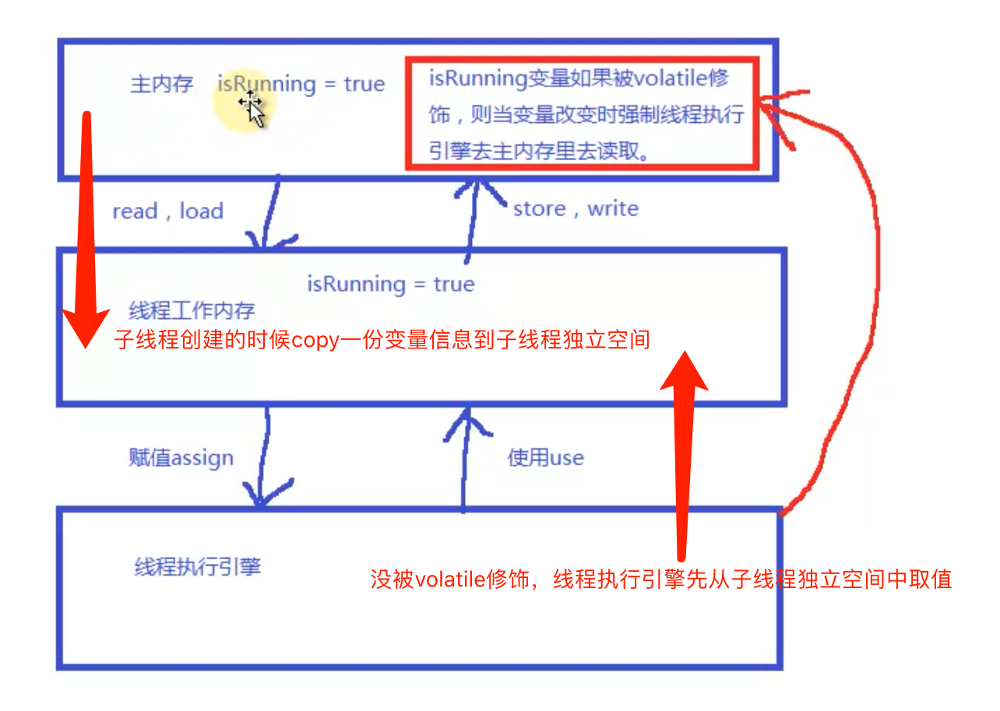

- volatile虽然拥有多个线程的可见性，但是却不具备同步性（也就是原子性)（count++方法，每次叠加1000次，分10个线程执行，最后一个线程执行完毕最终值不是10000）。可以算是一个轻量级的synchronized,性能要比synchronized强很多，不会造成阻塞（在很多开源框架里，比如netty的底层代码就大量使用volatile，可见netty性能一定是不错的）。这里需要注意：一般volatile用于只针对于多个线程可见的变量操作，并不能代替synchronized的同步功能。如果保证原子性可以用AtomicInteger.

```Java
private static AtomicInteger count = new AtomicInter(0); //count初始化值0
//使用incrementAndGet（)方法叠加
count.incrementAndGet();
```
- volatile只具有可见性，没有原子性。要实现原子性建议使用atomic类的系列对象，支持原子性操作（注意atomic类只保证本身方法的原子性，并不保证多次操作的原子性）。
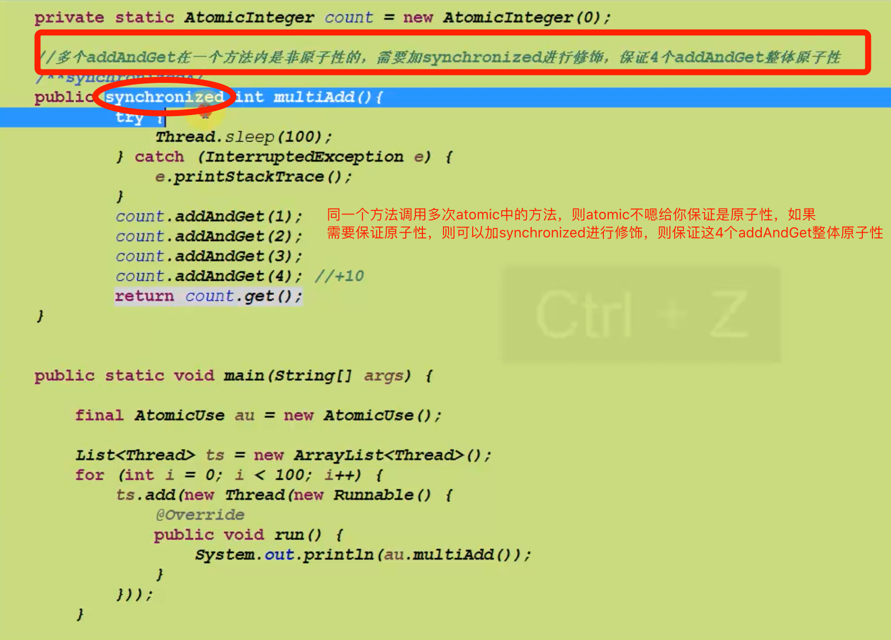

#### 并发编程下的多线程间通信概念wait，notify，线程经典面试题
- 使用wait/notify方法实现线程间通信。（这两个方法都是object的类的方法，换句话说java的所有的对象都提供了这两个方法）
  - wait和notify必须配合synchronized关键字使用
  - wait方法释放锁，notify方法不释放锁（wait方法调用后，其他线程可以拿到锁执行方法；notify方法则必须等到此线程synchronized代码块执行完，其他线程才能拿到锁进行执行）

使用示例：参考[waitnotify](https://github.com/CentMeng/JavaFrameTest/tree/master/src/com/msj/sync/waitnotify)

#### 模拟底层阻塞队列（queue）实现讲解
上面内容实践操作，示例：[MyQueue](https://github.com/CentMeng/JavaFrameTest/blob/master/src/com/msj/sync/MyQueue.java)

#### ThreadLocal
- ThreadLocal:线程局部变量，是一种多线程间并发访问变量的解决方案。与其synchronized等加锁的方式不同，ThreadLocal完全不提供锁，而使用以空间换时间的手段，为每个线程提供变量的独立副本，以保障线程安全。
- 从性能上说，ThreadLocal不具有绝对的优势，在并发不是很高的时候，加锁的性能会更好，但作为一套与锁无关的线程安全解决方案，在高并发量或者竞争激烈的场景，使用ThreadLocal可以在一定程度上减少锁竞争。

#### 单例和多线程结合使用
单例模式：最常见的就是饥饿模式和懒汉模式。一个直接实例化对象，一个在调用方法时进行实例化对象。在多线程模式中，考虑到性能和线程安全问题，我们一般选择下面两种比较经典的单例模式，在性能提高的同时,又保证了线程安全。

- dubble check instance

```Java
public class DubbleSingleton {

private static DubbleSingleton ds;

public static DubbleSingleton getInstance(){
		if(ds == null){
			try {
				//模拟初始化对象的准备时间...
				Thread.sleep(3000);
			} catch (InterruptedException e) {
				e.printStackTrace();
			}
			synchronized (DubbleSingleton.class) {
				if(ds == null){
					ds = new DubbleSingleton();
				}
			}
		}
		return ds;
	}
}
```
- static inner class (简单，安全)

```Java
public class InnerSingleton {
	
	private static class Singletion {
		private static Singletion single = new Singletion();
	}
	
	public static Singletion getInstance(){
		return Singletion.single;
	}
	
}
```
### 3 同步类容器
#### 同步类容器
- 同步类容器都是线程安全的，但在某些场景下可能需要加锁来保护复合操作。复合类操作如：迭代、跳转、以及条件运算。这些复合操作在多线程并发地修改容器时，可能会表现出意外的行为，最经典的便是ConcurrentModificationException。原因是当容器迭代的过程中，被并发地修改了内容，这是由于早起迭代器设计的时候并没有考虑并发修改的问题。
- 同步类容器：如古老的Vector,HashTable。这些容器的同步功能其实都是有JDK的Collections.synchronized ** 等方法去创建实现的。其底层的机制无非就是用传统的synchronized关键字对每个公用的方法都进行同步，使得每次只能有一个线程访问容器的状态。这很明显不满足我们今天互联网时代高并发的需求，在保证线程安全的同时，也必须有足够好的性能

```
//HashMap线程不安全，但被修饰后返回的就是线程安全的map
Map<Object,Object> map = Collections.synchronizedMap(new HashMap<>());
```  

- 并发类容器：在jdk5.0之后提供了多种并发类容器来替代同步类容器从而改善性能。同步类容器的状态都是串行化的。他们虽然实现了线程安全，但是严重降低了并发性，在多线程环境时，严重降低了应用程序的吞吐量。
- 并发类容器是专门针对并发设计的，使用ConcurrentHashMap来代替给予散列的传统的HashTable，而且在ConcurrentHashMap中，添加了一些常见复合操作的支持。以及使用了CopyOnWriteArrayList代替Vector，并发地CopyOnWriteArraySet，以及并发的Queue，ConcurrentLinkedQueue和LinkedBlockingQueue，前者是高性能的队列，后者是以阻塞形式的队列。

#### Concurrent集合类讲解与底层原理实现
- ConcurrentMap两个重要实现
  - ConcurrentHashMap
  - ConcurrentSkipListMap（支持并发排序功能，密闭ConcurrentHashMap）
- ConcurrentHashMap内部使用段（Segment）来表示这些不同的部分，每个段其实就是一个小的HashTable，他们有自己的锁。只要多个修改操作发生在不同的段上，他们就可以并发进行。把一个整体分成了16个段（Segment）。也就是最高支持16个线程的并发修改操作。这也是在多线程场景时减少锁的粒度从而降低锁竞争的一种方案。并且代码中大多共享变量使用volatile关键字声明，目的是第一时间获取修改的内容，性能非常好。
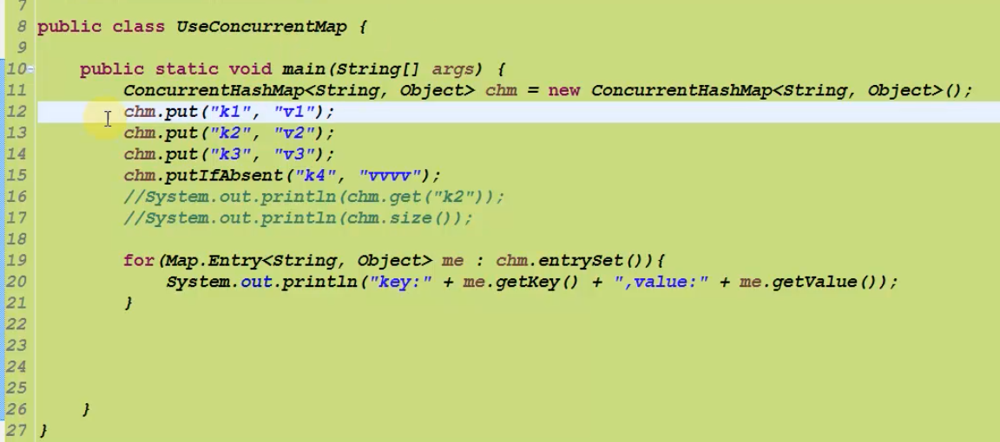
- Copy-On-Write简称COW，是一种用于程序设计中的优化策略。JDK里的COW容器有两种：CopyOnWriteArrayList和CopyOnWriteArraySet，COW容器非常有用，可以在非常多的并发场景中使用到。***适用于读多写少的操作。写多的情况建议使用ArrayList，Set加锁方式实现同步***
- CopyOnWrite容器即写时复制的容器。通俗的理解是当我们往一个容器添加元素的时候，不直接往当前容器添加，而是先将当前容器进行Copy，复制出一个新的容器，然后新的容器里刚添加元素，添加完元素之后，再将原容器的引用指向新的容器。这样做的好处是我们可以对CopyOnWrite容器进行***并发地读***，而不需要加锁，因为当前容器不会添加任何元素。而且COW容器的写操作已经加锁，不会出现写操作数据不一致问题情况。CopyOnWrite也是一种读写分离的思想，读和写不同的容器。

#### 各类并发Queue
- MQ适用场景：生产端快，消费端慢的情况或生产端产生大量数据，消费端来不及消费的情况。消费者快的情况可以用netty或者mina这种基于点对点tcp通讯的框架。
- 阻塞队列与普通队列的区别在于，当队列是空的时，从队列中获取元素的操作将会被阻塞，或者当队列是满时，往队列里添加元素的操作会被阻塞。试图从空的阻塞队列中获取元素的线程将会被阻塞，直到其他的线程往空的队列插入新的元素。同样，试图往已满的阻塞队列中添加新元素的线程同样也会被阻塞，直到其他的线程使队列重新变得空闲起来，如从队列中移除一个或者多个元素，或者完全清空队列.
- ConcurrentLinkedQueue：适用于高并发场景下的队列，通过无锁的方式，实现了高并发状态下的高性能。是高性能队列但不是阻塞队列。先进先出原则，queue里面元素不能为null。
  - add()和offer() 都是加入元素。（ConcurrentLinkQueue中，这两种方法没有任何区别）。
  - poll()和peek（） 都是取头元素节点，区别在于前者会删除元素，后者不会
- BlockingQueue接口
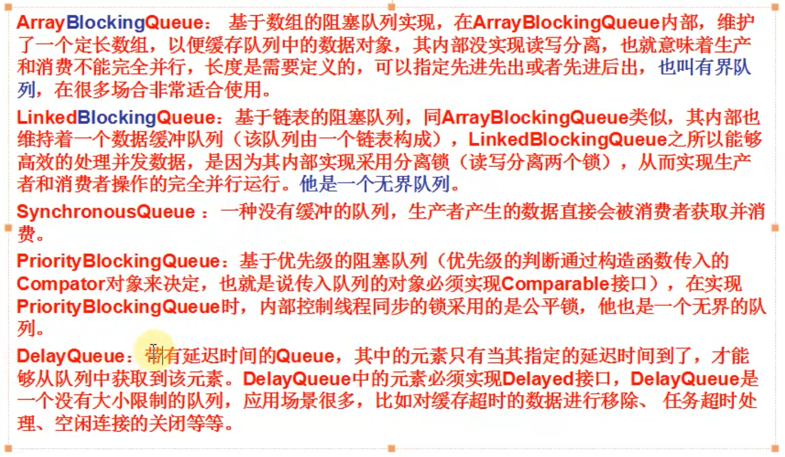 
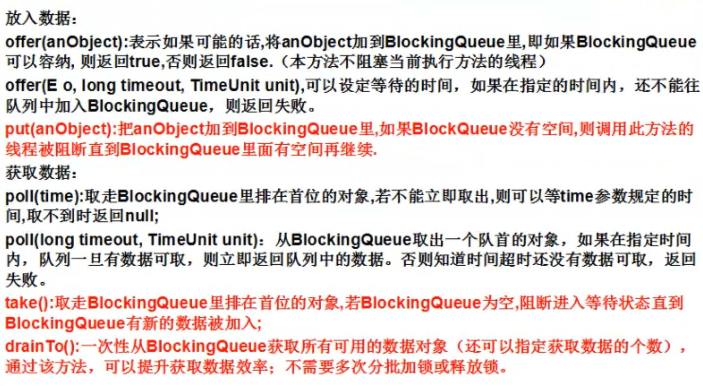 

  -  ArrayBlockingQueue:阻塞队列，有界队列，不能读写分离。（队列满了再添加会抛出Queue full异常）。适用于Queue大，有峰值的情况。
  -  LinkedBlockingQueue：阻塞队列，无界队列，能读写分离。适合Queue不大情况。
  -  SynchronousQueue：不允许添加任何元素（不可以add()和offer()，只有阻塞了add（）才不会报异常，如下图。这是因为不是往队列添加，而是直接丢给阻塞的线程处理）。适用于数据量少，即来即走的情况。
  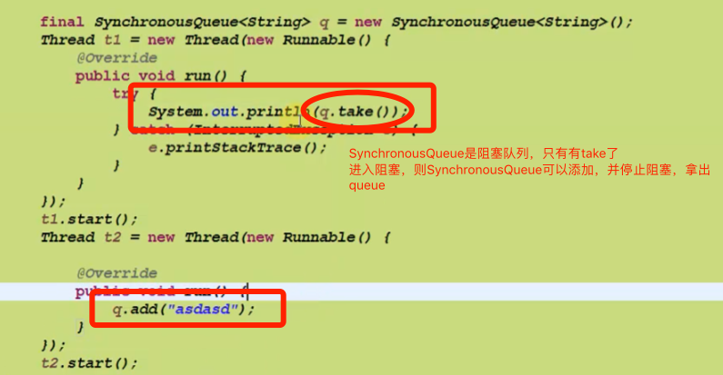
  
  -  DelayQueue：带有延迟时间的Queue，元素只有当其执行的延迟时间到了，才能从队列中获取到该元素。没有大小限制，使用场景，比如对缓存超时的数据进行移除，任务超时处理，空闲连接的关闭等等。(参考[UseDelayQueue](https://github.com/CentMeng/JavaFrameTest/blob/master/src/com/msj/sync/queue/UseDelayQueue.java))
  -  PriorityBlockingQueue：不遵循先进先出原则，遵循比较原则，优先级由传入的对象Compator对象决定，也就是传入队列的对象必须实现Comparable接口。（参考[UsePriorityBlockingQueue](https://github.com/CentMeng/JavaFrameTest/blob/master/src/com/msj/sync/queue/UsePriorityBlockingQueue.java)）<font color="#F00">循环输出并没有排序，只有每次take时候就排序，取出优先级最高的</font>。

-  Deque 双端队列，允许在队列的头部或尾部进行出队和入队操作。
  - LinkedBlockingDeque是一个线程安全的双端队列实现，可以说他是最为复杂的一种队列，在内部实现维护了前端和后端节点，但是其没有实现读写分离，因此同一时间只能有一个线程对其进行操作。在高并发中性能远低于其他BlockingQueue。更要低于ConcurrentLinkedQueue，在jdk早期有一个非线程安全的Deque就是ArrayDeque，java6里添加了LinkedBlockingDeque来弥补多线程场景下线程安全的问题。 

### 4. 多线程的设计模式
#### Future模式讲解，即异步加载(见[future](https://github.com/CentMeng/JavaFrameTest/tree/master/src/com/msj/sync/future) )
- Future模式类似于商品订单。比如在网购时，当看中某一件商品时，就可以提交订单，当订单处理完成后，在家里等待商品送货上门即可。或者说更形象的我们发送Ajax请求的时候，页面是异步的进行后台处理，用户无须一直等待请求的结果，可以继续浏览或操作其他内容。
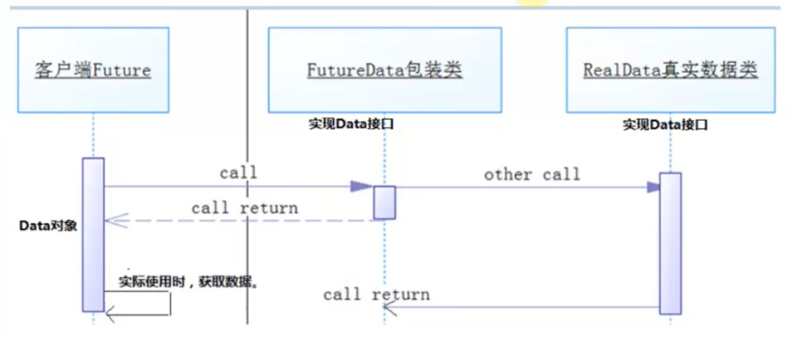

#### Master-Worker模式(见[masterworker](https://github.com/CentMeng/JavaFrameTest/tree/master/src/com/msj/sync/masterworker))
- ***并行计算，使用多线程对同一个对象进行队列操作，处理完出队***
- Master-Worker模式是常用的并行计算模式。它的核心思想是系统由两类进程协作工作：Master进程和Worker进程。Master负责接收和分配任务，Worker负责处理子任务。当各个Worker子进程处理完成后，会将结果返回给Master，由Master做归纳和总结。其好处是能将一个大任务分解成若干个小任务，并行执行，从而提高系统的吞吐量。
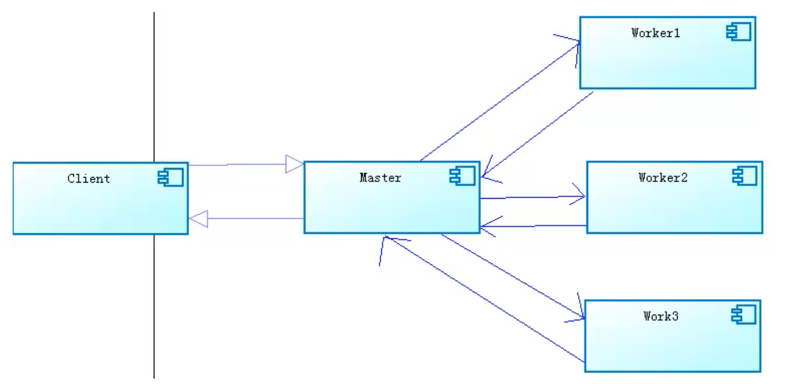
- Master-Worker开发引导图
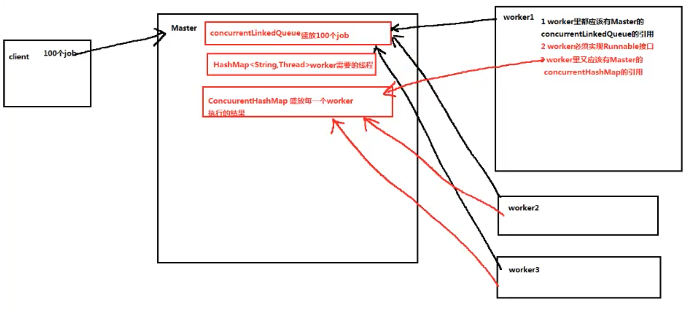

#### 生产者-消费者模式(见[productorconsumer](https://github.com/CentMeng/JavaFrameTest/tree/master/src/com/msj/sync/productorconsumer))
- 生产者和消费者也是一个非常经典的多线程模式，我们在实际开发中应用非常广泛的思想概念。在生产-消费模式中，通常有两类线程，即若干个生产者的线程和若干个消费者的线程。生产者线程负责提交用户请求，消费者线程则负责具体处理生产者提交的任务，在生产者和消费者之间通过共享内存缓存区进行通信。
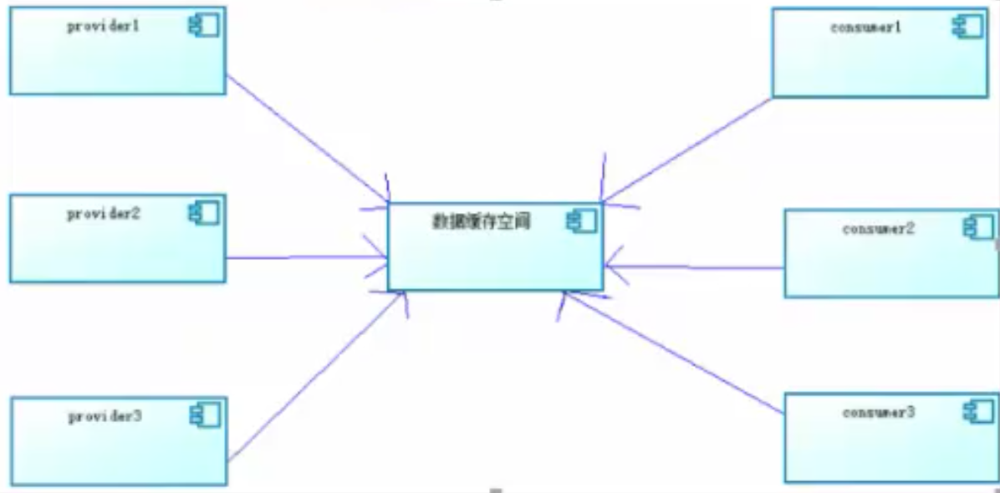

### 5. 线程池

#### Executor框架
- Executors创建线程池的方法：
  - newFixedThreadPool()方法，该方法返回一个固定数量的线程池（创建几个就几个），该方法的线程数始终不变。当有一个任务提交时，若线程池中空闲，则立即执行，若没有，则会被暂缓在一个任务队列中等待有空闲的线程去执行。
  - newSingleThreadExecutor()方法，创建一个线程的线程池，若空闲则执行，若没有空闲线程则暂缓在任务队列中。
  - newCachedThreadPool()方法，返回一个可根据实际情况调整线程个数的线程池，不限制最大线程数量，若有空闲的线程执行则执行任务，若无任务则不创建线程。并且每一个空闲线程会在60秒后自动回收。
  - newScheduledThreadPool()方法，该方法放回一个ScheduledExecutorService对象，但该线程可以指定线程的数量。
- 自定义线程池(见[executors](https://github.com/CentMeng/JavaFrameTest/tree/master/src/com/msj/sync/executors/test2))

```Java
public ThreadPoolExecutor(int corePoolSize,
                              int maximumPoolSize,
                              long keepAliveTime,
                              TimeUnit unit,
                              BlockingQueue<Runnable> workQueue,
                              ThreadFactory threadFactory,
                              RejectedExecutionHandler handler) 
```
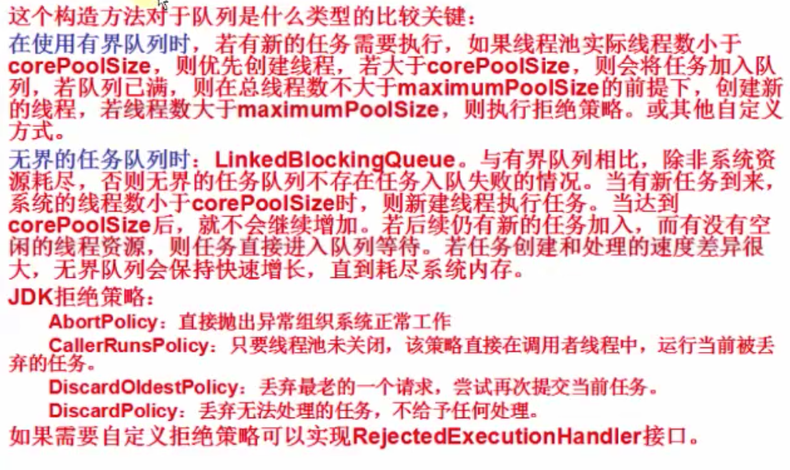

- 自定义拒绝策略：
  - 方案1：高峰期过程中，通过HttpUrlConnection创建一个请求，通过这个请求发回传数据方，告诉他一会再发（高峰期不建议这样使用，因为资源已经很紧张了，再发送请求的话也是占用资源的，不过使用HttpClient可以配置请求的线程池数）。
  - 方案2：输出日志或将队列缓存其他地方（不建议缓存其他地方，因为这样还不如给队列扩容），然后有个调度的
  - job把日志记录的再重新跑一遍。

### 6. Concurrent.util常用类
- CyclicBarrier使用：

假设有一个场景：每个线程代表一个跑步运动员，当运动员都准备好后，才一起出发，只要有一个人没有准备好，大家都等待。示例：[UseCyclicBarrier](https://github.com/CentMeng/JavaFrameTest/blob/master/src/com/msj/sync/executors/test3/UseCyclicBarrier.java)

- CountDownLatch使用：

他经常用于监听某些初始化操作，等初始化执行完毕后，通知主线程继续工作。使用场景使用于：例如方法中包含1，2方法，1方法要多线程执行，执行完毕后才能执行2方法。在1方法后执行await(),await后面写2方法。示例：[UseCountDownLatch](https://github.com/CentMeng/JavaFrameTest/blob/master/src/com/msj/sync/executors/test3/UseCountDownLatch.java)

- Callbale和Future使用：

这个例子其实就是我们之前实现的Future模式。jdk给予一个实现的封装，使用非常简单。示例：[UseFuture](https://github.com/CentMeng/JavaFrameTest/blob/master/src/com/msj/sync/executors/test3/UseFuture.java)

Future模式非常适合处理耗时很长的业务逻辑时进行使用，可以有效的减少系统的响应时间，提高系统的吞吐量。

- Executor的submit()和execute()区别
  - submit可以传入实现Callable接口的实例对象
  - submit方法有返回值

### 7. 高并发

- 信号量
信号量可以用来解决限流（控制系统流量）。拿到信号量的线程可以进入，否则就等待。示例见：[UseSemaphore](https://github.com/CentMeng/JavaFrameTest/blob/master/src/com/msj/sync/executors/test3/UseSemaphore.java)。一般使用Redis进行限流，比如用将用户信息放到Redis缓存里，然后记录用户访问的url，加入1分钟只允许访问60次，如果超过60次提示访问频繁。

- 解决高并发
  - 网络端
  - 服务器层面（ngix负载均衡（ngix最大只支持2000万并发，超过2000万可以通过ngix结合使用lvs或者haprox来进行负载均衡）->多个tomcat分流）
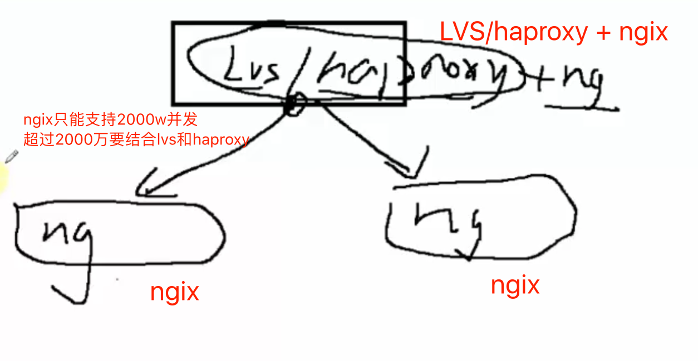
  - 业务（业务模块化，在业务上进行并发分流，细粒度）
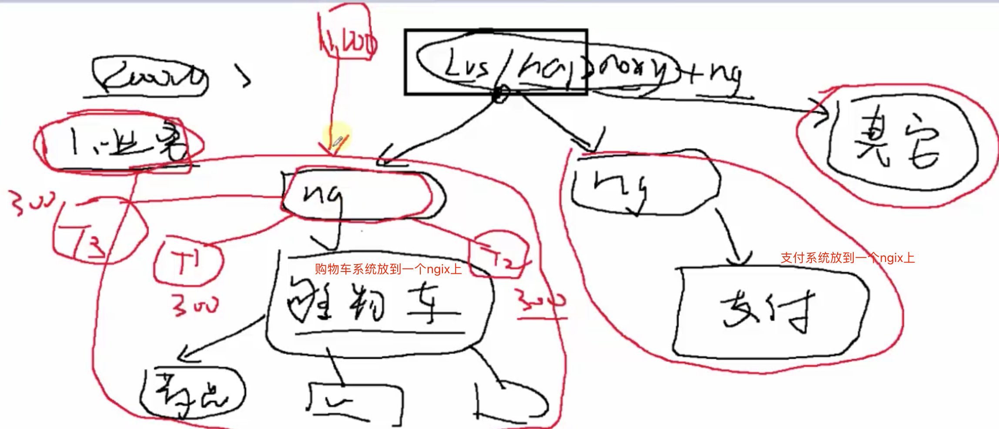
  - Java层面限流
- 峰值计算，进行多轮压力测试后，采用80/20原则，即80%的访问请求在20%的时间内达到。

```
峰值qps = （总PV * 80%）/(60*60*24*20%)
```
例如：100次请求需要10秒完成，则80次请求需要8秒，但希望在20%的时间内完成即1.6秒完成。
然后再将总的峰值qps除以单台机器所能承受的最高的gps值，就是所需要机器的数量：
```
机器数 = 总的峰值qps 
```

- 秒杀方案
  - 一个单独独立的子系统(和商城主系统独立)，这样即使服务挂了，也不影响主服务。

### 8. 锁
#### 重入锁
在需要同步的代码上部分加入锁定，但最后一定不要忘记释放锁定，不然会造成锁永远无法释放，其他线程永远进不来的情况。示例：[UseReentrantLock](https://github.com/CentMeng/JavaFrameTest/blob/master/src/com/msj/sync/lock/lock1/UseReentrantLock.java)

#### 锁与等待/通知(类似synchronized中的wait和notify，notifyall)
我们再使用Lock的时候，可以使用一个新的等待/通知的类，它就是Condition。这个Condition一定是针对具体某一把锁。也就是在只有锁的基础之上才会产生Condition.Condition比synchronized的wait，notify要灵活。因为Condition可以根据一个Lock创建多个Condition,见[UseManyCondition](https://github.com/CentMeng/JavaFrameTest/blob/master/src/com/msj/sync/lock/lock1/UseManyCondition.java)。
使用场景：两个方法并行计算，方法1中有的方法需要等待方法2计算完毕后，才能继续执行。
示例：[UseCondition](https://github.com/CentMeng/JavaFrameTest/blob/master/src/com/msj/sync/lock/lock1/UseCondition.java)
#### 公平锁与非公平锁
```Java
//默认非公平锁
Lock lock = new ReentranLock(boolean fair);
```
- 公平锁是哪个线程代码先调用则锁放开后调用哪个线程

- 公平锁浪费性能
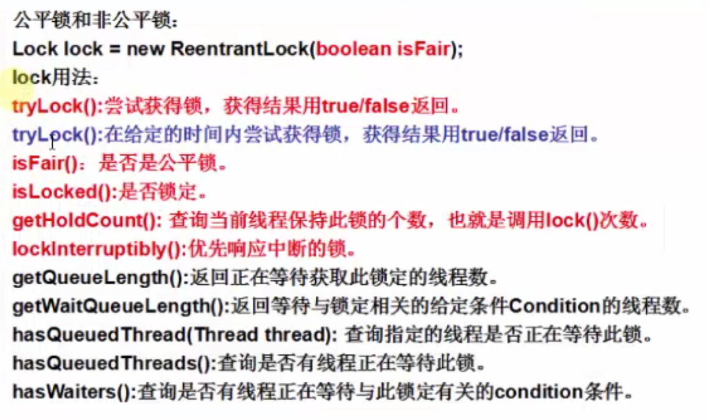

#### ReentrantReadWriteLock读写锁
- 实现读写分离的锁。在高并发的情况下，尤其是读多写少的情况下，性能要远高于重入锁。示例：[ReentrantReadWriteLock](https://github.com/CentMeng/JavaFrameTest/blob/master/src/com/msj/sync/lock/lock2/UseReentrantReadWriteLock.java)
- 之前学synchronized，ReentrantLock时，我们知道，同一时间内，只能有一个线程进行访问被锁定的代码，那么读写锁则不同，其本质是分成两个锁，即读锁，写锁。在读锁下，多个线程可以并发的进行访问，但是在写锁的时候，只能一个个的顺序访问。

#### 分布式锁
- 一个服务部署到两台服务器上，相同的服务实现同步。可以使用zookeeper的分布式锁。

#### 锁的优化
- 避免死锁
- 减少锁的持有时间
- 减小锁的粒度
- 锁的分离
- 尽量使用无锁的操作，如原子类（Atomic系列类），voliate

### 无锁并行计算框架（Disruptor）
- 全球最快最好用的无锁并行计算框架。Martin Fowler在自己网站上写了一篇LMAX架构的文章，在文章中他介绍了LMAX是一种新型零售金融交易平台，它能够以很低的延迟产生大量交易。这个系统是建立在JVM平台上，其核心是一个业务逻辑处理器，<font color = "#f00">它能够在一个线程里每秒处理6百万订单。</font>业务逻辑处理器完全是运行在内存中，使用事件源驱动方式。业务逻辑处理器的核心是Disruptor。
- Disruptor是一个高性能的异步处理框架，或者可以认为是最快的消息框架（轻量的JMS），也可以认为是一个观察者模式的实现，或者事件监听模式的实现。 
- ***官方学习网站：[http://ifeve.com/disruptor-getting-started/](http://ifeve.com/disruptor-getting-started/)***
- 在Disruptor中，我们想实现[hello world](https://github.com/CentMeng/JavaFrameTest/blob/master/src/com/msj/sync/disruptor/base) 需要如下几步骤：
  -  第一：建立一个Event类
  -  第二：建立一个工厂Event类，用于创建Event类实例对象
  -  第三：需要有一个监听事件类，用于处理数据（Event类）
  -  第四：我们需要进行测试代码编写。实例化Disruptor实例，配置一系列参数。然后我们对Disruptor实例绑定监听事件类，接受并处理数据。
  -  第五：在Disruptor中，真正存储数据的核心叫做RingBuffer(环型缓存)，我们通过Disruptor实例拿到它，然后把数据生产出来，把数据加入到RingBuffer的实例对象中即可。
 
#### Disruptor术语说明
-  RingBuffer: 被看作Disruptor最主要的组件，然而从3.0开始RingBuffer仅仅负责存储和更新在Disruptor中流通的数据。对一些特殊的使用场景能够被用户(使用其他数据结构)完全替代。
-  Sequence: Disruptor使用Sequence来表示一个特殊组件处理的序号。和Disruptor一样，每个消费者(EventProcessor)都维持着一个Sequence。大部分的并发代码依赖这些Sequence值的运转，因此Sequence支持多种当前为AtomicLong类的特性。
-  Sequencer: 这是Disruptor真正的核心。实现了这个接口的两种生产者（单生产者和多生产者）均实现了所有的并发算法，为了在生产者和消费者之间进行准确快速的数据传递。
-  SequenceBarrier: 由Sequencer生成，并且包含了已经发布的Sequence的引用，这些的Sequence源于Sequencer和一些独立的消费者的Sequence。它包含了决定是否有供消费者来消费的Event的逻辑。
-  WaitStrategy：决定一个消费者将如何等待生产者将Event置入Disruptor。
-  Event：从生产者到消费者过程中所处理的数据单元。Disruptor中没有代码表示Event，因为它完全是由用户定义的。
-  EventProcessor：主要事件循环，处理Disruptor中的Event，并且拥有消费者的Sequence。它有一个实现类是BatchEventProcessor，包含了event loop有效的实现，并且将回调到一个EventHandler接口的实现对象。
-  EventHandler：由用户实现并且代表了Disruptor中的一个消费者的接口。
-  Producer：由用户实现，它调用RingBuffer来插入事件(Event)，在Disruptor中没有相应的实现代码，由用户实现。
-  WorkProcessor：确保每个sequence只被一个processor消费，在同一个WorkPool中的处理多个WorkProcessor不会消费同样的sequence。
-  WorkerPool：一个WorkProcessor池，其中WorkProcessor将消费Sequence，所以任务可以在实现WorkHandler接口的worker吃间移交
-  LifecycleAware：当BatchEventProcessor启动和停止时，于实现这个接口用于接收通知。

#### 	Disruptor印象
-  把一个个生产的对象（生产一堆）传到Disruptor中的RingBuffer容器中（环形结构），消费者在RingBuffer中注册监听事件，然后RingBuffer一旦有数据就会主动把生产对象传给消费者处理。
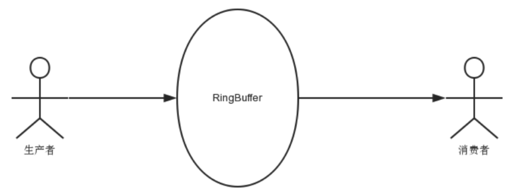   
- 理解RingBuffer
  -  RingBuffer是一个环，可以把他用做在上下文（线程）间传递数据的buffer。大小必须是2的n次方，否则影响性能（个数是2的n次方更有利于基于二进制的计算机进行计算）。
  -  基本来说，ringbuffer拥有一个序号（Sequence），这个序号指向数组中下一个可用元素。随着你不停地填充这个buffer（可能也会有相应的读取），这个序号会一直增长，直到绕过这个环。
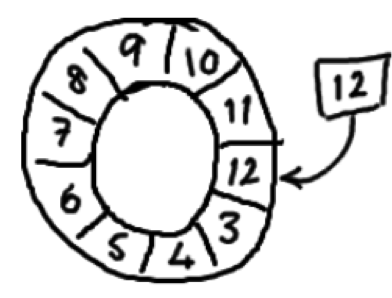
  -  要找到数组中当前序号指向的元素，可以通过mod操作：sequence mod array length = array index（取模操作）以上面的ringbuffer为例（java的mod语法）：12 % 10 = 2。
  -  如果你看了维基百科里面的关于环形buffer的词条，你就会发现，我们的实现方式，与其最大的区别在于：没有尾指针。我们只维护了一个指向下一个可用位置的序号。这种实现是经过深思熟虑的—我们选择用环形buffer的最初原因就是想要提供可靠的消息传递。
  -  我们实现的ring buffer和大家常用的队列之间的区别是，我们不删除buffer中的数据，也就是说这些数据一直存放在buffer中，直到新的数据覆盖他们。这就是和维基百科版本相比，我们不需要尾指针的原因。ringbuffer本身并不控制是否需要重叠。
  -  因为它是数组，所以要比链表快，而且有一个容易预测的访问模式。
  -  这是对CPU缓存友好的，也就是说在硬件级别，数组中的元素是会被预加载的，因此在ringbuffer当中，cpu无需时不时去主存加载数组中的下一个元素。
  -  其次，你可以为数组预先分配内存，使得数组对象一直存在（除非程序终止）。这就意味着不需要花大量的时间用于垃圾回收。此外，不像链表那样，需要为每一个添加到其上面的对象创造节点对象—对应的，当删除节点时，需要执行相应的内存清理操作。
 
#### 场景应用
- 在helloWorld的实例中，我们创建Disruptor实例，然后调用getRingBuffer方法去获取RingBuffer，其实在很多时候，我们可以直接使用RingBuffer，以及其他的API操作。我们一起熟悉下示例：

  -  [使用EventProcessor消息处理器](https://github.com/CentMeng/JavaFrameTest/blob/master/src/com/msj/sync/disruptor/generate1)
  -  [使用WorkerPool消息处理器](https://github.com/CentMeng/JavaFrameTest/blob/master/src/com/msj/sync/disruptor/generate1)
  -  [在复杂场景下使用RingBuffer（希望P1生产的数据给C1、C2并行执行，最后C1、C2执行结束后C3执行）](https://github.com/CentMeng/JavaFrameTest/blob/master/src/com/msj/sync/disruptor/generate2)
  -  [多生产者、消费者使用](https://github.com/CentMeng/JavaFrameTest/blob/master/src/com/msj/sync/disruptor/multi)


 

