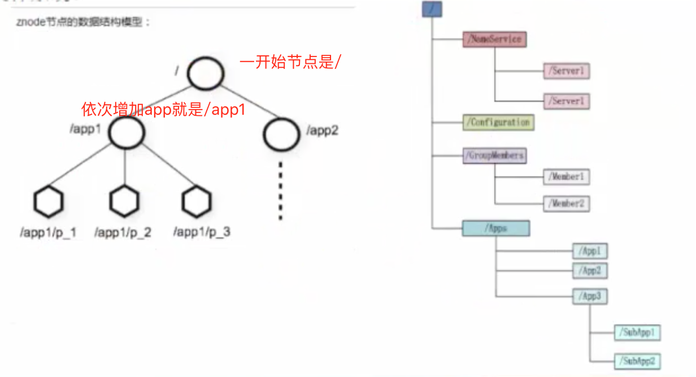
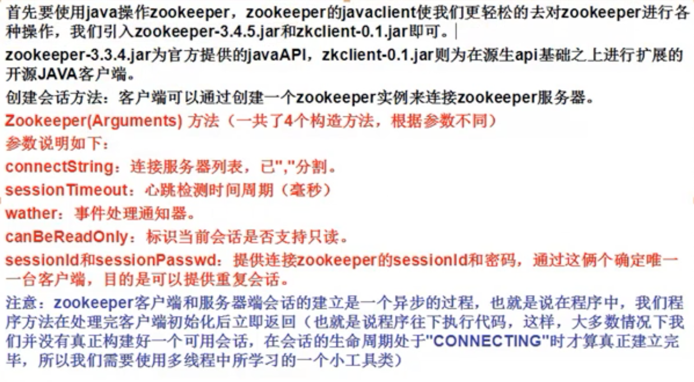
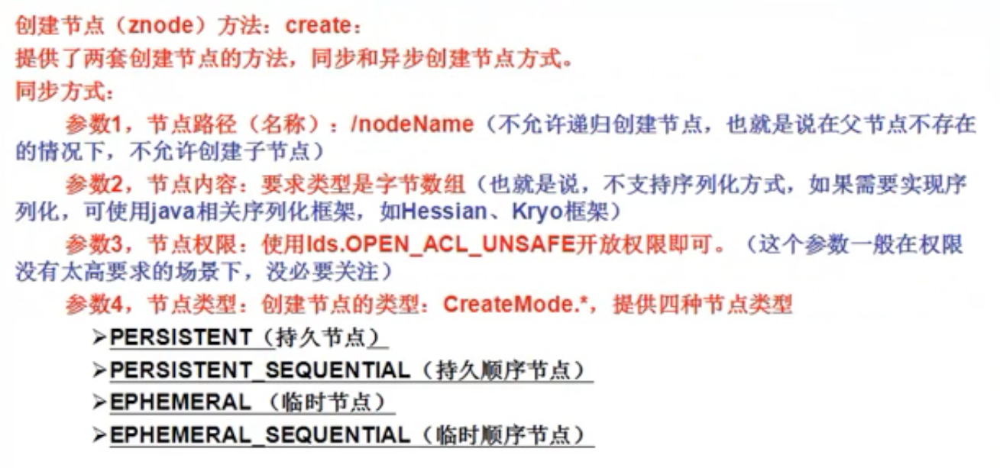
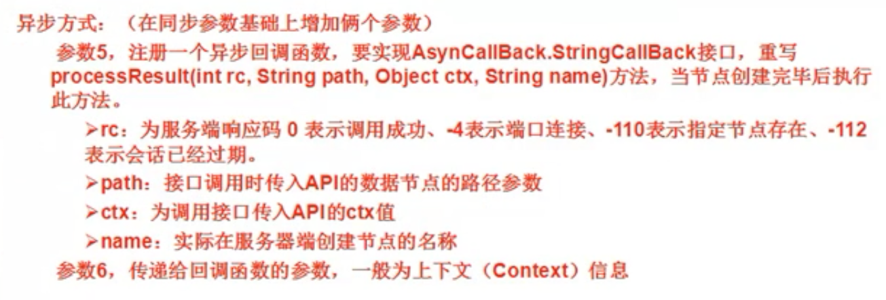
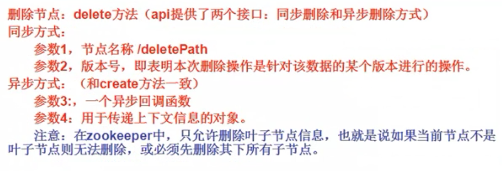
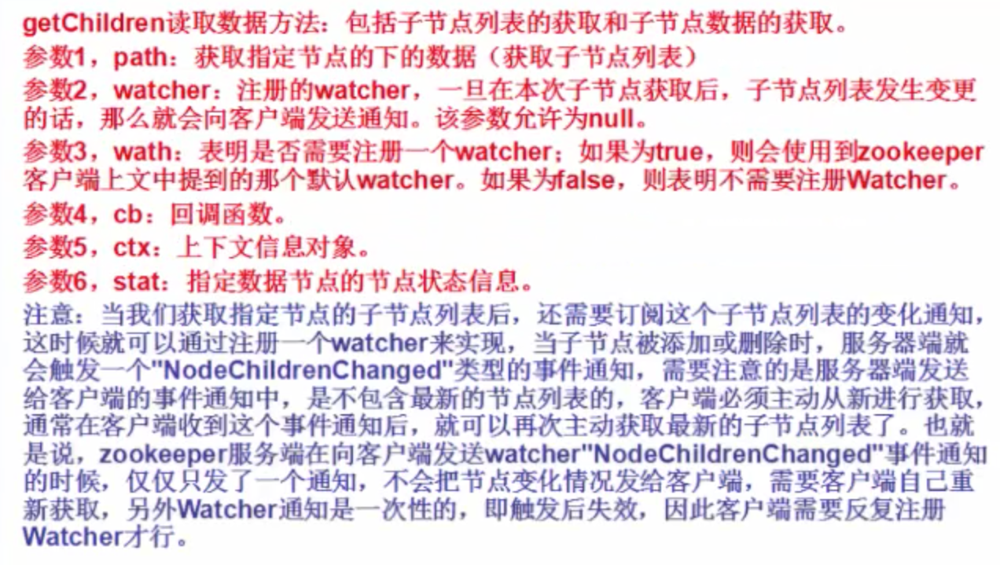
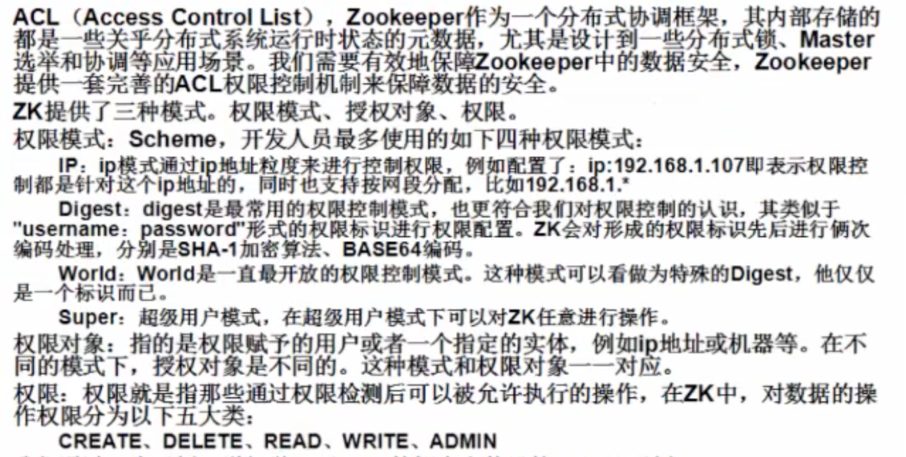
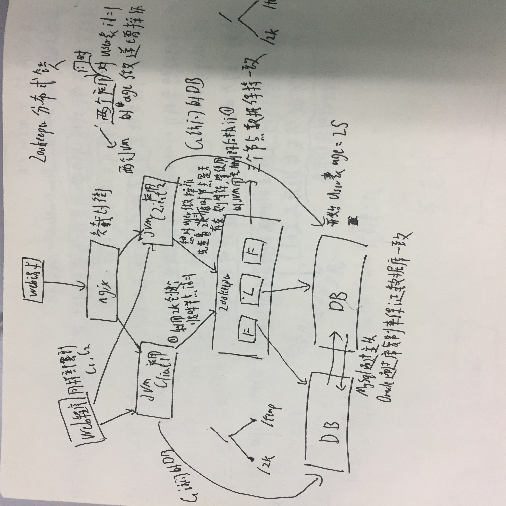
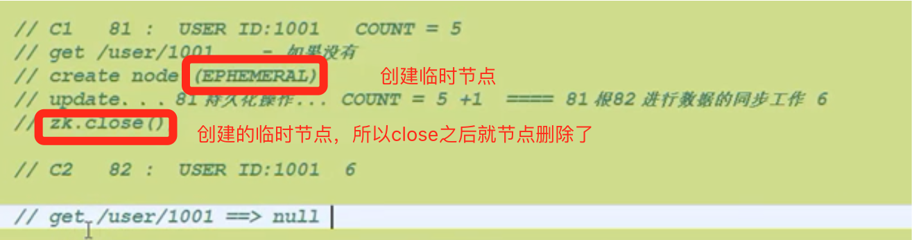

## Zookeeper简介说明
### 什么是Zookeeper？
Zookeeper是一个高效的分布式协调服务，它暴露了一些公共服务，比如命名/配置管理/同步控制/群组服务等。我们可以使用ZK来实现比如达成共识/集群管理/leader选举（选举通过[PAXOS算法](http://www.cnblogs.com/shenguanpu/p/4048660.html)）等。

Zookeeper是一个高可用的分布式管理与协调框架，基于ZAB算法（原子消息广播协议）的实现。该框架能够很好地保证分布环境中数据的一致性。也正是基于这样的特性，使得Zookeeper成为了解决分布式一致性的问题的利器。

<font color="#f00">顺序一致性：从一个客户端发起的事务请求，最终将会严格地按照其发起的顺序被应用到zookeeper中去。

原子性：所有事务请求的处理结果在整个集群中所有机器上的应用情况是一致的，也就是说，要么整个集群所有的机器都成功应用了某一事务，要么都没有应用，一定不会出现部分机器应用了该事务，而另一部分没有应用的情况（一个Leader节点，两个F节点，当对F1做修改数据操作，Consumer是无法对两个F节点和Leader节点做修改，只有当F1操作完毕并且同步给Leader和F2之后，Consumer才可以做操作）。

单一视图：无论客户端连接的是哪一个zookeeper服务器，其看到的服务器端数据模型都是一致的。

可靠性：一旦服务器成功地应用了一个事务，并完成对客户端的响应，那么该事务所引起的服务器端状态将会被一致保留下来。除非有另外一个事务对其更改。

实时性：通常所说的实时性就是指一旦事务被成功应用，那么客户端就能立刻从服务器上获取变更后的新数据，zookeeper仅仅能保证在一段时间内，客户端最终一定能从服务器端读取最新的数据状态。</font>

### Zookeeper设计目标
- 目标1：简单的数据结构。Zookeeper就是以简单的树形结构来进行相互协调的（也叫树形名字空间）。
- 目标2：可以构建集群。一般Zookeeper集群通常由一组机器构成，一般3~5台机器就可以组成一个Zookeeper集群。只要集群中超过半数以上的机器能够正常工作，那么整个集群就能正常对外提供服务。
- 目标3：顺序访问。对于来自每一个客户端的每一个请求，Zookeeper都会分配一个全局唯一的递增编号，这个编号反映了所有事务操作的先后顺序，应用程序可以使用Zookeeper的这个特性来实现更高层次的同步。
- 目标4：高性能。由于Zookeeper将全量数据存储在内存中，并直接服务于所有的非事务请求，因此尤其是在读操作为主的场景下性能非常突出。在JMater压力测试下(100%读请求场景下)，其结果大约在12-13w的QPS(每秒查询率)。

### Zookeeper的结构
> Zookeeper会维护一个具有层次关系的数据结构，它非常类似于一个标准的文件系统。



### Zookeeper的数据模型
1. 每个子目录项如NameService都被称作为znode，这个znode是被它所在的路径唯一标识，如Server1这个znode的标识为/NameService/Service1。
2. znode可以有子节点目录，并且每个znode可以存储数据，注意EPHEMERAL类型的目录节点不能有子节点目录。
3. znode是有版本的，每个znode中存储的数据可以有多个版本，也就是一个访问路径中可以存储多份数据。
4. znode可以是临时节点，一旦创建这个znode的客户端与服务器失去联系，这个znode也将自动删除，Zookeeper的客户端和服务器通信采用长连接方式，每个客户端和服务器通过心跳来保持连接，这个连接状态称为session，如果znode是临时节点，这个session失效，znode也就删除了。
5. znode的目录名可以自动编号，如App1已经存在，再创建的话，将会自动命名为App2。
6. znode可以被监控，包括这个目录节点中存储的数据的修改，子节点目录的变化等，一旦变化可以通知设置监控的客户端，这个是Zookeeper的核心特性，Zookeeper的很多功能都是基于这个特性实现的，后面再典型的应用场景中会有实例介绍。

### Zookeeper组成
ZK server根据其身份特性分为三种 leader，Follower，Observer，其中Follower和Observer又统称Learner（学习者）。

- Leader：负责客户端的writer类型请求
- Follower：负责客户端的reader类型请求，参与leader选举等。
- Observer：特殊的"Follower"，其可以接受客户端reader请求，但不参与选举。（扩容系统支撑能力，提高了读取速度。因为它不接受任何同步的写入请求，只负责与leader同步数据）

### 应用场景

> Zookeeper从设计模式角度来看，是一个基于观察者模式设计的分布式服务管理框架，它负责存储和管理大家都关心的数据，然后接受观察者的注册，一旦这些数据的状态发生变化，Zookeeper就将负责同志已经在Zookeeper上注册的那些观察者做出相应的反应，从而实现集群中类似Master/Slave管理模式。

- 配置管理:配置的管理在分布式应用环境中很常见，比如我们在平常的应用系统中，经常会碰到这样的需求：如机器的配置列表、运行时的开关配置、数据库配置信息等。这些全局配置信息通畅具备以下3个特性：
  -  数据量比较小
  -  数据内容在运行时动态发生变化
  -  集群中各个节点共享信息，配置一致
   
- 集群管理：Zookeeper不仅能够帮你维护当前的集群中机器的服务状态，而且能够帮你选出一个”总管“，让这个总管来管理集群，这就是Zookeeper的另一个功能Leader，并实现集群容错功能。
  -  希望知道当前集群中究竟有多少机器工作
  -  对集群中每天集群的运行时状态进行数据收集
  -  对集群中每台集群进行上下线操作 

- 发布与订阅：Zookeeper是一个典型的发布/订阅模式的分布式数控管理与协调框架，开发人员可以使用它来进行分布式数据的发布与订阅。

- 数据库切换：比如我们初始化Zookeeper的时候读取其节点上的数据库配置文件，当配置一旦发生变更时，Zookeeper就能帮助我们把变更的通知发送到各个客户端，每个客户端在接收到这个变更通知后，就可以重新进行最新数据的获取。

- 分布式日志的收集：我们可以做一个日志系统收集集群中所有的日志信息，进行统一管理。

- 分布式锁、队列管理等等。Zookeeper的特性就是在分布式场景下高可用，但是原生的API实现分布式功能非常困难，团队去实现也太浪费时间，即使实现了也未必稳定。那么可以采用第三方的客户端的完美实现，比如Curator框架，他是Apache的定级项目。

### [ZAB和Paxos算法](https://my.oschina.net/OutOfMemory/blog/812947)


## 搭建Zookeeper与配置文件说明
### 结构：一共三个节点
(zk服务器集群规模不小于3个节点),要求服务器之间系统时间保持一致，搭建时候集群规模是奇数即3，5，7。
### 上传zk
- 进行解压： tar zookeeper-3.4.5.tar.gz
- 重命名： mv zookeeper-3.4.5 zookeeper
- 修改环境变量： vi /etc/profile

```
export
ZOOKEEPER_HOME=/usr/local/zookeeper
export
PATH=.:$HADOOP_HOME/bin:$ZOOKEEPER_HOME/bin:$JAVA_HOME/...
```

- 刷新： source /etc/profile
- 到zookeeper下修改配置文件

```
cd /usr/local/zookeeper/conf
mv zoo_sample.cfg zoo.cfg
```

- 修改conf: vi zoo.cfg 修改两处
  -  （1）dataDir=/usr/local/zookeeper/data
  -  （2）最后面添加

```
server.0=msj（ip可以用192.168.1.121替换）:2888:3888
server.1=hadoop1:2888:3888
server.2=hadoop2:2888:3888
```

- 服务器标识配置：
  -  创建文件夹：mkdir data
  -  创建文件myid并填写内容为0：vi
myid (内容为服务器标识 ： 0)
> server.0 写0，server.1写1，server.2写2

  -  进行复制zookeeper目录到hadoop01和hadoop02
还有/etc/profile文件
  -  把hadoop01、hadoop02中的myid文件里的值修改为1和2
路径(vi /usr/local/zookeeper/data/myid)
  -  启动zookeeper：

路径：/usr/local/zookeeper/bin

执行：zkServer.sh start(注意这里3台机器都要进行启动)

状态：zkServer.sh status(在三个节点上检验zk的mode,一个leader和俩个follower)

### 操作zookeeper (shell)

> 可以使用工具进行管理[ZooInspector](https://github.com/CentMeng/JavaFrameTest/tree/master/src/com/msj/zookeeper/doc/连接Zookeeper工具/ZooInspector.rar)

- zkCli.sh 进入zookeeper客户端
- 根据提示命令进行操作：
  -  查找：ls / ls /zookeeper
  -  创建并赋值：create /msj hadoop
  -  获取：get /msj
  -  设值：set /msj mengshaojie
  -  可以看到zookeeper集群的数据一致性
  -  创建节点有俩种类型：短暂（ephemeral）、持久（persistent）
### zoo.cfg详解：
- tickTime： 基本事件单元，以毫秒为单位。这个时间是作为 Zookeeper
服务器之间或客户端与服务器之间维持心跳的时间间隔，也就是每隔 tickTime时间就会发送一个心跳。

- dataDir：存储内存中数据库快照的位置，顾名思义就是 Zookeeper
保存数据的目录，默认情况下，Zookeeper将写数据的日志文件也保存在这个目录里。

- clientPort： 这个端口就是客户端连接 Zookeeper 服务器的端口，Zookeeper会监听这个端口，接受客户端的访问请求。

- initLimit： 这个配置项是用来配置 Zookeeper接受客户端初始化连接时最长能忍受多少个心跳时间间隔数，当已经超过 10 个心跳的时间（也就是 tickTime）长度后Zookeeper 服务器还没有收到客户端的返回信息，那么表明这个客户端连接失败。总的时间长度就是
10*2000=20 秒。

- syncLimit： 这个配置项标识 Leader 与 Follower之间发送消息，请求和应答时间长度，最长不能超过多少个 tickTime的时间长度，总的时间长度就是 5*2000=10 秒

- server.A = B:C:D :

  -  A表示这个是第几号服务器,

  -  B 是这个服务器的 ip 地址；

  -  C 表示的是这个服务器与集群中的 Leader服务器交换信息的端口；

  -  D 表示的是万一集群中的 Leader服务器挂了，需要一个端口来重新进行选举，选出一个新的 Leader

## java操作Zookeeper

> Zookeeper的官方API并不太好用，建议使用Curator




- 同步创建时创建过程中进行阻塞，异步则创建时候后续代码继续执行



- delete时候版本号，是做检查，如果不是同一个版本，就不删除了。-1是跳过检查
- get时候只支持获取一层（假如/test下面有/test/a1、/test/a2、/test/a3，a1中有b1,则/test的getChildren方法只能获取a1,a2,a3不能获取b1）



- 在ZK中，只允许删除叶子节点信息，也就是说如果当前节点不是叶子节点则无法删除，或必须先删除其下所有子节点



### [连接、创建、修改、删除ZooKeeper](https://github.com/CentMeng/JavaFrameTest/tree/master/src/com/msj/zookeeper/zookeeper/base/ZookeeperBase.java)

- 原生API不允许递归创建/删除节点（即没有父节点，直接路径创建子节点）
，但Curator有API支持
- ZooKeeper不支持序列化对象，但可以使用Kryo框架实现

- exists方法意义在于无论节点是否存在，都可以进行注册watcher，能够对节点的创建、删除和修改进行监听，但是其子节点发送各种变化，都不回通知客户端。
- 关于参数watcher 的boolean值，因为watcher的监控是一次性的，如果继续使用watcher则传true，关于参数watcher对象，如果使用新的watcher则传入新watcher。

### Watcher、ZK状态、事件类型

- 示例：[ZooKeeper Watcher](https://github.com/CentMeng/JavaFrameTest/tree/master/src/com/msj/zookeeper/zookeeper/watcher/ZooKeeperWatcher.java)

zookeeper有watch操作，是一次性触发的，当watch监视的数据发生变化时，通知设置了该watch的client，即watcher。

同样，其watcher是监听数据发生了某些变化，那就一定会有对应的事件类型，和状态类型。

- 事件类型：（znode节点相关的）
  -  EventType.NodeCreated
  -  EventType.NodeDataChanged
  -  EventType.NodeChildrenChanged
  -  EventType.NodeDeleted

- 状态类型：（是跟客户端实例相关的）
  -  KeeperState.Disconnected
  -  KeeperState.SyncConnected
  -  KeeperState.AuthFailed
  -  KeeperState.Expired   
 
<font color="#F00">watcher的特性：一次性、客户端串行执行、轻量</font>

- 一次性：对于ZK的watcher，你只需要记住一点:zookeeper有watch事件，是一次性触发的，当watch监视的数据发生变化时，通知设置了该watch的client，即watcher，<font color="#F00">由于zookeeper的监控都是一次性的所以每次必须设置监控</font>。
- 客户端串行执行：客户端watcher回调的过程是一个串行同步的过程，这为我们保证了顺序，同时需要开发人员注意一点，千万不要因为一个Watcher的处理逻辑影响了整个客户端的Watcher回调。
- 轻量：WatchedEvent是ZK整个Watcher通知机制的最小通知单元，整个结构只包含三部分：通知状态、时间类型和节点路径。也就是Watcher通知非常的简单，只会告诉客户端发生了事件而不会告知其具体内容，需要客户自己去进行获取，比如NodeDataChanged事件，ZK只会通知客户端指定节点的数据发生了变更，而不会直接提供具体的数据内容。

### ZooKeeper的ACL（AUTH）


- 示例：[ZooKeeperAuth](https://github.com/CentMeng/JavaFrameTest/tree/master/src/com/msj/zookeeper/zookeeper/auth/ZookeeperAuth.java)

## 应用场景实例
### ZooKeeper分布式锁实现
> 利用临时节点来实现分布式锁，因为临时节点效率高。ZooKeeper存在内存中，get效率很高




*<font color="#f00">ZooKeeper创建的时候如果已经创建会抛异常，所以创建的时候也要如果时间过长，可能出现抛异常情况</font>*

### ZooKeeper实现多个Client端使用同一个文件

- 示例：[ZKWatcher](https://github.com/CentMeng/JavaFrameTest/tree/master/src/com/msj/zookeeper/zookeeper/cluster/ZKWatcher.java)

## zkClient客户端
ZKClient是由Datameer的工程师StefanGroschupf和Peter voss一起开发的。在原生API接口基础上进行了封装，简化了ZK的复杂性。

- 示例：[ZKClientBase](https://github.com/CentMeng/JavaFrameTest/tree/master/src/com/msj/zookeeper/zkclient/base/ZkClientBase.java)

### 创建客户端方法：ZKClient（Arguments）
- 参数1：zkServers zookeeper服务器的地址，用”，“隔开
- 参数2：session Timeout 超时会话，为毫秒，默认为30000ms
- 参数3：connection Timeout 连接超时会话
- 参数4：IZKConnection 接口的实现类
- 参数5：zkSerializer 自定义序列化实现

### 创建节点方法
create、createEphemeral、createEphemeralSequential、createPersistent、createPersistentSequential

- 参数1：path 路径
- 参数2：data 数据内容，可以传null
- 参数3：mode，节点类型，为一个枚举类型，4种形式
- 参数4：acl策略
- 参数5：callback 回调函数
- 参数6：context上下文对象
- 参数7：createParents 是否创建父节点

### 删除节点方法delete、deleteRecursive

### 读取子节点数据方法：getChildren

### 读取节点数据方法：readData
- 参数1：path路径
- 参数2：returnNullIfPathNotExists（避免为空节点抛出异常，直接返回null）
- 参数3：节点状态

### 更新数据方法writeData

### 检查节点是否存在方法exists

### subscribeChildChanges方法（watcher）

> ZKClient并没有类似watcher、watch参数，这也就是说我们开发人员无需关心反复注册Watcher的问题，ZKClient给我们提供了一套监听方式，我们可以使用监听节点的方式进行操作，剔除了繁琐的watcher操作，简化了代码的复杂程度。

示例：[ZkClientWatcher1](https://github.com/CentMeng/JavaFrameTest/tree/master/src/com/msj/zookeeper/zkclient/watcher/ZkClientWatcher1.java)

- 参数1：path路径
- 参数2：实现了IZKChildListener接口的类（如：实例化IZKChildListener类）只需要重写其handleChildChangs（Sting parentPath，List<String> currentChilds）方法。其中参数parentPath为所监听节点全路径，currentChilds为最新的子节点列表（相对路径）。
- IZKChildListener事件针对于下面三个事件触发：（数据变更有DataChange的API）
  -  新增子节点
  -  减少子节点
  -  删除节点

### subscribeDataChanges方法

> 监控数据变更的api

### 方便性
- ZKClient支持地柜创建/删除
- 读写可以直接传Object对象

## Curator框架

> Curator框架已经是Apache的顶级项目，里面提供了更多丰富的操作，例如session超时重连、主从选举、分布式计算器、分布式锁等等适用于各种复杂的zookeeper场景的API封装。

maven依赖：

```xml
<dependency>
	<groupId>org.apache.curator</groupId>
	<artifactld>curator-framework</artifactld>
	<version>2.4.2</version>
</dependency>
```

### Curator框架的使用
Curator框架中使用链式编程风格，易读性更强，使用工程方法创建连接对象。

- 示例：[curator](https://github.com/CentMeng/JavaFrameTest/tree/master/src/com/msj/zookeeper/curator)

#### 1.使用CuratorFrameworkFactory的两个静态工厂方法（参数不同）来实现：
- 参数1：connectString，连接串
- 参数2：retryPolicy，重试连接策略。有四种实现分别为：ExponentialBackoffRetry、RetryNTimes、RetryOneTimes、RetryUntilElapsed
- 参数3：sessionTimeoutMs 会话超时时间，默认为60000ms
- 参数4：connectionTimeoutMs 连接超时时间，默认为15000ms
- 注意：对于retryPolicy策略通过一个接口来让用户自定义实现

#### 2.创建节点create方法，可选链式项：

creatingParentsIfNeeded、withMode、forPath、withACL等

#### 3.删除节点delete方法，可选链式项：

deletingChildrenIfNeeded、guaranteed、withVersion、forPath等等

#### 4.读取和修改数据getData、setData方法

#### 5.异步绑定回调方法。比如创建节点时绑定一个回调函数，该回调函数可以输出服务器的状态码以及服务器事件类型。还可以加入一个线程池进行优化操作。

- 如果大规模或者频繁对节点做操作的话，使用线程池

#### 6.读取子节点方法getChildren

#### 7.判断节点是否存在方法checkExists

### Curator监听
>如果要使用类似Watcher的监听功能Curator必须依赖一个jar包，Maven依赖：

```
<dependency>
<groupId></groupId>
<artifactId>curator-recipes</artifactId>
<version>2.4.2</version>
</dependency>
```
有了这个依赖包，我们使用NodeCache的方式去客户端实例中注册一个监听缓存，然后实现对应的监听方法即可，这里我们主要有两种监听方式：

- [NodeCacheListener](https://github.com/CentMeng/JavaFrameTest/tree/master/src/com/msj/zookeeper/curator/watcher/CuratorWatcher1.java)：监听节点的新增、修改操作
- [PathChildrenCacheListener](https://github.com/CentMeng/JavaFrameTest/tree/master/src/com/msj/zookeeper/curator/watcher/CuratorWatcher2.java)：监听子节点（一级节点）的新增、修改、删除操作

> ZKClient也免去了重复注册的代码，但他底层还是重复注册的代码封装，而Curator是通过在Client端增加Cache，如果服务端有变更，则拿cache做对比，有变化重新覆盖cache。

### Curator场景应用
#### 分布式锁功能
> 在分布式场景中，我们为了保证数据的一致性，经常在程序运行的某一个点需要进行同步操作（java可提供synchronized或者Reentrantlock实现）比如我们看一个小示例，这个示例会出现分布式不同步的问题：<br/>因为我们之前所说的是在高并发下访问一个程序，现在我们则是在高并发下访问多个服务器节点（分布式）。<br>我们使用Curator基于ZK的特性提供的分布式锁来处理分布式场景的数据一致性，ZK本身的分布式是有写问题的，我以前在实现的时候遇到过。。。这里强烈推荐使用Curator的分布式锁。

- 示例：[lock2](https://github.com/CentMeng/JavaFrameTest/tree/master/src/com/msj/zookeeper/curator/lock/Lock2.java)

#### 分布式计数器功能
> 一说到分布式计数器，你可能脑海里想到了AtomicInteger这种经典的方式，如果针对于一个jvm的场景当然没有问题，但是我们现在是分布式场景下，就需要利用Curator框架的DistributeAtomicInteger了。

- 示例：[CuratorAtomicInteger](https://github.com/CentMeng/JavaFrameTest/tree/master/src/com/msj/zookeeper/curator/atomicinteger/CuratorAtomicInteger.java)

#### 分布式Barrier使用
> 设置同时开始同时结束；类似CountDownLatch

- 示例：[CuratorBarrier](https://github.com/CentMeng/JavaFrameTest/tree/master/src/com/msj/zookeeper/curator/barrier)

#### 分布式数据共享

> ZooKeeper文件做修改，Client端会接收到通知

- 示例：[cluster](https://github.com/CentMeng/JavaFrameTest/tree/master/src/com/msj/zookeeper/curator/cluster)